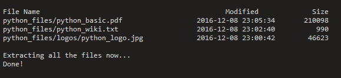
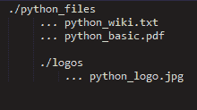
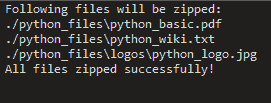
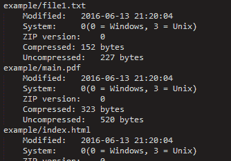

# 在 Python 中处理 zip 文件

> 原文:[https://www.geeksforgeeks.org/working-zip-files-python/](https://www.geeksforgeeks.org/working-zip-files-python/)

本文解释了如何使用简单的 python 程序对 zip 文件执行各种操作。

**什么是 zip 文件？**

ZIP 是一种支持无损数据压缩的归档文件格式。无损压缩是指压缩算法允许从压缩数据中完美地重建原始数据。因此，ZIP 文件是包含一个或多个压缩文件的单个文件，提供了一种理想的方法来缩小大文件并将相关文件保存在一起。

**为什么我们需要 zip 文件？**

*   降低存储需求。
*   提高标准连接的传输速度。

为了使用 python 处理 zip 文件，我们将使用一个名为 [zipfile](https://docs.python.org/2/library/zipfile.html) 的内置 python 模块。

**1。提取压缩文件**

```py
# importing required modules
from zipfile import ZipFile

# specifying the zip file name
file_name = "my_python_files.zip"

# opening the zip file in READ mode
with ZipFile(file_name, 'r') as zip:
    # printing all the contents of the zip file
    zip.printdir()

    # extracting all the files
    print('Extracting all the files now...')
    zip.extractall()
    print('Done!')
```

上面的程序提取了一个名为“my_python_files.zip”的 zip 文件，该文件位于与这个 python 脚本相同的目录中。
上述程序的输出可能是这样的:



让我们试着理解上面的代码:

*   ```py
    from zipfile import ZipFile
    ```

    ZipFile 是一类用于读写 zip 文件的 zipfile 模块。这里我们只从 ZipFile 模块导入类 zipfile。

*   ```py
    with ZipFile(file_name, 'r') as zip:
    ```

    这里，通过调用接受 zip 文件名和模式参数的 ZipFile 构造函数来创建一个 ZipFile 对象。我们在 **READ** 模式下创建一个 ZipFile 对象，并将其命名为 **zip** 。

*   ```py
    zip.printdir()
    ```

    **printdir()** 方法打印归档的目录。

*   ```py
    zip.extractall()
    ```

    **extractall()** 方法将 zip 文件的所有内容提取到当前工作目录。您也可以调用 **extract()** 方法，通过在 zip 文件中指定路径来提取任何文件。
    例如:

    ```py
    zip.extract('python_files/python_wiki.txt')
    ```

    这将只提取指定的文件。

    如果你想读一些特定的文件，你可以这样走:

    ```py
    data = zip.read(name_of_file_to_read)
    ```

**2。写入压缩文件**

考虑这样格式的目录(文件夹):



在这里，我们需要对整个目录及其子目录进行爬网，以便在将它们写入 zip 文件之前获得所有文件路径的列表。
下面的程序通过抓取要压缩的目录来实现这一点:

```py
# importing required modules
from zipfile import ZipFile
import os

def get_all_file_paths(directory):

    # initializing empty file paths list
    file_paths = []

    # crawling through directory and subdirectories
    for root, directories, files in os.walk(directory):
        for filename in files:
            # join the two strings in order to form the full filepath.
            filepath = os.path.join(root, filename)
            file_paths.append(filepath)

    # returning all file paths
    return file_paths        

def main():
    # path to folder which needs to be zipped
    directory = './python_files'

    # calling function to get all file paths in the directory
    file_paths = get_all_file_paths(directory)

    # printing the list of all files to be zipped
    print('Following files will be zipped:')
    for file_name in file_paths:
        print(file_name)

    # writing files to a zipfile
    with ZipFile('my_python_files.zip','w') as zip:
        # writing each file one by one
        for file in file_paths:
            zip.write(file)

    print('All files zipped successfully!')        

if __name__ == "__main__":
    main()
```

上述程序的输出如下所示:



让我们试着把上面的代码分成几个片段来理解:

*   ```py
    def get_all_file_paths(directory):
        file_paths = []

        for root, directories, files in os.walk(directory):
            for filename in files:
                filepath = os.path.join(root, filename)
                file_paths.append(filepath)

        return file_paths
    ```

    首先，为了获取我们目录中的所有文件路径，我们创建了这个使用 **os.walk()** 方法的函数。在每次迭代中，该目录中的所有文件都被追加到一个名为**文件路径**的列表中。
    最后，我们返回所有的文件路径。

*   ```py
    file_paths = get_all_file_paths(directory)
    ```

    这里我们把要压缩的目录传递给**get _ all _ file _ path()**函数，得到一个包含所有文件路径的列表。

*   ```py
    with ZipFile('my_python_files.zip','w') as zip:
    ```

    这里，我们这次在 WRITE 模式下创建一个 ZipFile 对象。

*   ```py
    for file in file_paths:
                zip.write(file)
    ```

    在这里，我们使用 **write** 的方法将所有的文件一个一个的写到 zip 文件中。

**3。获取关于 zip 文件的所有信息**

```py
# importing required modules
from zipfile import ZipFile
import datetime

# specifying the zip file name
file_name = "example.zip"

# opening the zip file in READ mode
with ZipFile(file_name, 'r') as zip:
    for info in zip.infolist():
            print(info.filename)
            print('\tModified:\t' + str(datetime.datetime(*info.date_time)))
            print('\tSystem:\t\t' + str(info.create_system) + '(0 = Windows, 3 = Unix)')
            print('\tZIP version:\t' + str(info.create_version))
            print('\tCompressed:\t' + str(info.compress_size) + ' bytes')
            print('\tUncompressed:\t' + str(info.file_size) + ' bytes')
```

上述程序的输出可能如下所示:



```py
for info in zip.infolist():
```

在这里， **infolist()** 方法创建了一个包含关于 zip 文件的所有信息的 **ZipInfo** 类的实例。
我们可以访问所有信息，如文件的最后修改日期、文件名、创建文件的系统、Zip 版本、压缩和未压缩形式的文件大小等。

本文由**尼克尔·库马尔**供稿。如果你喜欢极客博客并想投稿，你也可以用 write.geeksforgeeks.org 写一篇文章或者把你的文章邮寄到 review-team@geeksforgeeks.org。看到你的文章出现在极客博客主页上，帮助其他极客。

如果你发现任何不正确的地方，或者你想分享更多关于上面讨论的话题的信息，请写评论。