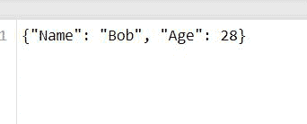

# 用 Python 给文件写字典

> 原文:[https://www . geesforgeks . org/write-a-dictionary-to-a-file-in-python/](https://www.geeksforgeeks.org/write-a-dictionary-to-a-file-in-python/)

[**字典**](https://www.geeksforgeeks.org/python-dictionary/) 用于以键:值对的形式存储数据值。在本文中，我们将看到如何将字典写入文件。实际上我们只能向文件中写入一个字符串。如果我们想写一个字典对象，我们要么需要使用 json 将它转换成字符串，要么序列化它。

**方法:1** **使用 Json** 存储带对象的字典

**进场:**

*   导入 [**Json**](https://www.geeksforgeeks.org/javascript-json/)
*   创建一个 [**字典**](https://www.geeksforgeeks.org/python-dictionary/) 按顺序将其传递到文本文件中。
*   以写模式打开文件。
*   对 json 字符串使用 json.dumps()

**代码:**

## 蟒蛇 3

```
import json

details = {'Name': "Bob",
          'Age' :28}

with open('convert.txt', 'w') as convert_file:
     convert_file.write(json.dumps(details))
```

**输出:**



**方法二:使用循环**

**进场:**

*   创建字典。
*   以写入模式打开文件。
*   这里我们使用带键值对的 For 循环，其中“名称”是键，“Alice”是值，因此 For 循环遍历每个键:每个对的值对
*   然后 f.write()函数只写字符串“%s”形式的输出

**代码:**

## 蟒蛇 3

```
details={'Name' : "Alice",
         'Age' : 21,
         'Degree' : "Bachelor Cse",
         'University' : "Northeastern Univ"}

with open("myfile.txt", 'w') as f: 
    for key, value in details.items(): 
        f.write('%s:%s\n' % (key, value))
```