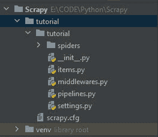
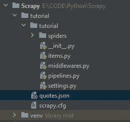
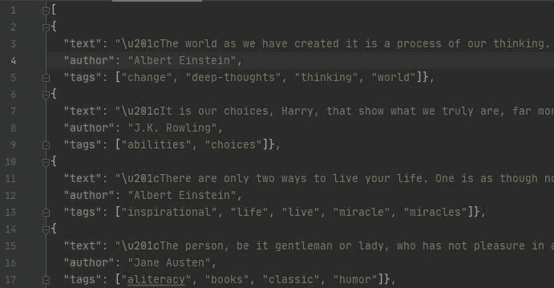

# 将 Scrapy Python 输出写入 JSON 文件

> 原文:[https://www . geesforgeks . org/writing-scrapy-python-output-to-JSON-file/](https://www.geeksforgeeks.org/writing-scrapy-python-output-to-json-file/)

在本文中，我们将看到如何用 Python 将杂乱的输出写入 JSON 文件。

## 使用杂乱的命令行外壳

将数据保存到 JSON 的最简单方法是使用以下命令:

```py
scrapy crawl <spiderName> -O <fileName>.json
```

这将生成一个具有提供的文件名的文件，该文件包含所有被擦除的数据。

请注意，在命令行中使用 **-O** 会覆盖任何具有该名称的现有文件，而使用 **-o** 会将新内容附加到现有文件中。但是，附加到 JSON 文件会使文件内容无效。因此，使用以下命令将数据追加到现有文件中。

```py
scrapy crawl <spiderName> -o <fileName>.jl
```

**注:**。jl 表示 JSON 行格式。

### **分步实施:**

**第一步:创建项目**

现在要在 scrapy 中启动一个新项目，请使用以下命令

```py
scrapy startproject tutorial
```

这将创建一个包含以下内容的目录:



移动到我们使用以下命令创建的教程目录:

```py
cd tutorial
```

**第二步:创建蜘蛛(教程/蜘蛛/报价 _spider.py)**

蜘蛛是用户定义并用来从网站上抓取信息的程序。这是我们蜘蛛的代码。在项目的**教程/蜘蛛**目录下创建一个名为 quotes_spider.py 的文件:

## 蟒蛇 3

```py
import scrapy

class QuotesSpider(scrapy.Spider):

    # name of variable should be 'name' only
    name = "quotes" 

    # urls from which will be used to extract information
    # list should be named 'start_urls' only
    start_urls = [
        'http://quotes.toscrape.com/page/1/',
        'http://quotes.toscrape.com/page/2/',
    ]

    def parse(self, response):

        # handle the response downloaded for each of the
        # requests made should be named 'parse' only
        for quote in response.css('div.quote'):
            yield {
                'text': quote.css('span.text::text').get(),
                'author': quote.css('small.author::text').get(),
                'tags': quote.css('div.tags a.tag::text').getall(),
            }
```

这是一个简单的蜘蛛，从网站上获取引文、作者姓名和标签。

**第五步:运行程序**

要运行程序并将潦草的数据保存到 JSON，请使用:

```py
scrapy crawl quotes -O quotes.json
```



我们可以看到在我们的项目结构中已经创建了一个文件 **quotes.json** ，这个文件包含了所有的抓取数据。

**JSON 输出:**



这只是我们的 spider 抓取的 quotes.json 文件的许多引用中的几个。