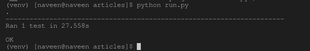

# 使用硒 Python 编写测试

> 原文:[https://www . geesforgeks . org/writing-tests-use-selenium-python/](https://www.geeksforgeeks.org/writing-tests-using-selenium-python/)

Selenium 的 Python 模块是为使用 Python 执行自动化测试而构建的。硒 Python 绑定提供了一个简单的应用编程接口，可以使用硒网络驱动程序编写功能/验收测试。通过硒 Python 应用编程接口，您可以直观地访问硒网络驱动程序的所有功能。本文说明了如何使用 Selenium Python 使用 Python Selenium 编写自动化测试。

如果您还没有安装 Selenium 及其组件，请从这里开始安装–[Selenium Python 介绍和安装](https://geeksforgeeks.org/selenium-python-introduction-and-installation/)。硒包本身不提供测试工具/框架。人们可以使用 Python 的 unittest 模块编写测试用例。工具/框架的其他选项是 py.test 和 nose。

#### 如何在 Python 中使用 Selenium 编写测试

我们使用了 Python 的 unittest 框架来编写测试。让我们使用 Python 硒测试在 Python.org 测试搜索功能。要了解更多关于 unittest 的信息，请访问–[unit test 文档](https://docs.python.org/2/library/unittest.html)。每一行的解释都在代码中给出。

**Code –**

```
# import all required frameworks
import unittest
from selenium import webdriver
from selenium.webdriver.common.keys import Keys

# inherit TestCase Class and create a new test class
class PythonOrgSearch(unittest.TestCase):

    # initialization of webdriver
    def setUp(self):
        self.driver = webdriver.Firefox()

    # Test case method. It should always start with test_
    def test_search_in_python_org(self):

        # get driver
        driver = self.driver
        # get python.org using selenium
        driver.get("http://www.python.org")

        # assertion to confirm if title has python keyword in it
        self.assertIn("Python", driver.title)

        # locate element using name
        elem = driver.find_element_by_name("q")

        # send data
        elem.send_keys("pycon")

        # recieve data
        elem.send_keys(Keys.RETURN)
        assert "No results found." not in driver.page_source

    # cleanup method called after every test performed
    def tearDown(self):
        self.driver.close()

# execute the script
if __name__ == "__main__":
    unittest.main()
```

**输出–**
