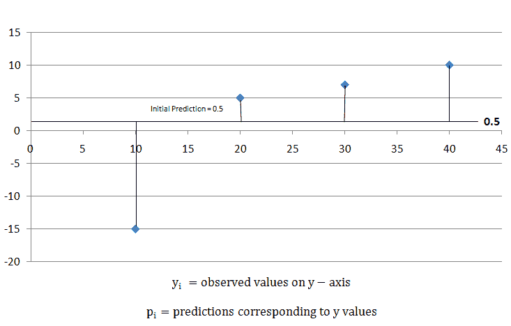
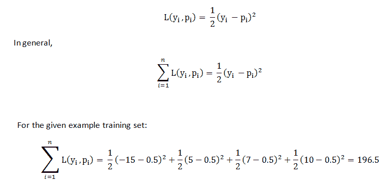
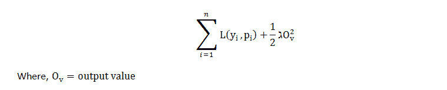
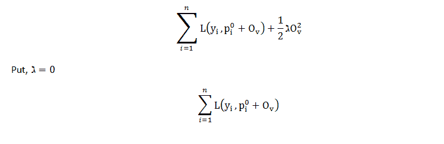
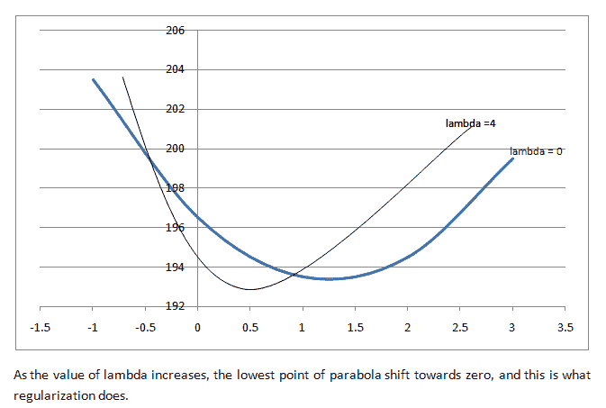
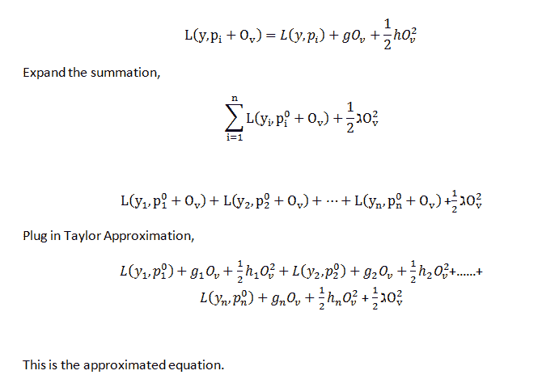
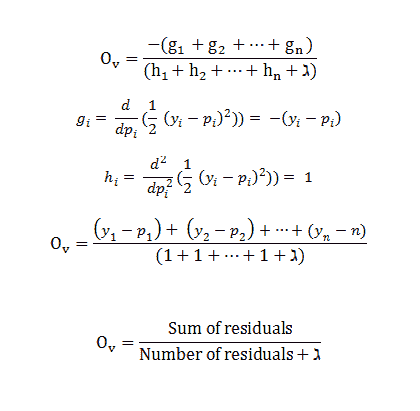

# XGBoost 用于回归

> 原文:[https://www.geeksforgeeks.org/xgboost-for-regression/](https://www.geeksforgeeks.org/xgboost-for-regression/)

回归问题的结果是连续值或实值。一些常用的回归算法是线性回归和决策树。回归中涉及几个指标，如均方根误差(RMSE)和均方误差(MAE)。这些都是 XGBoost 模型的一些关键成员，每一个都扮演着重要的角色。

*   **RMSE:** 是均方误差(MSE)的平方根。
*   **MAE:** 它是实际和预测差异的绝对总和，但它在数学上有所欠缺，这就是为什么与其他指标相比，它很少被使用的原因。

XGBoost 是一种构建监督回归模型的强大方法。这种说法的有效性可以通过了解它的(XGBoost)目标函数和基础学习者来推断。

目标函数包含损失函数和正则项。它讲述了实际值和预测值之间的差异，即模型结果离实际值有多远。XGBoost 中最常见的回归问题的损失函数是`reg:linear`，二进制分类的损失函数是`reg:logistics`。

集成学习涉及训练和组合单个模型(称为基本学习者)以获得单个预测，而 XGBoost 是集成学习方法之一。XGBoost 希望有基础学习者在余数上一致不好，这样当所有的预测组合在一起时，坏的预测会抵消掉，而更好的预测会相加形成最终的好预测。

**Code:**

```py
# Necessary imports
import numpy as np
import pandas as pd
import xgboost as xg
from sklearn.model_selection import train_test_split
from sklearn.metrics import mean_squared_error as MSE

# Load the data
dataset = pd.read_csv("boston_house.csv")
X, y = dataset.iloc[:, :-1], dataset.iloc[:, -1]

# Splitting
train_X, test_X, train_y, test_y = train_test_split(X, y,
                      test_size = 0.3, random_state = 123)

# Instantiation
xgb_r = xg.XGBRegressor(objective ='reg:linear',
                  n_estimators = 10, seed = 123)

# Fitting the model
xgb_r.fit(train_X, train_y)

# Predict the model
pred = xgb_r.predict(test_X)

# RMSE Computation
rmse = np.sqrt(MSE(test_y, pred))
print("RMSE : % f" %(rmse))
```

**输出:**

```py
129043.2314

```

**代码:线性基础学习者**

```py
# Necessary imports
import numpy as np
import pandas as pd
import xgboost as xg
from sklearn.model_selection import train_test_split
from sklearn.metrics import mean_squared_error as MSE

# Load the data
dataset = pd.read_csv("boston_house.csv")
X, y = dataset.iloc[:, :-1], dataset.iloc[:, -1]

# Splitting
train_X, test_X, train_y, test_y = train_test_split(X, y, 
                      test_size = 0.3, random_state = 123)

# Train and test set are converted to DMatrix objects,
# as it is required by learning API.
train_dmatrix = xg.DMatrix(data = train_X, label = train_y)
test_dmatrix = xg.DMatrix(data = test_X, label = test_y)

# Parameter dictionary specifying base learner
param = {"booster":"gblinear", "objective":"reg:linear"}

xgb_r = xg.train(params = param, dtrain = train_dmatrix, num_boost_round = 10)
pred = xgb_r.predict(test_dmatrix)

# RMSE Computation
rmse = np.sqrt(MSE(test_y, pred))
print("RMSE : % f" %(rmse))
```

**输出:**

```py
 124326.24465

```

**注意:**数据集需要转换成**数据矩阵。**是 XGBoost 的创作者做的一个优化的数据结构。它为封装带来了性能和效率提升。

损失函数还负责分析模型的复杂性，如果模型变得更复杂，就需要对其进行惩罚，这可以使用正则化来完成。它通过 LASSO (L1)和 Ridge (L2)正则化来惩罚更复杂的模型，以防止过度拟合。最终目标是找到简单准确的模型。

**正则化参数如下:**

*   **γ:**允许分裂发生的最小损失减少。伽玛越高，分裂越少。

*   **lamba** :叶权重上的 L2 正则化，这比 L1 平滑 nd 导致叶权重平滑下降，不像 L1 对叶权重强制实施强约束。

以下是有助于构建 XGBoost 回归树的公式。

**第一步:**计算相似度得分，有助于树的生长。

```py
Similarity Score = (Sum of residuals)^2 / Number of residuals + lambda

```

**第二步:**计算增益，确定如何拆分数据。

```py
Gain = Left tree (similarity score) + Right (similarity score) - Root (similarity score)

```

**步骤 3:** 通过计算 Gain 和 gamma(用户定义的树复杂度参数)之间的差值来修剪树

```py
Gain - gamma

```

如果结果是正数，则不要修剪，如果结果是负数，则修剪并再次从树上的下一个增益值减去伽玛。

**步骤 4:** 计算剩余叶子的输出值

```py
Output value = Sum of residuals / Number of residuals + lambda

```

**注意:**如果 lambda 的值大于 0，则通过缩小相似性得分导致更多修剪，并且导致叶子的输出值更小。

让我们看看数学中寻找合适的输出值以最小化损失函数的一部分

对于分类和回归，XGBoost 从初始预测开始，通常为 0.5，如下图所示。



要了解预测效果如何，请使用公式
计算损失函数

举个例子，结果是 196.5。稍后，我们可以应用这个损失函数并比较结果，并检查预测是否正在改善。

XGBoost 使用那些损失函数通过最小化下面的等式来构建树:

等式的第一部分是损失函数，等式的第二部分是正则化项，最终目标是最小化整个等式。

为了优化第一棵树的输出值，我们编写如下等式，用初始预测和输出值替换 p(i)，并让 lambda = 0 进行更简单的计算。现在方程看起来像，


之前计算过初始预测的损失函数，结果是 **196.5** 。

所以，对于*输出值= 0* ，*损耗函数= 196.5* 。类似地，如果我们为输出值= -1，损失函数= 203.5，为输出值= +1，损失函数= 193.5，以此类推绘制其他输出值的点，如果我们在图中绘制这个点。我们得到一个类似 T4 抛物线的结构。这是方程作为输出值函数的曲线图。


如果λ= 0，最佳输出值在抛物线的底部，导数为**零。** XGBoost 使用二阶泰勒近似进行分类和回归。包含输出值的损失函数可以近似为:


第一部分是损失函数，第二部分包括损失函数的一阶导数，第三部分包括损失函数的二阶导数。一阶导数与梯度下降有关，所以这里 XGBoost 用 **'g'** 表示一阶导数，二阶导数与 Hessian 有关，所以在 XGBoost 中用 **'h'** 表示。在方程式中插入相同的内容:


删除不包含输出值项的项，现在通过以下步骤最小化剩余功能:

*   取 w.r.t 输出值的导数。
*   集合导数等于 0(求抛物线的最低点)
*   求解输出值。
    *   g(i) =负残差
    *   h(i) =残差数


这是回归中 XGBoost 的输出值公式。它给出了抛物线最低点的 x 轴坐标。