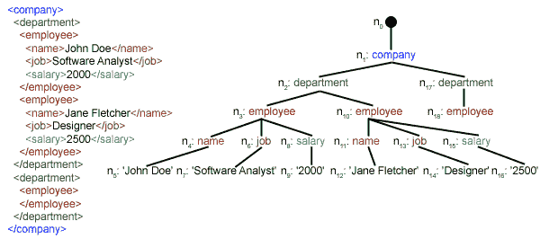
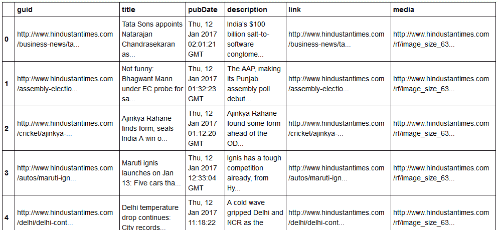

# Python 中的 XML 解析

> 原文:[https://www.geeksforgeeks.org/xml-parsing-python/](https://www.geeksforgeeks.org/xml-parsing-python/)

本文主要讨论如何解析给定的 XML 文件，并以结构化的方式从中提取一些有用的数据。

**XML:** XML 代表可扩展标记语言。它被设计用来存储和传输数据。它被设计成人类可读和机器可读的。这就是为什么，XML 的设计目标强调互联网上的简单性、通用性和可用性。
本教程中要解析的 XML 文件实际上是一个 RSS 提要。

**RSS:** RSS(Rich Site Summary，通常称为真正简单的联合)使用一系列标准的网络订阅源格式来发布经常更新的信息，如博客条目、新闻标题、音频和视频。RSS 是 XML 格式的纯文本。

*   无论是自动化过程还是人类，RSS 格式本身都相对容易阅读。
*   本教程中处理的 RSS 是来自热门新闻网站的顶级新闻故事的 RSS 源。你可以在这里查看一下[。我们的目标是处理这个 RSS 提要(或 XML 文件)，并将其保存为其他格式以备将来使用。](http://www.hindustantimes.com/rss/topnews/rssfeed.xml)

**使用的 python 模块:**本文将重点介绍在 Python 中使用内置的 [xml](https://docs.python.org/2/library/xml.html) 模块来解析 xml，主要重点将放在该模块的 [ElementTree XML API](https://docs.python.org/2/library/xml.etree.elementtree.html) 上。

**实施:**

```
#Python code to illustrate parsing of XML files
# importing the required modules
import csv
import requests
import xml.etree.ElementTree as ET

def loadRSS():

    # url of rss feed
    url = 'http://www.hindustantimes.com/rss/topnews/rssfeed.xml'

    # creating HTTP response object from given url
    resp = requests.get(url)

    # saving the xml file
    with open('topnewsfeed.xml', 'wb') as f:
        f.write(resp.content)

def parseXML(xmlfile):

    # create element tree object
    tree = ET.parse(xmlfile)

    # get root element
    root = tree.getroot()

    # create empty list for news items
    newsitems = []

    # iterate news items
    for item in root.findall('./channel/item'):

        # empty news dictionary
        news = {}

        # iterate child elements of item
        for child in item:

            # special checking for namespace object content:media
            if child.tag == '{http://search.yahoo.com/mrss/}content':
                news['media'] = child.attrib['url']
            else:
                news[child.tag] = child.text.encode('utf8')

        # append news dictionary to news items list
        newsitems.append(news)

    # return news items list
    return newsitems

def savetoCSV(newsitems, filename):

    # specifying the fields for csv file
    fields = ['guid', 'title', 'pubDate', 'description', 'link', 'media']

    # writing to csv file
    with open(filename, 'w') as csvfile:

        # creating a csv dict writer object
        writer = csv.DictWriter(csvfile, fieldnames = fields)

        # writing headers (field names)
        writer.writeheader()

        # writing data rows
        writer.writerows(newsitems)

def main():
    # load rss from web to update existing xml file
    loadRSS()

    # parse xml file
    newsitems = parseXML('topnewsfeed.xml')

    # store news items in a csv file
    savetoCSV(newsitems, 'topnews.csv')

if __name__ == "__main__":

    # calling main function
    main()
```

上述代码将:

*   从指定的网址加载 RSS 源，并将其保存为一个 XML 文件。
*   解析 XML 文件，将新闻保存为字典列表，其中每个字典都是一个新闻项目。
*   将新闻项目保存到 CSV 文件中。

让我们试着理解代码的各个部分:

*   **Loading and saving RSS feed**

    ```
    def loadRSS():
        # url of rss feed
        url = 'http://www.hindustantimes.com/rss/topnews/rssfeed.xml'
        # creating HTTP response object from given url
        resp = requests.get(url)
        # saving the xml file
        with open('topnewsfeed.xml', 'wb') as f:
            f.write(resp.content)
    ```

    在这里，我们首先通过向 RSS 提要的 URL 发送一个 HTTP 请求来创建一个 HTTP 响应对象。响应的内容现在包含我们保存为本地目录中的 **topnewsfeed.xml** 的 XML 文件数据。
    有关请求模块如何工作的更多信息，请阅读本文:
    [使用 Python 获取和发布请求](https://www.geeksforgeeks.org/get-post-requests-using-python/) 

*   **Parsing XML** We have created **parseXML()** function to parse XML file. We know that XML is an inherently hierarchical data format, and the most natural way to represent it is with a tree. Look at the image below for example:
    [](https://media.geeksforgeeks.org/wp-content/cdn-uploads/parsing-XML.gif)

    这里，我们使用的是 **xml.etree.ElementTree** (简称 ET)模块。为此，元素树有两个类-**元素树**将整个 XML
    文档表示为一棵树，**元素**表示该树中的单个节点。与整个文档的交互(读写文件)通常在**元素树**级别完成。与单个 XML 元素及其子元素的交互是在**元素**级别完成的。

    好了，现在让我们来看看 **parseXML()** 函数:

    ```
    tree = ET.parse(xmlfile)
    ```

    这里，我们通过解析传递的**XML 文件来创建一个**元素树**对象。**

    ```
    root = tree.getroot()
    ```

    **getroot()** 函数返回**树**的根作为**元素**对象。

    ```
    for item in root.findall('./channel/item'):
    ```

    现在，一旦您看了一下您的 XML 文件的结构，您会注意到我们只对**项**元素感兴趣。
    **。/channel/item** 实际上是 [XPath](https://www.w3.org/TR/xpath/) 语法(XPath 是一种用于寻址 XML 文档各部分的语言)。在这里，我们要找到**通道**的所有**项**子级**根**的子级(用“.”表示))元素。
    您可以在这里阅读更多关于支持的 XPath 语法[的信息。](https://docs.python.org/2/library/xml.etree.elementtree.html#supported-xpath-syntax)

    ```
    for item in root.findall('./channel/item'):

            # empty news dictionary
            news = {}

            # iterate child elements of item
            for child in item:

                # special checking for namespace object content:media
                if child.tag == '{http://search.yahoo.com/mrss/}content':
                    news['media'] = child.attrib['url']
                else:
                    news[child.tag] = child.text.encode('utf8')

            # append news dictionary to news items list
            newsitems.append(news)
    ```

    现在，我们知道我们正在迭代**项**元素，其中每个**项**元素包含一条新闻。因此，我们创建了一个空的**新闻**字典，我们将在其中存储关于新闻条目的所有可用数据。要遍历元素的每个子元素，我们只需遍历它，如下所示:

    ```
    for child in item:
    ```

    现在，请注意这里的一个示例项元素:
    [](https://media.geeksforgeeks.org/wp-content/cdn-uploads/16-1.png)

    我们将不得不单独处理名称空间标签，因为它们在解析时会扩展到它们的原始值。所以，我们这样做:

    ```
    if child.tag == '{http://search.yahoo.com/mrss/}content':
                    news['media'] = child.attrib['url']
    ```

    **child.attrib** 是与元素相关的所有属性的字典。这里，我们对**媒体:内容**命名空间标签的 **url** 属性感兴趣。
    现在，对于所有其他孩子，我们只需做:

    ```
    news[child.tag] = child.text.encode('utf8')
    ```

    **child.tag** 包含子元素的名称。 **child.text** 存储该子元素中的所有文本。最后，一个示例项元素被转换为字典，如下所示:

    ```
    {'description': 'Ignis has a tough competition already, from Hyun.... ,
     'guid': 'http://www.hindustantimes.com/autos/maruti-ignis-launch.... ,
     'link': 'http://www.hindustantimes.com/autos/maruti-ignis-launch.... ,
     'media': 'http://www.hindustantimes.com/rf/image_size_630x354/HT/... ,
     'pubDate': 'Thu, 12 Jan 2017 12:33:04 GMT ',
     'title': 'Maruti Ignis launches on Jan 13: Five cars that threa..... }
    ```

    然后，我们简单地将这个 dict 元素添加到列表**新闻条目**中。
    最后，这个列表被返回。

*   **将数据保存到 CSV 文件** 现在，我们只需将新闻项目列表保存到 CSV 文件中，以便将来可以使用**savetosv()**功能轻松使用或修改。要了解更多关于将字典元素写入 CSV 文件的信息，请浏览本文:
    [在 Python 中处理 CSV 文件](https://www.geeksforgeeks.org/working-csv-files-python/) [](https://www.geeksforgeeks.org/working-csv-files-python/) 

现在，我们的格式化数据是这样的:
[](https://media.geeksforgeeks.org/wp-content/cdn-uploads/result.png)

如您所见，分层的 XML 文件数据已经转换为简单的 CSV 文件，因此所有新闻故事都以表格的形式存储。这也使得扩展数据库变得更加容易。
同样，人们可以在他们的应用程序中直接使用类似 JSON 的数据！这是从不提供公共应用编程接口但提供一些 RSS 源的网站中提取数据的最佳选择。

以上文章中用到的所有代码和文件都可以在[这里](https://github.com/nikhilkumarsingh/geeksforgeeks/tree/master/xml_parsing)找到。

**接下来呢？**

*   你可以看看上面例子中使用的新闻网站的更多 rss 源。您也可以尝试通过解析其他 rss 源来创建上述示例的扩展版本。
*   你是板球迷吗？那么[这个](http://synd.cricbuzz.com/j2me/1.0/livematches.xml) rss 提要一定是你感兴趣的！您可以解析这个 XML 文件来获取关于现场板球比赛的信息，并用于制作桌面通知程序！

**[HTML 和 XML 小测验](https://www.geeksforgeeks.org/html-and-xml-gq/)**

本文由**尼克尔·库马尔供稿。**如果你喜欢 GeeksforGeeks 并想投稿，你也可以写一篇文章，把你的文章邮寄到 review-team@geeksforgeeks.org。看到你的文章出现在极客博客主页上，帮助其他极客。

如果您发现任何不正确的地方，或者您想分享更多关于上面讨论的主题的信息，请写评论