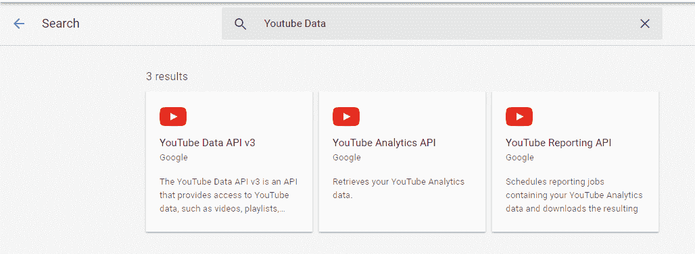
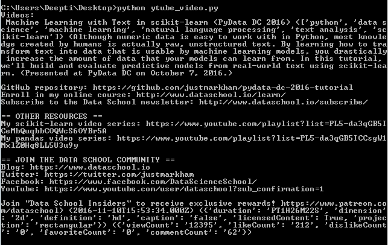
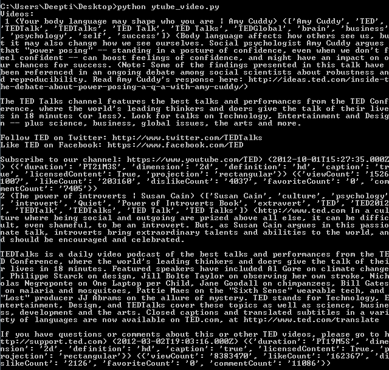

# 处理视频的 Youtube 数据 API | Set-1

> 原文:[https://www . geesforgeks . org/YouTube-data-API-for-handling-videos-set-1/](https://www.geeksforgeeks.org/youtube-data-api-for-handling-videos-set-1/)

在继续下一步之前，让我们看一下视频部分的内容。Youtube 数据应用编程接口允许对视频执行以下操作:

*   目录
*   插入
*   更新
*   速度
*   获取评级
*   举报虐待行为
*   删除

我们来讨论一下如何使用 Youtube 数据 API 来处理视频。

请按照以下步骤启用该应用编程接口并开始使用它。

1.  **创建新项目，启用 API 并创建凭据:**在此步骤中，我们将创建一个项目并启用 API。
    *   进入[谷歌开发者控制台](https://developers.google.com/)，点击页面右上角**登录**。使用有效谷歌帐户的凭据登录。如果您没有谷歌帐户，请先设置一个帐户，然后使用详细信息登录谷歌开发者主页。
    *   现在导航到开发人员仪表板并创建一个新项目。
    *   单击启用应用编程接口选项。
    *   In the search field, search for Youtube Data API and select the Youtube Data API option that comes in the drop down list.

        

    *   您将被重定向到一个屏幕，显示关于 **Youtube 数据应用编程接口**的信息，以及两个选项:*启用和尝试应用编程接口*
    *   点击*启用*选项开始使用应用编程接口。
    *   在边栏中的“应用程序接口和服务”下，选择“凭据”。
    *   在“凭据”选项卡中，选择“创建凭据”下拉列表，然后选择“应用编程接口密钥”。
        凭证有两种类型: **API 密钥**和 **OAuth** 。OAuth 以`.json`文件的形式为您提供客户端 Id 和密钥。OAuth 通常用于需要授权的地方，比如检索用户喜欢的视频。因此，对于不需要授权的其他情况，如使用关键字搜索视频或搜索相关视频等，我们将使用应用编程接口密钥。
2.  **安装:**python 的谷歌 API 客户端可以使用简单的 **pip** 命令:

    ```
    pip install --upgrade google-api-python-client
    ```

    进行安装

**列表方式编码:**

1.  **List video by Video Id:** Below example shows how to retrieve details about a specific video identified by the video Id mentioned in the parameter list.

    ```
    # import libraries
    from googleapiclient.discovery import build
    import pprint

    # arguments to be passed to build function
    DEVELOPER_KEY = "Your_developer_key"
    YOUTUBE_API_SERVICE_NAME = "youtube"
    YOUTUBE_API_VERSION = "v3"

    # creating youtube resource object
    # for interacting with API
    youtube = build(YOUTUBE_API_SERVICE_NAME, 
                         YOUTUBE_API_VERSION,
                developerKey = DEVELOPER_KEY)

    def video_details(video_id):

        # Call the videos.list method
        # to retrieve video info
        list_videos_byid = youtube.videos().list(id = video_id,
              part = "id, snippet, contentDetails, statistics",
                                                   ).execute()

     # extracting the results from search response
        results = list_videos_byid.get("items", [])

        # empty list to store video details
        videos = []

        for result in results:
            videos.append("(% s) (% s) (% s) (% s) (% s) (% s)" % (result["snippet"]["title"],
                                                                  result["snippet"]["tags"],
                                                                  result['snippet']['description'],
                                                                  result["snippet"]["publishedAt"],
                                                                  result['contentDetails'], 
                                                                  result["statistics"]))

        print("Videos:\n", "\n".join(videos), "\n")

    if __name__ == "__main__":

        video_id = "vTaxdJ6VYWE"
        video_details(video_id)
    ```

    **输出:**
    

2.  **List videos by Multiple Video Ids:** Below example shows how to retrieve information about multiple videos, identified by the multiple video Ids mentioned in the parameter list.

    ```
    # import libraries
    from googleapiclient.discovery import build
    import pprint

    # arguments to be passed to build function
    DEVELOPER_KEY = "developer_key"
    YOUTUBE_API_SERVICE_NAME = "youtube"
    YOUTUBE_API_VERSION = "v3"

    # creating youtube resource 
    # object for interacting with API
    youtube = build(YOUTUBE_API_SERVICE_NAME,
                         YOUTUBE_API_VERSION,
                developerKey = DEVELOPER_KEY)

    def multiple_video_details():

        # Call the videos.list method
        # to retrieve video info
        list_videos_byid = youtube.videos().list(
                 id = 'Ks-_Mh1QhMc, c0KYU2j0TM4',
          part = "id, snippet, contentDetails, statistics",
                                      ).execute()

     # extracting the results from search response
        results = list_videos_byid.get("items", [])
        # empty list to store video details
        videos = []
        n = 1
        for result in results:
            videos.append(" (% s) (% s) (% s) (% s) (% s) (% s) " 
                                  % (n, result["snippet"]["title"],
                                        result["snippet"]["tags"],
                                        result['snippet']['description'],
                                        result["snippet"]["publishedAt"],
                                        result['contentDetails'],
                                        result["statistics"]))
            n = n + 1

        print ("Videos:\n", "\n".join(videos), "\n")

    if __name__ == "__main__":
        multiple_video_details()
    ```

    **输出:**
    

    **注意:**我们在上面的例子中只使用了有限的参数。还有许多其他参数可以设置，如果没有设置，那么可以从 [Youtube 视频列表文档](https://developers.google.com/youtube/v3/docs/videos/list)中找到它们的默认值。请参考文档以全面了解可用参数。

    **参考:**T2】https://developers.google.com/youtube/v3/docs/videos/list