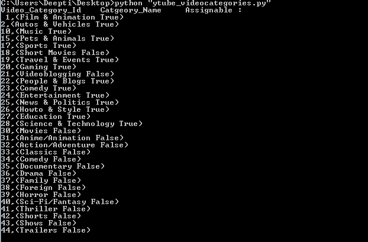
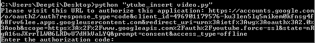
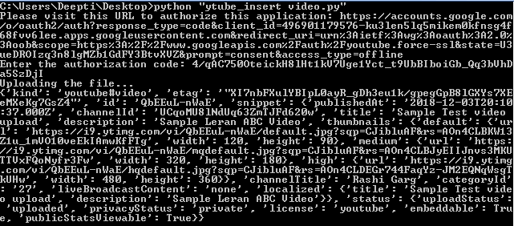
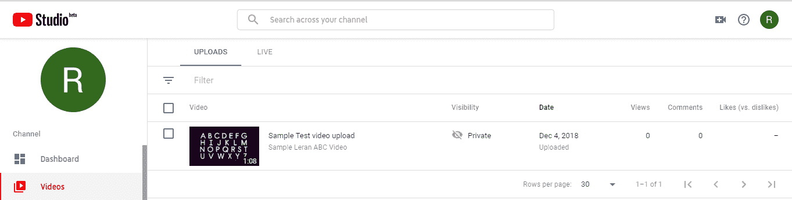

# 处理视频的 Youtube 数据 API | Set-3

> 原文:[https://www . geesforgeks . org/YouTube-data-API-for-handling-videos-set-3/](https://www.geeksforgeeks.org/youtube-data-api-for-handling-videos-set-3/)

前提条件:处理视频的 Youtube 数据 API |[Set-1](https://www.geeksforgeeks.org/youtube-data-api-for-handling-videos-set-1/)、 [Set-2](https://www.geeksforgeeks.org/youtube-data-api-for-handling-videos-set-2/)

在继续之前，首先看看如何获得有效的视频类别列表，以确定将视频放在哪个类别中。例如，我们使用了`regionCode`参数的“输入”值。您可以使用任何其他值。只有`assignable`参数值为“真”的类别才能用于视频插入或更新。

让我们讨论一下如何在授权用户的账户 youtube 账户中插入视频。

**查找有效视频类别:**

```py
# importing library
from apiclient.discovery import build

# Arguments that need to passed
# to the build function
DEVELOPER_KEY = "API_key" 
YOUTUBE_API_SERVICE_NAME = "youtube"
YOUTUBE_API_VERSION = "v3"

# creating Youtube Resource Object
youtube_object = build(YOUTUBE_API_SERVICE_NAME, 
                            YOUTUBE_API_VERSION,
                   developerKey = DEVELOPER_KEY)

def youtube_video_categories():

    # calling the videoCategory.list method
    # to retrieve youtube video categories result
    video_category = youtube_object.videoCategories(
       ).list(part ='snippet', regionCode ='IN').execute()

    # extracting the results
    # from video_category response
    results = video_category.get("items", [])

    # empty list to store video category metadata
    videos_categories = []

    # extracting required info
    # from each result object
    for result in results:

        # video_categories result object
        videos_categories.append("% s, (% s % s)"
                   %(result["id"],
                   result["snippet"]["title"],
                   result["snippet"]["assignable"]))

    print ("Video_Category_Id Catgeory_Name     Assignable :\n",
                          "\n".join(videos_categories), "\n")

if __name__ == "__main__":
    youtube_video_categories()
```

**输出:**


由于在授权用户的帐户中插入视频需要用户授权，因此我们将为本例创建 OAuth 类型的凭据。按照以下步骤生成客户端标识和密钥。

1.  进入谷歌[谷歌开发者控制台](https://developers.google.com/)，点击页面右上角的登录。使用有效谷歌帐户的凭据登录。如果您没有谷歌帐户，请先设置一个帐户，然后使用详细信息登录谷歌开发者主页。
2.  现在导航到[开发者仪表盘](https://console.developers.google.com/apis/credentials?project=norse-strata-223521)并创建一个新项目。
3.  单击启用应用编程接口选项。
4.  在搜索字段中，搜索 Youtube 数据应用编程接口，并选择下拉列表中的 Youtube 数据应用编程接口选项。
    
5.  您将被重定向到一个屏幕，显示关于 Youtube 数据应用编程接口的信息，以及两个选项:启用和尝试应用编程接口。
6.  单击启用选项开始使用应用编程接口。
7.  在边栏中的“应用程序接口和服务”下，选择“凭据”。
8.  在页面顶部，选择“审核同意”屏幕选项卡。选择电子邮件地址，输入产品名称(如果尚未设置)，然后单击保存按钮。
9.  在“凭据”选项卡中，选择“创建凭据”下拉列表，然后选择“验证客户端标识”。OAuth 通常用于需要授权的地方，比如检索用户喜欢的视频。
10.  选择应用类型其他，输入名称“YouTube 数据 API 我的视频”，点击创建按钮。
11.  单击确定。
12.  点击客户端标识右侧的下载按钮，下载 JSON 文件。
13.  将文件保存并重命名为`client_secret.json`并移动到工作目录。

使用`pip`命令安装附加库:

```py
pip install --upgrade google-auth google-auth-oauthlib google-auth-httplib2
```

我们下载了一个示例视频-学习 ABC，展示上传的工作原理。id、snippet.title 和 snippet.categoryId 是强制属性，其他都是可选的。

**插入视频:**这个例子展示了如何将视频上传到授权用户的账户。视频上传受以下限制:

1.  文件最大大小为 128 兆字节
2.  可接受的媒体 MIME 类型只有视频/*、应用程序/八位字节流

```py
# importing necessary libraries
import os
import urllib.request, urllib.parse, urllib.error
import http.client
import urllib.request
import urllib.error
import http.client
import httplib2
import random
import time
import google.oauth2.credentials
import google_auth_oauthlib.flow
from googleapiclient.discovery import build
from googleapiclient.errors import HttpError
from google_auth_oauthlib.flow import InstalledAppFlow
from apiclient.http import MediaFileUpload

# The CLIENT_SECRETS_FILE variable 
# specifies the name of a file that 
# contains client_id and client_secret.
CLIENT_SECRETS_FILE = "client_secret.json"

# This scope allows for full read /
# write access to the authenticated
# user's account and requires requests
# to use an SSL connection.
SCOPES = ['https://www.googleapis.com/auth/youtube.force-ssl']
API_SERVICE_NAME = 'youtube'
API_VERSION = 'v3'

def get_authenticated_service():
flow = InstalledAppFlow.from_client_secrets_file(
                     CLIENT_SECRETS_FILE, SCOPES)

credentials = flow.run_console()
return build(API_SERVICE_NAME, API_VERSION,
                credentials = credentials)

# Here we are telling HTTP Transport
# Library not to retry the video upload.
httplib2.RETRIES = 1

# MAX_RETRIES specifies the maximum number
# of retries that can done before giving up.
MAX_RETRIES = 10

# Always retry when these exceptions are raised.
RETRIABLE_EXCEPTIONS = (httplib2.HttpLib2Error, IOError,
                        http.client.NotConnected,
                        http.client.IncompleteRead,
                        http.client.ImproperConnectionState,
                        http.client.CannotSendRequest,
                        http.client.CannotSendHeader,
                        http.client.ResponseNotReady,
                        http.client.BadStatusLine)

# Always retry when an apiclient.errors.HttpError
# with one of these status codes is raised.
RETRIABLE_STATUS_CODES = [500, 502, 503, 504]

# This method implements an exponential
# backoff strategy to resume a failed upload.
def resumable_upload(request, resource, method):
response = None
error = None
retry = 0

while response is None:
    try:

    print("Uploading the file...")
    status, response = request.next_chunk()

    if response is not None:

        if method == 'insert' and 'id' in response:
            print(response)
        elif method != 'insert' or 'id' not in response:
            print(response)
        else:
            exit("The file upload failed with an\
            unexpected response: % s" % response)

    except HttpError as e:
    if e.resp.status in RETRIABLE_STATUS_CODES:
        error = "A retriable HTTP error % d occurred:\n % s"
                                % (e.resp.status, e.content)
    else:
        raise
    except RETRIABLE_EXCEPTIONS as e:
        error = "A retriable error occurred: % s" % e

    if error is not None:
        print(error)
    retry += 1

    if retry > MAX_RETRIES:
        exit("No longer attempting to retry.")

    max_sleep = 2 ** retry
    sleep_seconds = random.random() * max_sleep

    print(("Sleeping % f seconds and then retrying..."
                                    % sleep_seconds))
    time.sleep(sleep_seconds)

def print_response(response):
    print(response)

# Build a resource based on a list of 
# properties given as key-value pairs.
# Leave properties with empty values
# out of the inserted resource.
def build_resource(properties):

    resource = {}
    for p in properties:

        # Given a key like "snippet.title", split into
        # "snippet" and "title", where
        # "snippet" will be an object and "title"
        # will be a property in that object.
        prop_array = p.split('.')
        ref = resource
        for pa in range(0, len(prop_array)):
        is_array = False
        key = prop_array[pa]

        # For properties that have array values,
        # convert a name like "snippet.tags[]" to 
        # snippet.tags, and set a flag to handle
        # the value as an array.
        if key[-2:] == '[]':
            key = key[0:len(key)-2:]
            is_array = True

        if pa == (len(prop_array) - 1):

            # Leave properties without values
            # out of inserted resource.
            if properties[p]:
                if is_array:
                    ref[key] = properties[p].split(', ')
                else:
                    ref[key] = properties[p]

        elif key not in ref:
            # For example, the property is "snippet.title",
            # but the resource does not yet have a "snippet" 
            # object. Create the snippet object here.
            # Setting "ref = ref[key]" means that in the
            # next time through the "for pa in range ..." loop,
            # we will be setting a property in the
            # resource's "snippet" object.
            ref[key] = {}
            ref = ref[key]
        else:
            # For example, the property is "snippet.description",
            # and the resource already has a "snippet" object.
            ref = ref[key]
    return resource

# Remove keyword arguments that are not set
def remove_empty_kwargs(**kwargs):
    good_kwargs = {}

    if kwargs is not None:
        for key, value in list(kwargs.items()):
            if value:
                good_kwargs[key] = value
    return good_kwargs

def videos_insert(client, properties, media_file, **kwargs):
    resource = build_resource(properties) 
    kwargs = remove_empty_kwargs(**kwargs) 
    request = client.videos().insert(body = resource,
               media_body = MediaFileUpload(media_file,
         chunksize =-1, resumable = True), **kwargs)

    return resumable_upload(request, 'video', 'insert')

if __name__ == '__main__':

    # When running locally, disable OAuthlib's
    # HTTPs verification. When running in production
    # * do not * leave this option enabled.
    os.environ['OAUTHLIB_INSECURE_TRANSPORT'] = '1'
    client = get_authenticated_service()
    media_file = 'videoplayback.3gp'

    if not os.path.exists(media_file):
        exit('Please specify the complete valid file location.')

    videos_insert(client, 
        {'snippet.categoryId': '27',
        'snippet.defaultLanguage': '',
        'snippet.description': 'Sample Leran ABC Video',
        'snippet.tags[]': '',
        'snippet.title': 'Sample Test video upload',
        'status.embeddable': '',
        'status.license': '',
        'status.privacyStatus': 'private',
        'status.publicStatsViewable': ''},
        media_file,
        part ='snippet, status')
```

**输出:**

当执行代码时，它会要求授权代码。要获取代码，您需要遵循命令行上方的命令提示符屏幕中提到的链接:输入授权代码。


现在，按照链接复制并粘贴授权代码，您将通过授予权限获得该代码。




现在你可以从使用过的账号上看到，它显示视频已经上传。


**参考文献:**

*   [https://developers.google.com/youtube/v3/docs/videos/insert](https://developers.google.com/youtube/v3/docs/videos/insert)
*   [https://developers . Google . com/YouTube/v3/docs/video categories/list](https://developers.google.com/youtube/v3/docs/videoCategories/list)