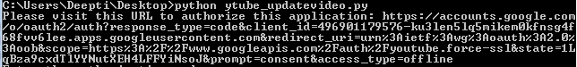
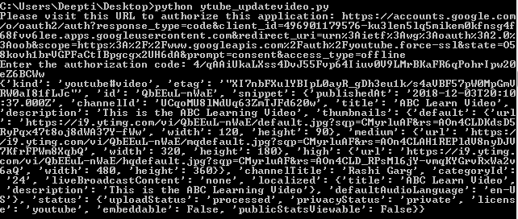
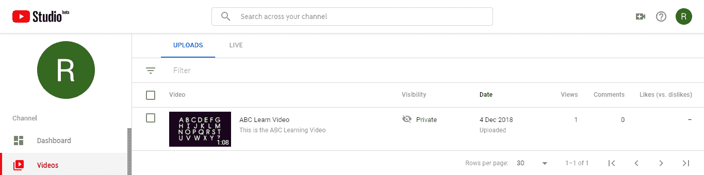
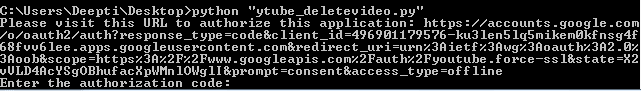
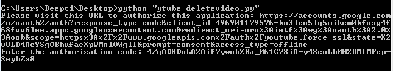
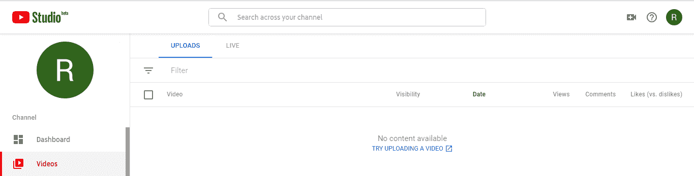

# 处理视频的 Youtube 数据 API | Set-4

> 原文:[https://www . geesforgeks . org/YouTube-data-API-for-handling-videos-set-4/](https://www.geeksforgeeks.org/youtube-data-api-for-handling-videos-set-4/)

前提条件:处理视频的 Youtube 数据 API |[Set-1](https://www.geeksforgeeks.org/youtube-data-api-for-handling-videos-set-1/)、 [Set-2](https://www.geeksforgeeks.org/youtube-data-api-for-handling-videos-set-2/) 、 [Set-3](https://www.geeksforgeeks.org/youtube-data-api-for-handling-videos-set-3/)

在本文中，我们将讨论与视频相关的两种方法:更新视频、删除视频。

更新视频和删除上传的视频需要用户授权，因此我们将为本例创建 OAuth 类型的凭据。按照以下步骤生成客户端标识和密钥。

1.  进入谷歌[谷歌开发者控制台](https://developers.google.com/)，点击页面右上角的登录。使用有效谷歌帐户的凭据登录。如果您没有谷歌帐户，请先设置一个帐户，然后使用详细信息登录谷歌开发者主页。
2.  现在导航到[开发者仪表盘](https://console.developers.google.com/apis/credentials?project=norse-strata-223521)并创建一个新项目。
3.  单击启用应用编程接口选项。
4.  在搜索字段中，搜索 Youtube 数据应用编程接口，并选择下拉列表中的 Youtube 数据应用编程接口选项。
    
5.  您将被重定向到一个屏幕，显示关于 Youtube 数据应用编程接口的信息，以及两个选项:启用和尝试应用编程接口。
6.  单击启用选项开始使用应用编程接口。
7.  在边栏中的“应用程序接口和服务”下，选择“凭据”。
8.  在页面顶部，选择“审核同意”屏幕选项卡。选择电子邮件地址，输入产品名称(如果尚未设置)，然后单击保存按钮。
9.  在“凭据”选项卡中，选择“创建凭据”下拉列表，然后选择“验证客户端标识”。OAuth 通常用于需要授权的地方，比如检索用户喜欢的视频。
10.  选择应用类型其他，输入名称“YouTube 数据 API 我的视频”，点击创建按钮，点击确定。
11.  点击客户端标识右侧的下载按钮，下载 JSON 文件。
12.  将文件保存并重命名为 client_secret.json，并将其移动到工作目录。

使用 **pip** 命令安装附加库:

```
pip install --upgrade google-auth google-auth-oauthlib google-auth-httplib2
```

**更新视频的代码:**这个例子展示了如何使用 ID(视频 Id)作为 Key 属性来更新视频属性。我们已经更新了之前上传的视频的属性。进行以下更新:

*   类别 1:从 27(教育)更改为 24(娱乐)
*   描述:从“学习 ABC 视频示例”更改为“这是 ABC 学习视频”
*   标题:由“样张测试视频上传”改为“ABC 学习视频”

属性 id、snippet.title、snippet.categoryId 是必需的，所有其他属性都是可选的。视频 Id 可以通过在 youtube 中播放视频并复制粘贴出现在=符号后的字母数字序列来确定。例如，在网址-https://www.youtube.com/watch?v=rfscVS0vtbw(视频标识为–rfscVS0vtbw)。

下面是代码:

```
import os
import google.oauth2.credentials
import google_auth_oauthlib.flow
from googleapiclient.discovery import build
from googleapiclient.errors import HttpError
from google_auth_oauthlib.flow import InstalledAppFlow

# The CLIENT_SECRETS_FILE variable specifies
# the name of a file that contains
# client_id and client_secret.
CLIENT_SECRETS_FILE = "client_secret.json"

# This scope allows for full read/write 
# access to the authenticated user's account
# and requires requests to use an SSL connection.
SCOPES = ['https://www.googleapis.com/auth/youtube.force-ssl']
API_SERVICE_NAME = 'youtube'
API_VERSION = 'v3'

def get_authenticated_service():
    flow = InstalledAppFlow.from_client_secrets_file(
                           CLIENT_SECRETS_FILE, SCOPES)

    credentials = flow.run_console()
    return build(API_SERVICE_NAME, API_VERSION, credentials = credentials)

def print_response(response):
    print(response)

# Build a resource based on a list of 
# properties given as key-value pairs.
# Leave properties with empty values
# out of the inserted resource.
def build_resource(properties):
    resource = {}

    for p in properties:
        # Given a key like "snippet.title", split
        # into "snippet" and "title", where
        # "snippet" will be an object and "title" 
        # will be a property in that object.
        prop_array = p.split('.')
        ref = resource
        for pa in range(0, len(prop_array)):
        is_array = False
        key = prop_array[pa]

        # For properties that have array values,
        # convert a name like "snippet.tags[]" to
        # snippet.tags, and set a flag to handle
        # the value as an array.
        if key[-2:] == '[]':
            key = key[0:len(key)-2:]
            is_array = True

        if pa == (len(prop_array) - 1):

            # Leave properties without values
            # out of inserted resource.
            if properties[p]:
            if is_array:
                ref[key] = properties[p].split(', ')
            else:
                ref[key] = properties[p]

        elif key not in ref:
            # For example, the property is "snippet.title",
            # but the resource does not yet have a "snippet"
            # object. Create the snippet object here.
            # Setting "ref = ref[key]" means that in the
            # next time through the "for pa in range ..." loop,
            # we will be setting a property in the
            # resource's "snippet" object.
            ref[key] = {}
            ref = ref[key]
        else:
            # For example, the property is
            # "snippet.description", and the resource
            # already has a "snippet" object.
            ref = ref[key]
    return resource

# Remove keyword arguments that are not set
def remove_empty_kwargs(**kwargs):
    good_kwargs = {}
    if kwargs is not None:
        for key, value in kwargs.items():
        if value:
            good_kwargs[key] = value
    return good_kwargs

def videos_update(client, properties, **kwargs):
    resource = build_resource(properties)
    kwargs = remove_empty_kwargs(**kwargs)
    response = client.videos().update(
        body = resource, **kwargs).execute()

    return print_response(response)

if __name__ == '__main__':

    # When running locally, disable
    # OAuthlib's HTTPs verification. 
    # When running in production * do not * 
    # leave this option enabled.
    os.environ['OAUTHLIB_INSECURE_TRANSPORT'] = '1'
    client = get_authenticated_service()

    # We will be changing categoryId, Description
    # and Title of the video specified using videoID
    videos_update(client, 
        {'id': 'QbEEuL-nWaE',
        'snippet.categoryId': '24',
        'snippet.defaultLanguage': '',
        'snippet.description': 'This is the ABC Learning Video',
        'snippet.tags[]': '',
        'snippet.title': 'ABC Learn Video',
        'status.privacyStatus': ''},
        part ='snippet, status')

```

**输出:**

当您执行代码时，您将被要求输入授权代码。要获取代码，您需要遵循命令行上方的命令提示符屏幕中提到的链接:输入授权代码。


现在，按照链接复制并粘贴授权代码，您将通过授予权限获得该代码。




我已经附上了两个程序的输出插入视频和更新视频。通过比较图像可以看出，视频的标题和描述有变化。




**删除视频的代码:**这个例子展示了如何从授权用户的账户中删除视频。必须提供 id 参数。

```
import os
import google.oauth2.credentials
import google_auth_oauthlib.flow
from googleapiclient.discovery import build
from googleapiclient.errors import HttpError
from google_auth_oauthlib.flow import InstalledAppFlow

# The CLIENT_SECRETS_FILE variable specifies the name of a file that contains
# client_id and client_secret.
CLIENT_SECRETS_FILE = "client_secret.json"

# This scope allows for full read / write access to the
# authenticated user's account and requires requests to use an SSL connection.
SCOPES = ['https://www.googleapis.com/auth/youtube.force-ssl']
API_SERVICE_NAME = 'youtube'
API_VERSION = 'v3'

def get_authenticated_service():
    flow = InstalledAppFlow.from_client_secrets_file(
                          CLIENT_SECRETS_FILE, SCOPES)
    credentials = flow.run_console()
    return build(API_SERVICE_NAME, API_VERSION, credentials = credentials)

def print_response(response):
    print(response)

# Remove keyword arguments that are not set
def remove_empty_kwargs(**kwargs):
    good_kwargs = {}
    if kwargs is not None:
        for key, value in kwargs.items():
        if value:
            good_kwargs[key] = value
    return good_kwargs

def videos_delete(client, **kwargs):

    kwargs = remove_empty_kwargs(**kwargs)

    response = client.videos().delete(
                    **kwargs).execute()

    return print_response(response)

if __name__ == '__main__':

    # When running locally, disable OAuthlib's
    # HTTPs verification. When running in production
    # * do not * leave this option enabled.
    os.environ['OAUTHLIB_INSECURE_TRANSPORT'] = '1'
    client = get_authenticated_service()

    videos_delete(client, id ='QbEEuL-nWaE',
                onBehalfOfContentOwner ='')
```

**输出:**

当您执行代码时，您将被要求输入授权代码。要获取代码，您需要遵循命令行上方的命令提示符屏幕中提到的链接:输入授权代码。


现在，按照链接复制并粘贴授权代码，您将通过授予权限获得该代码。




从账号可以看到，上传区没有视频。


**参考文献:**

1.  https://developers.google.com/youtube/v3/docs/videos/update
2.  https://developers.google.com/youtube/v3/docs/videos/delete