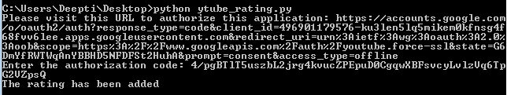
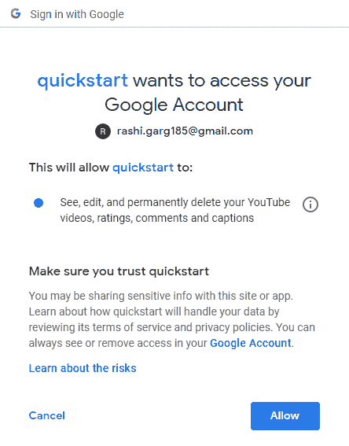
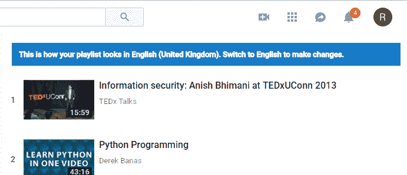
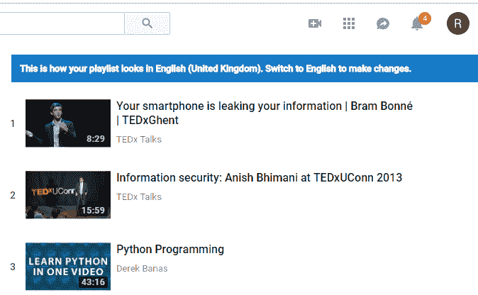
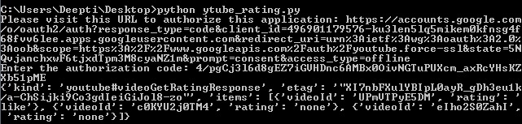

# 处理视频的 Youtube 数据 API | Set-5

> 原文:[https://www . geesforgeks . org/YouTube-data-API-for-handling-videos-set-5/](https://www.geeksforgeeks.org/youtube-data-api-for-handling-videos-set-5/)

前提条件:处理视频的 Youtube 数据 API |[Set-1](https://www.geeksforgeeks.org/youtube-data-api-for-handling-videos-set-1/)、 [Set-2](https://www.geeksforgeeks.org/youtube-data-api-for-handling-videos-set-2/) 、 [Set-3](https://www.geeksforgeeks.org/youtube-data-api-for-handling-videos-set-3/)

在本文中，我们将讨论给视频评分和获取视频评分。

本文中的示例将要求用户授权。因此，我们将首先创建 OAuth 凭据并安装其他库。
按照以下步骤生成客户端标识和密钥。

1.  进入谷歌[谷歌开发者控制台](https://developers.google.com/)，点击页面右上角的登录。使用有效谷歌帐户的凭据登录。如果您没有谷歌帐户，请先设置一个帐户，然后使用详细信息登录谷歌开发者主页。
2.  现在导航到[开发者仪表盘](https://console.developers.google.com/apis/credentials?project=norse-strata-223521)并创建一个新项目。
3.  单击启用应用编程接口选项。
4.  在搜索字段中，搜索 Youtube 数据应用编程接口，并选择下拉列表中的 Youtube 数据应用编程接口选项。
    
5.  您将被重定向到一个显示关于 Youtube 数据应用编程接口信息的屏幕，以及两个选项:**启用和尝试应用编程接口**。
6.  单击启用选项开始使用应用编程接口。
7.  在边栏中的“应用程序接口和服务”下，选择“凭据”。
8.  在页面顶部，选择“审核同意”屏幕选项卡。选择电子邮件地址，输入产品名称(如果尚未设置)，然后单击保存按钮。
9.  在“凭据”选项卡中，选择“创建凭据”下拉列表，然后选择“验证客户端标识”。OAuth 通常用于需要授权的地方，比如检索用户喜欢的视频。
10.  选择应用类型其他，输入名称“YouTube 数据 API 我的视频”，点击创建按钮，点击确定。
11.  点击客户端标识右侧的下载按钮，下载 JSON 文件。
12.  将文件保存并重命名为`client_secret.json`并移动到工作目录。

使用 **pip** 命令安装附加库:

```
pip install --upgrade google-auth google-auth-oauthlib google-auth-httplib2
```

**给视频评分的代码:**这个例子展示了如何给视频评分。在这个例子中，我们正在给一个视频评分。在这里你有三个选项可以尝试:喜欢、不喜欢和无(意味着从视频中删除喜欢/不喜欢任一类型的评分)。

```
import argparse
import os
import re
import urllib.request
import urllib.error
import google.oauth2.credentials
import google_auth_oauthlib.flow
from googleapiclient.discovery import build
from googleapiclient.errors import HttpError
from google_auth_oauthlib.flow import InstalledAppFlow

CLIENT_SECRETS_FILE = 'client_secret.json'

SCOPES = ['https://www.googleapis.com/auth/youtube.force-ssl']
API_SERVICE_NAME = 'youtube'
API_VERSION = 'v3'

def get_authenticated_service():
    flow = InstalledAppFlow.from_client_secrets_file(
                          CLIENT_SECRETS_FILE, SCOPES)

    credentials = flow.run_console()
    return build(API_SERVICE_NAME, API_VERSION,
                    credentials = credentials)

def like_video(youtube):
    youtube.videos().rate(id ='ZmtLzRJh8n8',
                   rating ='like').execute()

# Driver Code
if __name__ == '__main__':

    youtube = get_authenticated_service()

    try:
        like_video(youtube)
    except urllib.error.HttpError as e:
        print ('An HTTP error %d occurred:\n % s'
                     %(e.resp.status, e.content))
    else:
        print ('The rating has been added')
```

**输出:**

当您执行代码时，您将被要求输入授权代码。要获取代码，您需要遵循命令行上方的命令提示符屏幕中提到的链接:输入授权代码。


现在，按照链接复制并粘贴授权代码，您将通过授予权限获得该代码。



从我的 Youtube 帐户的图片中，您可以看到相似视频列表中增加了一个。





**代码到 getRating:** 这个例子展示了如何检索授权用户给参数列表中视频列表的评级。

```
import os
import google.oauth2.credentials
import google_auth_oauthlib.flow
from googleapiclient.discovery import build
from googleapiclient.errors import HttpError
from google_auth_oauthlib.flow import InstalledAppFlow

# The CLIENT_SECRETS_FILE variable
# specifies the name of a file that
# contains the OAuth 2.0 information
# for this application, including its 
# client_id and client_secret.
CLIENT_SECRETS_FILE = "client_secret.json"

# This OAuth 2.0 access scope allows for
# full read/write access to the authenticated
# user's account and requires requests to 
# use an SSL connection.
SCOPES = ['https://www.googleapis.com/auth/youtube.force-ssl']
API_SERVICE_NAME = 'youtube'
API_VERSION = 'v3'

def get_authenticated_service():
    flow = InstalledAppFlow.from_client_secrets_file(
                         CLIENT_SECRETS_FILE, SCOPES)
    credentials = flow.run_console()
    return build(API_SERVICE_NAME, API_VERSION,
                      credentials = credentials)

def print_response(response):
    print(response)

# Remove keyword arguments that are not set
def remove_empty_kwargs(**kwargs):
    good_kwargs = {}

    if kwargs is not None:
        for key, value in kwargs.items():
        if value:
            good_kwargs[key] = value
    return good_kwargs

def videos_get_rating(client, **kwargs):
    # See full sample for function
    kwargs = remove_empty_kwargs(**kwargs)

    response = client.videos().getRating(
                        **kwargs).execute()

    return print_response(response)

if __name__ == '__main__':
    # When running locally, disable OAuthlib's
    # HTTPs verification. When running in 
    # production * do not * leave this option enabled.
    os.environ['OAUTHLIB_INSECURE_TRANSPORT'] = '1'
    client = get_authenticated_service()

    videos_get_rating(client,
        id ='UPmVTPyE5DM, c0KYU2j0TM4, eIho2S0ZahI',
        onBehalfOfContentOwner ='')

```

**输出:**

当您执行代码时，您将被要求输入授权代码。要获取代码，您需要遵循命令行上方的命令提示符屏幕中提到的链接:输入授权代码。


现在，按照链接复制并粘贴授权代码，您将通过授予权限获得该代码。




从输出中可以看到，其中一个视频的评分为“喜欢”，另外两个视频没有评分。

**参考文献:**

1.  https://developers.google.com/youtube/v3/docs/videos/rate
2.  https://developers.google.com/youtube/v3/docs/videos/getRating