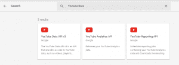
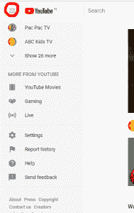
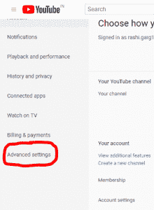

# Youtube 数据 API 播放列表| Set-1

> 原文:[https://www . geesforgeks . org/YouTube-data-API-playlist-set-1/](https://www.geeksforgeeks.org/youtube-data-api-playlist-set-1/)

在涵盖所有类型的搜索和视频方法后，我们将在本文中讨论播放列表。每个人一定都知道 Youtube 里有什么播放列表。使用 Youtube 数据应用编程接口检索播放列表有两种方法:

*   检索所有播放列表
*   检索我的播放列表

我们将用完整的代码和输出详细讨论这些方法。

按照以下步骤生成客户端标识和密钥。

*   进入谷歌[谷歌开发者控制台](https://developers.google.com/)点击页面右上角**登录**。使用有效谷歌帐户的凭据登录。如果您没有谷歌帐户，请先设置一个帐户，然后使用详细信息登录谷歌开发者主页。
*   现在导航到[开发者仪表盘](https://console.developers.google.com/apis/credentials?project=norse-strata-223521)并创建一个新项目。
*   点击**启用 API 选项**。
*   在搜索栏中，搜索 **Youtube 数据应用编程接口**，并选择下拉列表中的 Youtube 数据应用编程接口选项。



*   您将被重定向到一个显示关于 Youtube 数据应用编程接口信息的屏幕，以及两个选项:**启用和尝试应用编程接口**。
*   点击**启用**选项开始使用应用编程接口。
*   在侧栏的“应用程序接口和服务”下，选择**凭证**。
*   在页面顶部，选择**审核同意屏幕**选项卡。选择电子邮件地址，输入产品名称(如果尚未设置)，然后单击保存按钮。
*   在**凭证选项卡**中，选择创建凭证下拉列表，然后选择**验证客户端标识**。OAuth 通常用于需要授权的地方，比如检索用户喜欢的视频。
*   选择应用类型其他，输入名称“YouTube 数据 API 我的视频”，点击创建按钮，点击确定。
*   点击客户端 Id 右侧**下载按钮**下载 JSON 文件。
*   将文件保存并重命名为 client_secret.json，并将其移动到工作目录。

使用 **pip** 命令安装附加库:

```py
pip install --upgrade google-auth google-auth-oauthlib google-auth-httplib2
```

**注意:**我们忘记讨论的一件事是如何找到频道 Id，并在第一个代码中将其用作参数——列出与某个 Youtube 频道 Id 相关联的所有播放列表。

按照以下步骤查找频道标识:

*   登录您的 Youtube 帐户。
*   在左上角，单击三行图标并转到设置。



*   现在在左侧的同一菜单中，它将显示高级设置选项。



*   您将在**账户信息**下看到您的频道号。

**检索所有播放列表的代码:**此示例显示了如何检索由参数列表中提到的**频道**识别的 Youtube 频道拥有的所有播放列表。

## 蟒蛇 3

```py
import os
import google.oauth2.credentials
import google_auth_oauthlib.flow
from googleapiclient.discovery import build
from googleapiclient.errors import HttpError
from google_auth_oauthlib.flow import InstalledAppFlow

# The CLIENT_SECRETS_FILE variable specifies the name of a file that contains
# client_id and client_secret.
CLIENT_SECRETS_FILE = "client_secret.json"

# This scope allows for full read/write
# access to the authenticated user's account
# and requires requests to use an SSL connection.
SCOPES = ['https://www.googleapis.com/auth/youtube.force-ssl']
API_SERVICE_NAME = 'youtube'
API_VERSION = 'v3'

def get_authenticated_service():
  flow = InstalledAppFlow.from_client_secrets_file(CLIENT_SECRETS_FILE, SCOPES)
  credentials = flow.run_console()
  return build(API_SERVICE_NAME, API_VERSION, credentials = credentials)

def print_response(response):
  print(response)

# Build a resource based on a list of
# properties given as key-value pairs.
# Leave properties with empty values out
# of the inserted resource.
def build_resource(properties):
  resource = {}
  for p in properties:
    # Given a key like "snippet.title", split into
    # "snippet" and "title", where
    # "snippet" will be an object and "title"
    # will be a property in that object.
    prop_array = p.split('.')
    ref = resource
    for pa in range(0, len(prop_array)):
      is_array = False
      key = prop_array[pa]

      # For properties that have array values,
      # convert a name like "snippet.tags[]" to
      # snippet.tags, and set a flag to handle
      # the value as an array.
      if key[-2:] == '[]':
        key = key[0:len(key)-2:]
        is_array = True

      if pa == (len(prop_array) - 1):
        # Leave properties without values
        # out of inserted resource.
        if properties[p]:
          if is_array:
            ref[key] = properties[p].split(', ')
          else:
            ref[key] = properties[p]
      elif key not in ref:
        # For example, the property is "snippet.title", but the resource does
        # not yet have a "snippet" object. Create the snippet object here.
        # Setting "ref = ref[key]" means that in the next time through the
        # "for pa in range ..." loop, we will be setting a property in the
        # resource's "snippet" object.
        ref[key] = {}
        ref = ref[key]
      else:
        # For example, the property is "snippet.description",
        # and the resource already has a "snippet" object.
        ref = ref[key]
  return resource

# Remove keyword arguments that are not set
def remove_empty_kwargs(**kwargs):
  good_kwargs = {}
  if kwargs is not None:
    for key, value in kwargs.items():
      if value:
        good_kwargs[key] = value
  return good_kwargs

def playlists_list_by_channel_id(client, **kwargs):
  kwargs = remove_empty_kwargs(**kwargs)

  response = client.playlists().list(*kwargs).execute()

  return print_response(response)

if __name__ == '__main__':
  # When running locally, disable OAuthlib's
  # HTTPs verification. When running in production
  # * do not * leave this option enabled.
  os.environ['OAUTHLIB_INSECURE_TRANSPORT'] = '1'
  client = get_authenticated_service()

  playlists_list_by_channel_id(client,
    part ='snippet, contentDetails',

    # Replace with your Youtube Channel Id
    channelId ='UCqoMU8lNdUq63ZmTJFd620b',
    maxResults = 25)

```