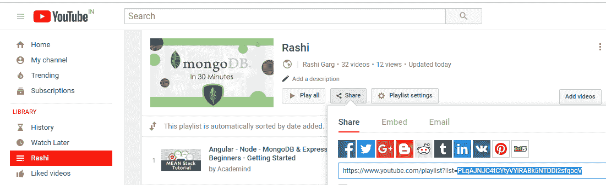
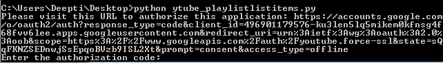
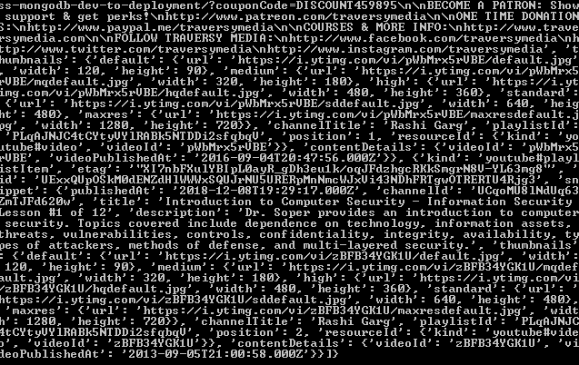
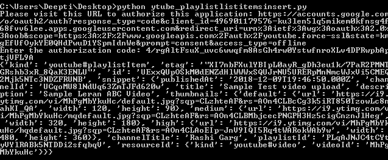

# Youtube 数据 API 播放列表| Set-3

> 原文:[https://www . geesforgeks . org/YouTube-data-API-playlist-set-3/](https://www.geeksforgeeks.org/youtube-data-api-playlist-set-3/)

从上一篇文章中，我们已经看到 API 可以用来插入、更新或删除播放列表。现在问题来了，一旦我们创建了播放列表，我们是否必须转到 Youtube，手动将视频添加到新创建的播放列表中。不！！！您所要做的就是使用 OAuth 凭据，只需知道播放列表 Id，就可以将视频添加到播放列表中。

我们可以找到想要使用的特定播放列表的播放列表标识。答案是——有两种方法可以找到身份证:

1.  第一种方法是使用我们在上一篇文章中讨论过的代码来列出您的所有播放列表。这将生成您拥有的播放列表列表，并在名称中提到 Id。
2.  第二种方法是登录你的 Youtube 账户。转到所需的播放列表，点击它，然后点击共享选项。这将向您显示播放列表标识。
    

由于所有这些都需要用户授权，因此我们将首先创建 OAuth 凭据。
在添加视频之前，我们将看到如何使用代码列出播放列表的内容。
按照以下步骤生成客户端标识和密钥。

1.  进入谷歌[谷歌开发者控制台](https://developers.google.com/)点击页面右上角**登录**。使用有效谷歌帐户的凭据登录。如果您没有谷歌帐户，请先设置一个帐户，然后使用详细信息登录谷歌开发者主页。
2.  现在导航到[开发者仪表盘](https://console.developers.google.com/apis/credentials?project=norse-strata-223521)并创建一个新项目。
3.  点击**启用 API 选项**。
4.  在搜索栏中，搜索 **Youtube 数据应用编程接口**，并选择下拉列表中的 Youtube 数据应用编程接口选项。
    T3】
5.  您将被重定向到一个显示关于 Youtube 数据应用编程接口信息的屏幕，以及两个选项:**启用和尝试应用编程接口**。
6.  点击**启用**选项开始使用应用编程接口。
7.  在侧栏的“应用程序接口和服务”下，选择**凭证**。
8.  在页面顶部，选择**审核同意屏幕**选项卡。选择电子邮件地址，输入产品名称(如果尚未设置)，然后单击保存按钮。
9.  在**凭证选项卡**中，选择创建凭证下拉列表，然后选择**验证客户端标识**。OAuth 通常用于需要授权的地方，比如检索用户喜欢的视频。
10.  选择应用类型其他，输入名称“YouTube 数据 API 我的视频”，点击创建按钮，点击确定。
11.  点击客户端 Id 右侧**下载按钮**下载 JSON 文件。
12.  将文件保存并重命名为 client_secret.json，并将其移动到工作目录。

使用 **pip** 命令安装附加库:

```py
pip install --upgrade google-auth google-auth-oauthlib google-auth-httplib2
```

**列出播放列表项目的代码:**

```py
import os
import google.oauth2.credentials
import google_auth_oauthlib.flow
from googleapiclient.discovery import build
from googleapiclient.errors import HttpError
from google_auth_oauthlib.flow import InstalledAppFlow

# The CLIENT_SECRETS_FILE variable specifies 
# the name of a file that contains
# client_id and client_secret.
CLIENT_SECRETS_FILE = "client_secret.json"

# This scope allows for full read/write 
# access to the authenticated user's account 
# and requires requests to use an SSL connection.
SCOPES = ['https://www.googleapis.com/auth/youtube.force-ssl']
API_SERVICE_NAME = 'youtube'
API_VERSION = 'v3'

def get_authenticated_service():
    flow = InstalledAppFlow.from_client_secrets_file(
                         CLIENT_SECRETS_FILE, SCOPES)

    credentials = flow.run_console()
    return build(API_SERVICE_NAME, API_VERSION, credentials = credentials)

def print_response(response):
    print(response)

# Build a resource based on a list of 
# properties given as key-value pairs.
# Leave properties with empty values out 
# of the inserted resource.
def build_resource(properties):
    resource = {}
    for p in properties:
        # Given a key like "snippet.title", split
        # into "snippet" and "title", where
        # "snippet" will be an object and "title" 
        # will be a property in that object.
        prop_array = p.split('.')
        ref = resource
        for pa in range(0, len(prop_array)):
            is_array = False
            key = prop_array[pa]

        # For properties that have array values, 
        # convert a name like "snippet.tags[]" to
        # snippet.tags, and set a flag to handle
        # the value as an array.
        if key[-2:] == '[]':
            key = key[0:len(key)-2:]
            is_array = True

        if pa == (len(prop_array) - 1):
            # Leave properties without values 
            # out of inserted resource.
            if properties[p]:
            if is_array:
                ref[key] = properties[p].split(',')
            else:
                ref[key] = properties[p]
        elif key not in ref:
            # For example, the property is "snippet.title",
            # but the resource does not yet have a "snippet"
            # object. Create the snippet object here. Setting 
            # "ref = ref[key]" means that in the next time 
            # through the "for pa in range ..." loop, we will 
            # be setting a property in the resource's "snippet" object.
            ref[key] = {}
            ref = ref[key]
        else:
            # For example, the property is "snippet.description",
            # and the resource already has a "snippet" object.
            ref = ref[key]
    return resource

# Remove keyword arguments that are not set
def remove_empty_kwargs(**kwargs):
    good_kwargs = {}
    if kwargs is not None:
        for key, value in kwargs.items():
        if value:
            good_kwargs[key] = value
    return good_kwargs

def playlist_items_list(client, **kwargs):

    kwargs = remove_empty_kwargs(**kwargs)
    response = client.playlistItems().list(**kwargs).execute()

    return print_response(response)

if __name__ == '__main__':
    # When running locally, disable OAuthlib's
    # HTTPs verification. When running in production 
    # *do not* leave this option enabled.
    os.environ['OAUTHLIB_INSECURE_TRANSPORT'] = '1'
    client = get_authenticated_service()

    playlist_items_list(client,
        part='snippet,contentDetails',
        maxResults=3,
        playlistId='PLqAJNJC4tCYtyVYlRABk5NTDDi2sfqbqV')
```

**输出:**
当你执行代码时，你会被要求输入授权码。要获取代码，您需要遵循命令行上方的命令提示符屏幕中提到的链接:输入授权代码。


现在，按照链接复制并粘贴授权代码，您将通过授予权限获得该代码。


为了方便起见，我们将 maxResults 参数设置为 3。否则，合计结果计数为 32。这意味着查询的播放列表由 32 个视频组成。




**插入视频的代码:**这个例子展示了如何将视频插入播放列表。id、snippet.resourceId.kind 和 snippet.resourceId.videoId 是必需的属性。
在将视频添加到所需的播放列表之前，我们将首先将视频上传到 youtube 频道，然后使用视频标识将视频分配到所需的播放列表。请按照 [Youtube 数据 API Videos | Set-3](https://www.geeksforgeeks.org/youtube-data-api-for-handling-videos-set-3/) 文章中提到的步骤上传视频。作为参考，我使用了相同的代码，并将相同的视频上传到了 Youtube 频道。

```py
import os
import google.oauth2.credentials
import google_auth_oauthlib.flow
from googleapiclient.discovery import build
from googleapiclient.errors import HttpError
from google_auth_oauthlib.flow import InstalledAppFlow

# The CLIENT_SECRETS_FILE variable specifies 
# the name of a file that contains
# client_id and client_secret.
CLIENT_SECRETS_FILE = "client_secret.json"

# This scope allows for full read/write access
# to the authenticated user's account and requires
# requests to use an SSL connection.
SCOPES = ['https://www.googleapis.com/auth/youtube.force-ssl']
API_SERVICE_NAME = 'youtube'
API_VERSION = 'v3'

def get_authenticated_service():
    flow = InstalledAppFlow.from_client_secrets_file(
                         CLIENT_SECRETS_FILE, SCOPES)

    credentials = flow.run_console()
    return build(API_SERVICE_NAME, API_VERSION, credentials = credentials)

def print_response(response):
    print(response)

# Build a resource based on a list of properties 
# given as key-value pairs. Leave properties with
# empty values out of the inserted resource.
def build_resource(properties):
    resource = {}
    for p in properties:
        # Given a key like "snippet.title", split into 
        # "snippet" and "title", where "snippet" will be
        # an object and "title" will be a property in that object.
        prop_array = p.split('.')
        ref = resource
        for pa in range(0, len(prop_array)):
            is_array = False
            key = prop_array[pa]

        # For properties that have array values,
        # convert a name like "snippet.tags[]" to 
        # snippet.tags, and set a flag to handle
        # the value as an array.
        if key[-2:] == '[]':
            key = key[0:len(key)-2:]
            is_array = True

        if pa == (len(prop_array) - 1):
            # Leave properties without values 
            # out of inserted resource.
            if properties[p]:
            if is_array:
                ref[key] = properties[p].split(',')
            else:
                ref[key] = properties[p]
        elif key not in ref:
            # For example, the property is "snippet.title",
            # but the resource does not yet have a "snippet"
            # object. Create the snippet object here.
            # Setting "ref = ref[key]" means that in the next
            # time through the "for pa in range ..." loop, we
            # will be setting a property in the
            # resource's "snippet" object.
            ref[key] = {}
            ref = ref[key]
        else:
            # For example, the property is "snippet.description",
            # and the resource already has a "snippet" object.
            ref = ref[key]
    return resource

# Remove keyword arguments that are not set
def remove_empty_kwargs(**kwargs):
    good_kwargs = {}
    if kwargs is not None:
        for key, value in kwargs.items():
        if value:
            good_kwargs[key] = value
    return good_kwargs

    def playlist_items_insert(client, properties, **kwargs):
    resource = build_resource(properties)
    kwargs = remove_empty_kwargs(**kwargs)

    response = client.playlistItems().insert(
        body=resource,**kwargs).execute()

    return print_response(response)

if __name__ == '__main__':

    # When running locally, disable OAuthlib's HTTPs
    # verification. When running in production *do not* 
    # leave this option enabled.
    os.environ['OAUTHLIB_INSECURE_TRANSPORT'] = '1'
    client = get_authenticated_service()

    playlist_items_insert(client, 
        {'snippet.playlistId': 'PLqAJNJC4tCYtyVYlRABk5NTDDi2sfqbqV',
        'snippet.resourceId.kind': 'youtube#video',
        'snippet.resourceId.videoId': 'MhPgMbYkuHc',
        'snippet.position': ''},
        part='snippet',
        onBehalfOfContentOwner='')
```

**输出:**
当你执行代码时，你会被要求输入授权码。要获取代码，您需要遵循命令行上方的命令提示符屏幕中提到的链接:输入授权代码。


现在，按照链接复制并粘贴授权代码，您将通过授予权限获得该代码。




如您所见，视频已添加到播放列表中。如果您运行上面讨论的代码来列出提到的播放列表中的所有项目，您将看到 totalResults 参数现在的值为 33。

**参考文献:**

1.  https://developers.google.com/youtube/v3/docs/playlistItems/insert
2.  https://developers.google.com/youtube/v3/docs/playlistItems/list
3.  https://developers.google.com/youtube/v3/docs/playlistItems