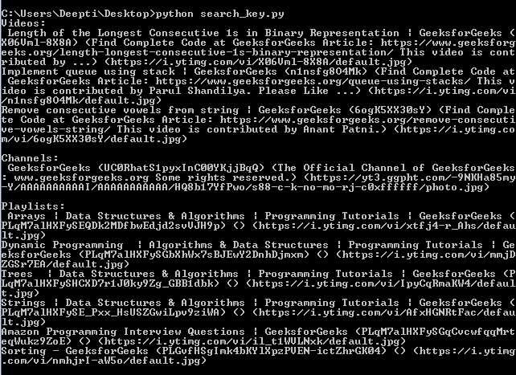
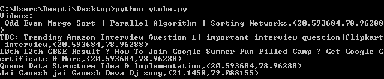

# Youtube 数据 API | Set-1

> 原文:[https://www.geeksforgeeks.org/youtube-data-api-set-1/](https://www.geeksforgeeks.org/youtube-data-api-set-1/)

谷歌提供了大量的应用编程接口供开发者选择。谷歌提供的每一项服务都有相关的应用编程接口。作为其中的一员，Youtube 数据应用编程接口使用起来非常简单，并提供了如下功能

*   搜索视频
*   处理视频，如检索视频信息、插入视频、删除视频等。
*   处理订阅，如列出所有订阅，插入或删除订阅。
*   检索关于注释的信息，如对由 parentId 标识的特定注释的回复等。

在本文中，我们将讨论 Google Youtube API。请按照以下步骤启用该应用编程接口并开始使用它。

1.  **创建新项目，启用 API 并创建凭据:**在此步骤中，我们将创建一个项目并启用 API。
    *   进入[谷歌开发者控制台](https://developers.google.com/)，点击页面右上角**登录**。使用有效谷歌帐户的凭据登录。如果您没有谷歌帐户，请先设置一个帐户，然后使用详细信息登录谷歌开发者主页。
    *   现在导航到[开发者仪表盘](https://console.developers.google.com/apis/dashboard?project=gurl-project-1541962189248&folder&organizationId)并创建一个新项目。
    *   点击**启用 API 选项**。
    *   In the search field, search for **Youtube Data API** and select the **Youtube Data API** option that comes in the drop down list.

        

    *   您将被重定向到一个屏幕，显示关于 **Youtube 数据应用编程接口**的信息，以及两个选项:**启用和尝试应用编程接口**
    *   点击**启用**选项开始使用应用编程接口。
    *   在侧栏的**应用编程接口&服务**下，选择**凭证**。
    *   在**凭证**标签中，选择**创建凭证**下拉列表，选择 **API 键**。
        凭证有两种类型: **API 密钥**和 **OAuth** 。OAuth 以. json 文件的形式为您提供客户端标识和密钥。OAuth 通常用于需要授权的地方，比如检索用户喜欢的视频。因此，对于不需要授权的其他情况，如使用关键字搜索视频或搜索相关视频等，我们将使用应用编程接口密钥。
2.  **安装:**python 的谷歌 API 客户端可以使用简单的 **pip** 命令:

    ```
    pip install --upgrade google-api-python-client
    ```

    进行安装

先说*搜索功能*。

**搜索方法**有五种变体——按关键词搜索、按位置搜索、搜索直播事件、搜索相关视频和搜索我的视频。让我们介绍前两种类型的搜索方法。

**按关键词搜索功能:**这将根据搜索查询返回视频、频道和播放列表列表。默认情况下，如果跳过**类型参数**，方法将显示视频、频道和播放列表。**最大结果**参数默认值为 5。本示例检索与关键字“极客”相关联的结果。

```
from apiclient.discovery import build

# Arguments that need to passed to the build function
DEVELOPER_KEY = "your_API_Key" 
YOUTUBE_API_SERVICE_NAME = "youtube"
YOUTUBE_API_VERSION = "v3"

# creating Youtube Resource Object
youtube_object = build(YOUTUBE_API_SERVICE_NAME, YOUTUBE_API_VERSION,
                                        developerKey = DEVELOPER_KEY)

def youtube_search_keyword(query, max_results):

    # calling the search.list method to
    # retrieve youtube search results
    search_keyword = youtube_object.search().list(q = query, part = "id, snippet",
                                               maxResults = max_results).execute()

    # extracting the results from search response
    results = search_keyword.get("items", [])

    # empty list to store video, 
    # channel, playlist metadata
    videos = []
    playlists = []
    channels = []

    # extracting required info from each result object
    for result in results:
        # video result object
        if result['id']['kind'] == "youtube# video":
            videos.append("% s (% s) (% s) (% s)" % (result["snippet"]["title"],
                            result["id"]["videoId"], result['snippet']['description'],
                            result['snippet']['thumbnails']['default']['url']))

        # playlist result object
        elif result['id']['kind'] == "youtube# playlist":
            playlists.append("% s (% s) (% s) (% s)" % (result["snippet"]["title"],
                                 result["id"]["playlistId"],
                                 result['snippet']['description'],
                                 result['snippet']['thumbnails']['default']['url']))

        # channel result object
        elif result['id']['kind'] == "youtube# channel":
            channels.append("% s (% s) (% s) (% s)" % (result["snippet"]["title"],
                                   result["id"]["channelId"], 
                                   result['snippet']['description'], 
                                   result['snippet']['thumbnails']['default']['url']))

    print("Videos:\n", "\n".join(videos), "\n")
    print("Channels:\n", "\n".join(channels), "\n")
    print("Playlists:\n", "\n".join(playlists), "\n")

if __name__ == "__main__":
    youtube_search_keyword('Geeksforgeeks', max_results = 10)

```

**输出:**


**按位置搜索功能:**本示例检索与关键字“极客”(Geeksforgeeks)相关联的结果。该请求检索由位置参数值指定的点的 100 公里(由`locationRadius` 参数值指定)内的前 5 个结果。

```
from apiclient.discovery import build

# Arguments that need to passed to the build function
DEVELOPER_KEY = "your_API_Key" 
YOUTUBE_API_SERVICE_NAME = "youtube"
YOUTUBE_API_VERSION = "v3"

# creating Youtube Resource Object
youtube_object = build(YOUTUBE_API_SERVICE_NAME, YOUTUBE_API_VERSION,
                                        developerKey = DEVELOPER_KEY)

def youtube_search_location(query, max_results = 5):

    # calling the search.list method to retrieve youtube search results
    search_location = youtube_object.search().list(q = query, type ='video',
                                           location ='20.593683, 78.962883',
                              locationRadius ='100km', part = "id, snippet",
                                          maxResults = max_results).execute()

    # extracting the results from search response
    results = search_location.get("items", [])

    # empty list to store video metadata
    videos = []

    # extracting required info from each result object
    for result in results:

        # video result object
        videos.append(result["id"]["videoId"])
    video_ids = ", ".join(videos)
    video_response = youtube_object.videos().list(id = video_ids, part ='snippet,
                                                     recordingDetails').execute()

    search_videos = []
    for video_result in video_response.get("items", []):
        search_videos.append("% s, (% s, % s)" %(video_result["snippet"]["title"],
                         video_result["recordingDetails"]["location"]["latitude"],
                       video_result["recordingDetails"]["location"]["longitude"]))

    print ("Videos:\n", "\n".join(search_videos), "\n")

if __name__ == "__main__":
    youtube_search_location('Geeksforgeeks', max_results = 5)
```

**输出:**


**注意:** `location`参数是指定地理位置的纬度/经度坐标的字符串。

*   位置参数标识区域中心的点。
*   locationRadius 参数指定与视频相关联的位置离该点的最大距离，以便视频仍包含在搜索结果中。

`type`参数只能是**视频中**这个搜索方法类型。在这个例子中，我们使用了印度德里的纬度/经度坐标。

**注意:**我们在上面的例子中只使用了有限的参数。还有许多其他参数可以设置，如果没有设置，那么可以从 [Youtube 搜索列表文档](https://developers.google.com/youtube/v3/docs/search/list)中找到它们的默认值。请参考文档以全面了解可用参数。

**参考文献:**T2】https://developers.google.com/youtube/v3/docs/search/list