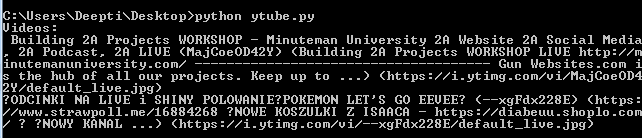
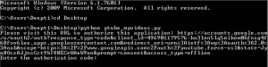
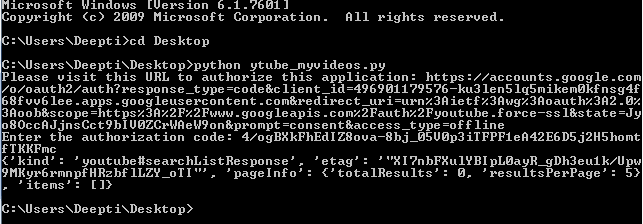

# Youtube 数据 API | Set-2

> 原文:[https://www.geeksforgeeks.org/youtube-data-api-set-2/](https://www.geeksforgeeks.org/youtube-data-api-set-2/)

前提条件: [Youtube 数据 API | Set-1](https://www.geeksforgeeks.org/youtube-data-api-set-1/)

在[之前的文章](https://www.geeksforgeeks.org/youtube-data-api-set-1/)中，我们已经讨论了搜索方法的前两种变体。现在让我们讨论剩下的三个——搜索直播事件、搜索相关视频和搜索我的视频。

**按直播事件搜索:**
给定示例检索与查询字符串 Python Programming 关联的前 5 个直播。`type parameter`必须设置为仅视频值。
`eventType`参数可以从给定的一组值中取任何值-已完成(这将仅包括已完成的广播)、直播(这将仅包括活动的广播)、即将到来(这将仅包括即将到来的广播)。

```py
from apiclient.discovery import build

# Arguments that need to passed to the build function
DEVELOPER_KEY = "Your_API_Key" 
YOUTUBE_API_SERVICE_NAME = "youtube"
YOUTUBE_API_VERSION = "v3"

# creating Youtube Resource Object
youtube_object = build(YOUTUBE_API_SERVICE_NAME, YOUTUBE_API_VERSION,
                                       developerKey = DEVELOPER_KEY)

def youtube_search_location(query, max_results = 2):

    # calling the search.list method to
    # retrieve youtube search results
    search_location = youtube_object.search().list(q = query,
                            type ='video', eventType ='live',
                                        part = "id, snippet",
                          maxResults = max_results).execute()

    # extracting the results from search response
    results = search_location.get("items", [])

    # empty list to store video metadata
    videos = []

    # extracting required info
    # from each result object
    for result in results:

        # video result object
        if result['id']['kind'] == "youtube# video":
            videos.append("% s (% s) (% s) (% s)" % (result["snippet"]["title"],
                                 result["id"]["videoId"], result['snippet']['description'],
                                 result['snippet']['thumbnails']['default']['url']))

    print ("Videos:\n", "\n".join(videos), "\n")

if __name__ == "__main__":
    youtube_search_location('Social Media', max_results = 2)
```

**输出:**


**按相关视频搜索:**这将有助于检索参数列表中视频标识指定的视频相关的视频。`type parameter`只能拍价值视频。

```py
from apiclient.discovery import build

# Arguments that need to passed
# to the build function
DEVELOPER_KEY = "Your_API_Key" 
YOUTUBE_API_SERVICE_NAME = "youtube"
YOUTUBE_API_VERSION = "v3"

# creating Youtube Resource Object
youtube_object = build(YOUTUBE_API_SERVICE_NAME, YOUTUBE_API_VERSION,
                                       developerKey = DEVELOPER_KEY)

def youtube_search_relatedto(max_results = 2):

    # calling the search.list method to
    # retrieve youtube search results
    search_relatedto = youtube_object.search().list(type ='video',
                                  relatedToVideoId ='X06Vml-8X8A',
                                             part = "id, snippet",
                               maxResults = max_results).execute()

    # extracting the results from search response
    results = search_relatedto.get("items", [])

    # empty list to store video metadata
    videos = []

    # extracting required info from each result object
    for result in results:
        # video result object
        if result['id']['kind'] == "youtube# video":
            videos.append("% s (% s) (% s) (% s)" % (result["snippet"]["title"],
                                                        result["id"]["videoId"],
                                               result['snippet']['description'],
                             result['snippet']['thumbnails']['default']['url']))

    print ("Videos:\n", "\n".join(videos), "\n")

if __name__ == "__main__":
    youtube_search_relatedto(max_results = 2)
```

**输出:**


**搜索我的视频:**本示例在授权用户的账户中搜索与关键字“Geeksforgeeks”匹配的视频。`forMine`参数表示应该在授权用户的账户内进行搜索。`type`参数也必须设置为视频。由于此方法需要用户的身份验证，因此我们将为本例创建`OAuth` 类型的凭据。按照以下步骤生成客户端标识和密钥。

1.  进入谷歌[谷歌开发者控制台](https://developers.google.com/)点击页面右上角**登录**。使用有效谷歌帐户的凭据登录。如果您没有谷歌帐户，请先设置一个帐户，然后使用详细信息登录谷歌开发者主页。
2.  现在导航到[开发者仪表盘](https://console.developers.google.com/apis/credentials?project=norse-strata-223521)并创建一个新项目。
3.  点击**启用 API 选项**。
4.  在搜索栏中，搜索 **Youtube 数据应用编程接口**，并选择下拉列表中的 Youtube 数据应用编程接口选项。
    T3】
5.  您将被重定向到一个显示关于 Youtube 数据应用编程接口信息的屏幕，以及两个选项:**启用和尝试应用编程接口**。
6.  点击**启用**选项开始使用应用编程接口。
7.  在侧栏的“应用程序接口和服务”下，选择**凭证**。
8.  在页面顶部，选择**审核同意屏幕**选项卡。选择电子邮件地址，输入产品名称(如果尚未设置)，然后单击保存按钮。
9.  在**凭证选项卡**中，选择创建凭证下拉列表，然后选择**验证客户端标识**。OAuth 通常用于需要授权的地方，比如检索用户喜欢的视频。
10.  选择应用类型其他，输入名称“YouTube 数据 API 我的视频”，点击创建按钮。
11.  单击确定。
12.  点击客户端 Id 右侧**下载按钮**下载 JSON 文件。
13.  将文件保存并重命名为 client_secret.json，并将其移动到工作目录。

使用 **pip** 命令安装附加库:

```py
pip install --upgrade google-auth google-auth-oauthlib google-auth-httplib2
```

```py
# importing libraries
import os
import google.oauth2.credentials
import google_auth_oauthlib.flow
from googleapiclient.discovery import build
from googleapiclient.errors import HttpError
from google_auth_oauthlib.flow import InstalledAppFlow

# The CLIENT_SECRETS_FILE variable specifies 
# the name of a file that contains
# client_id and client_secret.
CLIENT_SECRETS_FILE = "client_secret.json"

# This scope allows for full read/write 
# access to the authenticated user's account
# and requires requests to use an SSL connection.
SCOPES = ['https://www.googleapis.com / auth / youtube.force-ssl']
API_SERVICE_NAME = 'youtube'
API_VERSION = 'v3'

def get_authenticated_service():
  flow = InstalledAppFlow.from_client_secrets_file(CLIENT_SECRETS_FILE, SCOPES)
  credentials = flow.run_console()
  return build(API_SERVICE_NAME, API_VERSION, credentials = credentials)

def print_response(response):
  print(response)

# Build a resource based on a list of
# properties given as key-value pairs.
# Leave properties with empty values out
# of the inserted resource.
def build_resource(properties):
  resource = {}

  for p in properties:

    # Given a key like "snippet.title", split
    # into "snippet" and "title", where
    # "snippet" will be an object and "title" 
    # will be a property in that object.
    prop_array = p.split('.')

    ref = resource
    for pa in range(0, len(prop_array)):
      is_array = False
      key = prop_array[pa]

      # For properties that have array values, convert a 
      # name like "snippet.tags[]" to snippet.tags, and set
      #  a flag to handle the value as an array.
      if key[-2:] == '[]':
        key = key[0:len(key)-2:]
        is_array = True

      if pa == (len(prop_array) - 1):

        # Leave properties without values
        # out of inserted resource.
        if properties[p]:
          if is_array:
            ref[key] = properties[p].split(', ')
          else:
            ref[key] = properties[p]
      elif key not in ref:
        ref[key] = {}
        ref = ref[key]
      else:
        ref = ref[key]
  return resource

# Remove keyword arguments that are not set
def remove_empty_kwargs(**kwargs):
  good_kwargs = {}

  if kwargs is not None:
    for key, value in kwargs.items():
      if value:
        good_kwargs[key] = value
  return good_kwargs

def search_list_forMine(client, **kwargs):
  kwargs = remove_empty_kwargs(**kwargs)

  response = client.search().list(**kwargs).execute()

  return print_response(response)

if __name__ == '__main__':

  # When running locally, disable OAuthlib's
  #  HTTPs verification. When running in production
  # * do not * leave this option enabled.
  os.environ['OAUTHLIB_INSECURE_TRANSPORT'] = '1'
  client = get_authenticated_service()

  search_list_forMine(client,
    part ='snippet',
    maxResults = 5,
    forMine = True,
    q ='Geeksforgeeks',
    type ='video')
```

**输出:**
执行代码时，会询问授权码。要获取代码，您需要遵循命令行上方的命令提示符屏幕中提到的链接:输入授权代码。


现在，按照链接复制并粘贴授权代码，您将通过授予权限获得该代码。


由于本账号没有上传任何视频，所以总结果值为 0。输出画面如下:


有关可能的参数的完整列表，请参考 [Youtube 数据应用编程接口文档(search.list())](https://developers.google.com/youtube/v3/docs/search/list#examples) 。

**参考文献:**

1.  [https://developers.google.com/youtube/v3/docs/](https://developers.google.com/youtube/v3/docs/)
2.  [https://developers.google.com/youtube/v3/docs/search/list](https://developers.google.com/youtube/v3/docs/search/list)