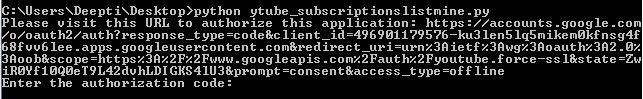
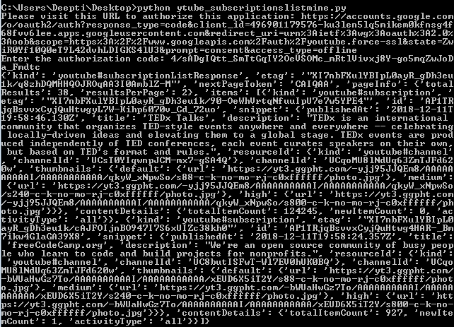
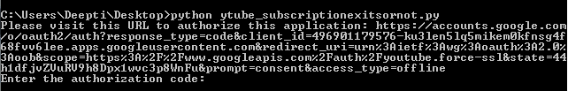
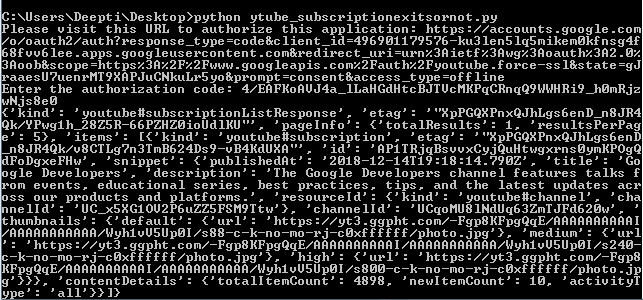

# Youtube 数据 API 订阅| Set-2

> 原文:[https://www . geesforgeks . org/YouTube-data-API-subscription-set-2/](https://www.geeksforgeeks.org/youtube-data-api-subscription-set-2/)

前提条件: [Youtube 数据 API 订阅| Set-1](https://www.geeksforgeeks.org/youtube-data-api-subscription-set-1/)

现在，我们将讨论列出订阅的其余两种方法，即列出授权用户帐户的订阅，并检查订阅是否存在。

**列出授权用户账户订阅的代码:**
这个例子展示了如何检索与自己账户相关的订阅列表。

**注意:**该方法强制要求用户授权。

```py
import os
import google.oauth2.credentials
import google_auth_oauthlib.flow
from googleapiclient.discovery import build
from googleapiclient.errors import HttpError
from google_auth_oauthlib.flow import InstalledAppFlow

# The CLIENT_SECRETS_FILE variable specifies
# the name of a file that contains
# client_id and client_secret.
CLIENT_SECRETS_FILE = "client_secret.json"

# This scope allows for full read/write access 
# to the authenticated user's account and requires
# requests to use an SSL connection.
SCOPES = ['https://www.googleapis.com/ auth/youtube.force-ssl']
API_SERVICE_NAME = 'youtube'
API_VERSION = 'v3'

def get_authenticated_service():
  flow = InstalledAppFlow.from_client_secrets_file(CLIENT_SECRETS_FILE, SCOPES)
  credentials = flow.run_console()
  return build(API_SERVICE_NAME, API_VERSION, credentials = credentials)

def print_response(response):
  print(response)

# Build a resource based on a list of 
# properties  given as key-value pairs.
# Leave properties with empty values 
# out of the inserted resource.
def build_resource(properties):
  resource = {}
  for p in properties:
    # Given a key like "snippet.title", split into
    # "snippet" and "title", where "snippet" will be
    # an object and "title" will be a property in that object.
    prop_array = p.split('.')
    ref = resource
    for pa in range(0, len(prop_array)):
      is_array = False
      key = prop_array[pa]

      # For properties that have array values, convert a name like
      # "snippet.tags[]" to snippet.tags, and set a flag to handle
      # the value as an array.
      if key[-2:] == '[]':
        key = key[0:len(key)-2:]
        is_array = True

      if pa == (len(prop_array) - 1):
        # Leave properties without values out of inserted resource.
        if properties[p]:
          if is_array:
            ref[key] = properties[p].split(', ')
          else:
            ref[key] = properties[p]
      elif key not in ref:
        # For example, the property is "snippet.title",
        # but the resource does not yet have a "snippet"
        # object. Create the snippet object here.
        # Setting "ref = ref[key]" means that in the next
        # time through the "for pa in range ..." loop,
        # we will be setting a property in the
        # resource's "snippet" object.
        ref[key] = {}
        ref = ref[key]
      else:
        # For example, the property is "snippet.description",
        #  and the resource already has a "snippet" object.
        ref = ref[key]
  return resource

# Remove keyword arguments that are not set
def remove_empty_kwargs(**kwargs):
  good_kwargs = {}
  if kwargs is not None:
    for key, value in kwargs.items():
      if value:
        good_kwargs[key] = value
  return good_kwargs

def subscriptions_list_my_subscriptions(client, **kwargs):

  kwargs = remove_empty_kwargs(**kwargs)
  response = client.subscriptions().list(**kwargs).execute()

  return print_response(response)

if __name__ == '__main__':
  # When running locally, disable OAuthlib's 
  # HTTPs verification. When running in production
  # * do not * leave this option enabled.
  os.environ['OAUTHLIB_INSECURE_TRANSPORT'] = '1'
  client = get_authenticated_service()

  subscriptions_list_my_subscriptions(client,
    part ='snippet, contentDetails',
    mine = True,
    maxResults = 2)
```

**输出:**

在执行代码时，您将被要求输入授权代码。要获取代码，您需要遵循命令行上方的命令提示符屏幕中提到的链接:输入授权代码。


现在，按照链接复制并粘贴授权代码，您将通过授予权限获得该代码。


我们已经将矿井属性设置为真值。从输出中可以清楚地看到，有 38 个订阅，由于我已经将 maxResults 属性声明为 2，所以它只显示 2 个结果。


**检查订阅是否存在的代码:**
此示例显示订阅是否存在。此示例显示授权用户是否订阅了由`forChannelId` 参数标识的频道。要检查另一个频道是否订阅了`forChannelId` 参数中指定的频道，请删除我的参数，并将其替换为 channelId 参数。：

```py
import os
import google.oauth2.credentials
import google_auth_oauthlib.flow
from googleapiclient.discovery import build
from googleapiclient.errors import HttpError
from google_auth_oauthlib.flow import InstalledAppFlow

# The CLIENT_SECRETS_FILE variable specifies
# the name of a file that contains
# client_id and client_secret.
CLIENT_SECRETS_FILE = "client_secret.json"

# This scope allows for full read/write access 
# to the authenticated user's account and 
# requires requests to use an SSL connection.
SCOPES = ['https://www.googleapis.com/auth/youtube.force-ssl']
API_SERVICE_NAME = 'youtube'
API_VERSION = 'v3'

def get_authenticated_service():
  flow = InstalledAppFlow.from_client_secrets_file(CLIENT_SECRETS_FILE, SCOPES)
  credentials = flow.run_console()
  return build(API_SERVICE_NAME, API_VERSION, credentials = credentials)

def print_response(response):
  print(response)

# Build a resource based on a list of properties
# given as key-value pairs. Leave properties with 
# empty values out of the inserted resource.
def build_resource(properties):
  resource = {}
  for p in properties:
    # Given a key like "snippet.title", split into 
    # "snippet" and "title", where "snippet" will be
    # an object and "title" will be a property in that object.
    prop_array = p.split('.')
    ref = resource
    for pa in range(0, len(prop_array)):
      is_array = False
      key = prop_array[pa]

      # For properties that have array values, convert a name like
      # "snippet.tags[]" to snippet.tags, and set a flag to handle
      # the value as an array.
      if key[-2:] == '[]':
        key = key[0:len(key)-2:]
        is_array = True

      if pa == (len(prop_array) - 1):
        # Leave properties without values out of inserted resource.
        if properties[p]:
          if is_array:
            ref[key] = properties[p].split(', ')
          else:
            ref[key] = properties[p]
      elif key not in ref:
        # For example, the property is "snippet.title", but the resource does
        # not yet have a "snippet" object. Create the snippet object here.
        # Setting "ref = ref[key]" means that in the next time through the
        # "for pa in range ..." loop, we will be setting a property in the
        # resource's "snippet" object.
        ref[key] = {}
        ref = ref[key]
      else:
        # For example, the property is "snippet.description", 
        # and the resource already has a "snippet" object.
        ref = ref[key]
  return resource

# Remove keyword arguments that are not set
def remove_empty_kwargs(**kwargs):
  good_kwargs = {}
  if kwargs is not None:
    for key, value in kwargs.items():
      if value:
        good_kwargs[key] = value
  return good_kwargs

def subscriptions_list_for_channel_id(client, **kwargs):
  kwargs = remove_empty_kwargs(**kwargs)
  response = client.subscriptions().list(**kwargs).execute()

  return print_response(response)

if __name__ == '__main__':
  # When running locally, disable OAuthlib's HTTPs verification. 
  # When running in production * do not * leave this option enabled.
  os.environ['OAUTHLIB_INSECURE_TRANSPORT'] = '1'
  client = get_authenticated_service()

  subscriptions_list_for_channel_id(client,
    part ='snippet, contentDetails',
    forChannelId ='UC_x5XG1OV2P6uZZ5FSM9Ttw',
    mine = True)
```

**输出:**

在执行代码时，您将被要求输入授权代码。要获取代码，您需要遵循命令行上方的命令提示符屏幕中提到的链接:输入授权代码。


现在，按照链接复制并粘贴授权代码，您将通过授予权限获得该代码。




由于 totalResults 参数的值为 1，这意味着授权用户订阅了指定的频道

**参考文献:**https://developers.google.com/youtube/v3/docs/subscriptions