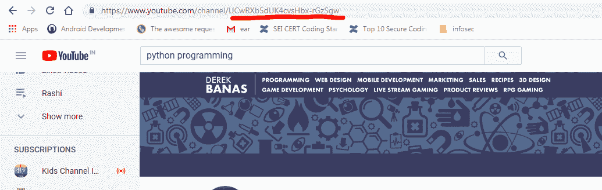
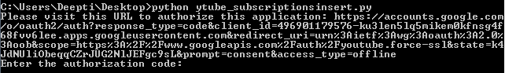
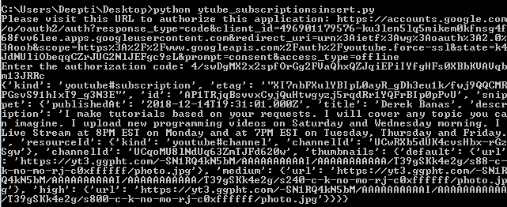
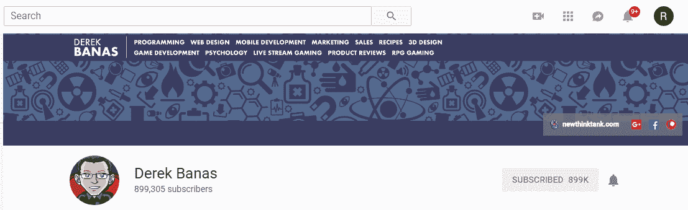
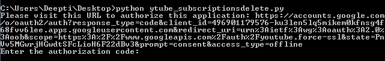
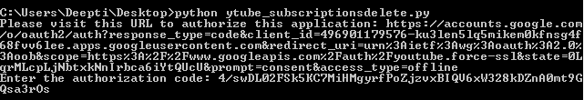

# Youtube 数据 API 订阅| Set-3

> 原文:[https://www . geesforgeks . org/YouTube-data-API-subscription-set-3/](https://www.geeksforgeeks.org/youtube-data-api-subscription-set-3/)

在之前的文章 [Youtube 数据 API 订阅|第 1 集](https://www.geeksforgeeks.org/youtube-data-api-subscription-set-1/)、[第 2 集](https://www.geeksforgeeks.org/youtube-data-api-subscription-set-2/)中，我们讨论了三种方法-

*   检索与频道标识相关联的订阅列表
*   检索我的订阅，即与授权用户的帐户相关联的订阅
*   检查订阅是否存在。

在本文中，我们将讨论以下两种方法

*   插入订阅
*   删除订阅

在继续之前，我们将首先讨论如何生成 *OAuth* 凭证。按照以下步骤生成客户端标识和密钥。

1.  进入谷歌[谷歌开发者控制台](https://developers.google.com/)点击页面右上角**登录**。使用有效谷歌帐户的凭据登录。如果您没有谷歌帐户，请先设置一个帐户，然后使用详细信息登录谷歌开发者主页。
2.  现在导航到[开发者仪表盘](https://console.developers.google.com/apis/credentials?project=norse-strata-223521)并创建一个新项目。
3.  点击**启用 API 选项**。
4.  在搜索栏中，搜索 **Youtube 数据应用编程接口**，并选择下拉列表中的 Youtube 数据应用编程接口选项。
    T3】
5.  您将被重定向到一个显示关于 Youtube 数据应用编程接口信息的屏幕，以及两个选项:**启用和尝试应用编程接口**。
6.  点击**启用**选项开始使用应用编程接口。
7.  在侧栏的“应用程序接口和服务”下，选择**凭证**。
8.  在页面顶部，选择**审核同意屏幕**选项卡。选择电子邮件地址，输入产品名称(如果尚未设置)，然后单击保存按钮。
9.  在**凭证选项卡**中，选择创建凭证下拉列表，然后选择**验证客户端标识**。OAuth 通常用于需要授权的地方，比如检索用户喜欢的视频。
10.  选择应用类型其他，输入名称“YouTube 数据 API 我的视频”，点击创建按钮，然后点击确定。
11.  点击客户端 Id 右侧**下载按钮**下载 JSON 文件。
12.  将文件保存并重命名为`client_secret.json` 并移动到工作目录。

使用 **pip** 命令安装附加库:

> pip 安装–升级 Google-auth Google-auth-oauthlib Google-auth-httplicb 2

**注意:**我们需要知道插入和删除订阅的频道 Id。按照以下步骤查找频道标识:

1.  登录您的 Youtube 帐户。
2.  浏览您想要订阅的频道。
3.  单击并打开频道。在网址中你会看到关键词**频道/**
    后的频道 Id

**插入订阅的代码:**此示例显示如何在由参数列表中提供的频道 Id 标识的 Youtube 频道中插入订阅。您可以通过更改**sniper . resourceid . channelid**属性来更改订阅。本示例添加了对德里克·巴纳斯频道的订阅。

```
import os
import google.oauth2.credentials
import google_auth_oauthlib.flow
from googleapiclient.discovery import build
from googleapiclient.errors import HttpError
from google_auth_oauthlib.flow import InstalledAppFlow

# The CLIENT_SECRETS_FILE variable specifies
# the name of a file that contains
# client_id and client_secret.
CLIENT_SECRETS_FILE = "client_secret.json"

# This scope allows for full read/write access 
# to the authenticated user's account and 
# requires requests to use an SSL connection.
SCOPES = ['https://www.googleapis.com/auth/youtube.force-ssl']
API_SERVICE_NAME = 'youtube'
API_VERSION = 'v3'

def get_authenticated_service():
  flow = InstalledAppFlow.from_client_secrets_file(CLIENT_SECRETS_FILE, SCOPES)
  credentials = flow.run_console()
  return build(API_SERVICE_NAME, API_VERSION, credentials = credentials)

def print_response(response):
  print(response)

# Build a resource based on a list of 
# properties given as key-value pairs.
# Leave properties with empty values out
# of the inserted resource.
def build_resource(properties):
  resource = {}
  for p in properties:
    # Given a key like "snippet.title", split into
    # "snippet" and "title", where "snippet" will be
    # an object and "title" will be a property in that object.
    prop_array = p.split('.')
    ref = resource
    for pa in range(0, len(prop_array)):
      is_array = False
      key = prop_array[pa]

      # For properties that have array values, convert a name like
      # "snippet.tags[]" to snippet.tags, and set a flag to handle
      # the value as an array.
      if key[-2:] == '[]':
        key = key[0:len(key)-2:]
        is_array = True

      if pa == (len(prop_array) - 1):
        # Leave properties without values 
        # out of inserted resource.
        if properties[p]:
          if is_array:
            ref[key] = properties[p].split(', ')
          else:
            ref[key] = properties[p]
      elif key not in ref:
        # For example, the property is "snippet.title", 
        # but the resource does not yet have a "snippet" 
        # object. Create the snippet object here. 
        # Setting "ref = ref[key]" means that in the
        # next time through the "for pa in range ..." loop,
        # we will be setting a property in the
        # resource's "snippet" object.
        ref[key] = {}
        ref = ref[key]
      else:
        # For example, the property is "snippet.description",
        #  and the resource already has a "snippet" object.
        ref = ref[key]
  return resource

# Remove keyword arguments that are not set
def remove_empty_kwargs(**kwargs):
  good_kwargs = {}
  if kwargs is not None:
    for key, value in kwargs.items():
      if value:
        good_kwargs[key] = value
  return good_kwargs

def subscriptions_insert(client, properties, **kwargs):
  resource = build_resource(properties)
  kwargs = remove_empty_kwargs(**kwargs)

  response = client.subscriptions().insert(
    body = resource,**kwargs).execute()

  return print_response(response)

if __name__ == '__main__':
  # When running locally, disable OAuthlib's 
  # HTTPs verification. When running in production
  # * do not * leave this option enabled.
  os.environ['OAUTHLIB_INSECURE_TRANSPORT'] = '1'
  client = get_authenticated_service()

  subscriptions_insert(client, 
    {'snippet.resourceId.kind': 'youtube# channel',
     'snippet.resourceId.channelId': 'UCwRXb5dUK4cvsHbx-rGzSgw'},
    part ='snippet')
```

**输出:**
执行代码时，会要求您输入授权码。要获取代码，您需要遵循命令行上方的命令提示符屏幕中提到的链接:输入授权代码。


现在，按照链接复制并粘贴授权代码，您将通过授予权限获得该代码。






如果您看到，从上面的输出很明显，我已经成功订阅了该频道。

**删除订阅的代码:**此示例显示如何删除订阅。 **id** 参数是订阅 id，即您可以在插入订阅时从命令提示符下记下，或者您可以运行代码列出所有订阅并记下所需订阅的订阅 id。在这个例子中，我删除了我在上面讨论的代码中添加的订阅。

```
import os
import google.oauth2.credentials
import google_auth_oauthlib.flow
from googleapiclient.discovery import build
from googleapiclient.errors import HttpError
from google_auth_oauthlib.flow import InstalledAppFlow

# The CLIENT_SECRETS_FILE variable specifies
#  the name of a file that contains client_id 
# and client_secret.
CLIENT_SECRETS_FILE = "client_secret.json"

# This scope allows for full read/write access 
# to the authenticated user's account and
# requires requests to use an SSL connection.
SCOPES = ['https://www.googleapis.com/auth/youtube.force-ssl']
API_SERVICE_NAME = 'youtube'
API_VERSION = 'v3'

def get_authenticated_service():
  flow = InstalledAppFlow.from_client_secrets_file(CLIENT_SECRETS_FILE, SCOPES)
  credentials = flow.run_console()
  return build(API_SERVICE_NAME, API_VERSION, credentials = credentials)

def print_response(response):
  print(response)

# Build a resource based on a list of properties 
# given as key-value pairs. Leave properties with
# empty values out of the inserted resource.
def build_resource(properties):
  resource = {}
  for p in properties:
    # Given a key like "snippet.title", split into
    # "snippet" and "title", where "snippet" will be
    # an object and "title" will be a property in that object.
    prop_array = p.split('.')
    ref = resource
    for pa in range(0, len(prop_array)):
      is_array = False
      key = prop_array[pa]

      # For properties that have array values, convert a name like
      # "snippet.tags[]" to snippet.tags, and set a flag to handle
      # the value as an array.
      if key[-2:] == '[]':
        key = key[0:len(key)-2:]
        is_array = True

      if pa == (len(prop_array) - 1):
        # Leave properties without values out of inserted resource.
        if properties[p]:
          if is_array:
            ref[key] = properties[p].split(', ')
          else:
            ref[key] = properties[p]
      elif key not in ref:
        # For example, the property is "snippet.title", 
        # but the resource does not yet have a "snippet" 
        # object. Create the snippet object here. 
        # Setting "ref = ref[key]" means that in the
        # next time through the "for pa in range ..." loop, 
        # we will be setting a property in the
        # resource's "snippet" object.
        ref[key] = {}
        ref = ref[key]
      else:
        # For example, the property is "snippet.description", 
        # and the resource already has a "snippet" object.
        ref = ref[key]
  return resource

# Remove keyword arguments that are not set
def remove_empty_kwargs(**kwargs):
  good_kwargs = {}
  if kwargs is not None:
    for key, value in kwargs.items():
      if value:
        good_kwargs[key] = value
  return good_kwargs

def subscriptions_delete(client, **kwargs):
  kwargs = remove_empty_kwargs(**kwargs)
  response = client.subscriptions().delete(**kwargs).execute()

  return print_response(response)

if __name__ == '__main__':
  # When running locally, disable OAuthlib's HTTPs
  #  verification. When running in production 
  # * do not * leave this option enabled.
  os.environ['OAUTHLIB_INSECURE_TRANSPORT'] = '1'
  client = get_authenticated_service()

  subscriptions_delete(client,
    id ='AP1TRjqBsvvxCyjQuHtwgyzj5rqdRr1YQFrBIp0pPvU')
```

**输出:**
执行代码时，会要求您输入授权码。要获取代码，您需要遵循命令行上方的命令提示符屏幕中提到的链接:输入授权代码。


现在，按照链接复制并粘贴授权代码，您将通过授予权限获得该代码。





从上面的输出可以看到，频道再次显示了订阅选项。

**参考文献:**

1.  https://developers.google.com/youtube/v3/docs/subscriptions
2.  https://developers.google.com/youtube/v3/docs/