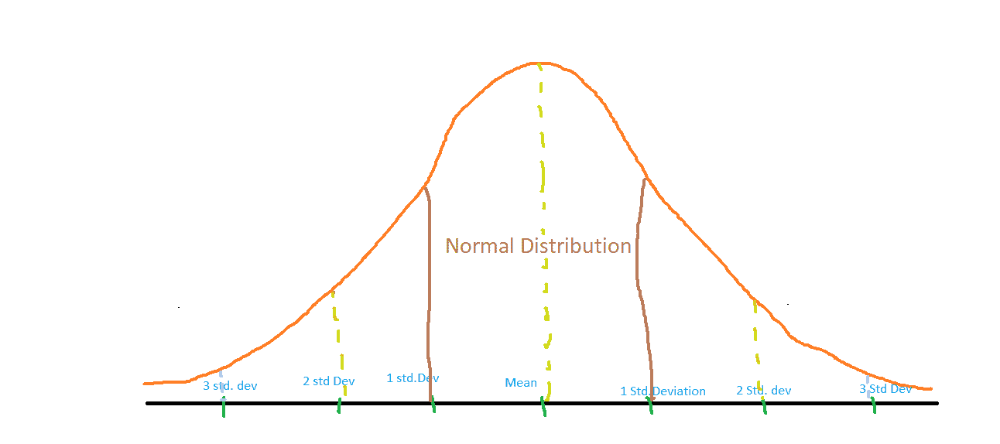

# 异常值检测的 Z 分数–Python

> 原文:[https://www . geesforgeks . org/z-score-for-离群点检测-python/](https://www.geeksforgeeks.org/z-score-for-outlier-detection-python/)

z 分数是统计学中的一个重要概念。z 分也叫标准分。这个分数有助于理解数据值是大于还是小于平均值，以及它离平均值有多远。更具体地说，Z 分数告诉我们一个数据点离平均值有多少标准差。

> **Z 评分=(x-均值)/ std。偏差**

正态分布如下所示，估计
68%的数据点位于+/- 1 标准偏差之间。
95%的数据点位于+/- 2 标准偏差之间
99.7%的数据点位于+/- 3 标准偏差之间


**Z 分值与离群值:**
如果一个数据点的 Z 分值大于 3，则表明该数据点与其他数据点存在较大差异。这样的数据点可能是异常值。
例如，在一项调查中，有人问一个人有几个孩子。
假设从人那里获得的数据是

> 1, 2, 2, 2, 3, 1, 1, 15, 2, 2, 2, 3, 1, 1, 2

显然，在这个数据集中，15 是一个异常值。

**让我们使用使用 Python 计算 Z 分数来找到这个离群值。**
**第一步:导入必要的库**

```
import numpy as np 
```

**第二步:计算平均值、标准差**

```
data = [1, 2, 2, 2, 3, 1, 1, 15, 2, 2, 2, 3, 1, 1, 2]
mean = np.mean(data)
std = np.std(data)
print('mean of the dataset is', mean)
print('std. deviation is', std)
```

**输出:**

```
mean of the dataset is 2.6666666666666665
std. deviation is 3.3598941782277745
```

**第三步:计算 Z 分数。如果 Z 得分> 3，打印为异常值。**

```
threshold = 3
outlier = []
for i in data:
    z = (i-mean)/std
    if z > threshold:
        outlier.append(i)
print('outlier in dataset is', outlier)
```

**输出:**

```
outlier in dataset is [15]
```

**结论** : Z 评分帮助我们识别数据中的异常值。