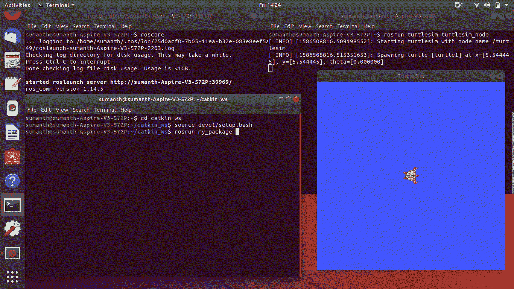

# 在 ROS-Python 中使用 Turtlesim 画一个圆

> 原文:[https://www . geesforgeks . org/draw-a-circle-use-turtlesim-in-ROS-python/](https://www.geeksforgeeks.org/draw-a-circle-using-turtlesim-in-ros-python/)

在本文中，我们将看到如何在 ROS-Python 中使用 Turtlesim 绘制一个圆。

ROS 代表机器人操作系统。ROS 是一组帮助构建机器人应用程序的库和工具。它被广泛用于机器人项目。ROS 是一个面向机器人的开源元操作系统。ROS 生态系统中的软件既有语言相关的工具，也有语言无关的工具。ROS 支持 Python、C++、Lisp 等语言。

**rospy** 是一个纯 Python 客户端库 ROS。我们将利用这个库来实现我们的代码。Turtlesim 是一个专门用于教授 ROS 和 ROS 包的通用工具。

想法是从**几何 _msgs.msg** 库中导入**扭曲**，并为速度分量指定适当的值。 **Twist** 表示乌龟在三维空间中的速度，分为 3 个线性分量和 3 个角度分量。这里的海龟是 2D，由一个线性分量(x 分量)和一个角分量(z 分量)控制。这是因为乌龟不能在 y 或 z 方向移动。因此。所有其他组件都等于 0。

## **分步实施:**

**第一步:**首先，导入程序中使用的所有包。 **rospy** 是一个 ROS-python 库，包含创建节点、获取时间、创建发布者等不同功能。**几何图形 _msgs** 库包含一个有用的变量类型**扭曲**，用于描述 3D 中的速度。

## 蟒蛇 3

```py
import rospy
from geometry_msgs.msg import Twist
import sys
```

**第二步:**接下来，我们定义我们的 turtle_circle 函数，在这个函数中我们初始化我们的 turtlesim 节点和我们的 publisher。我们还指定了一个等于 10Hz 的速率，也就是说，程序每秒循环 10 次。还会创建一个扭曲变量“等级”。

## 蟒蛇 3

```py
def turtle_circle(radius):
    rospy.init_node('turtlesim', anonymous=True)
    pub = rospy.Publisher('/turtle1/cmd_vel',
                          Twist, queue_size=10)
    rate = rospy.Rate(10)
    vel = Twist()
```

**第三步:**我们现在创建一个 while 循环，让海龟无限期地绕圈跑。在 while 循环中，我们适当地提供了海龟的速度分量，如上面的方法中所讨论的，然后将它们发布给海龟。我们还使用**函数打印每个环的半径。**末增加**。rate 对象跟踪自上次执行 rate.sleep()以来的时间，并休眠正确的时间以保持 10Hz 的频率。**

## 蟒蛇 3

```py
rospy.loginfo("Radius = %f", radius)
pub.publish(vel)
rate.sleep()
```

**步骤 4:** 最后，我们有一个主循环，它调用函数并处理异常(如果存在的话):

## 蟒蛇 3

```py
if __name__ == '__main__':
    try:
        turtle_circle(float(sys.argv[1]))
    except rospy.ROSInterruptException:
        pass
```

## **执行**套头衫的步骤:

使用以下命令在终端中启动 ROS:

```py
$ roscore
```

使用以下命令在新终端上启动 turtlesim 节点:

```py
$ rosrun turtlesim turtlesim_node
```

使用以下命令执行程序:

```py
$ rosrun my_package turtlesim.py 2.0
```

**下面是实现:**

## 蟒蛇 3

```py
#!/usr/bin/env python
# @uthor : Sumanth Nethi
import rospy
from geometry_msgs.msg import Twist
import sys

def turtle_circle(radius):
    rospy.init_node('turtlesim', anonymous=True)
    pub = rospy.Publisher('/turtle1/cmd_vel', 
                          Twist, queue_size=10)
    rate = rospy.Rate(10)
    vel = Twist()
    while not rospy.is_shutdown():
        vel.linear.x = radius
        vel.linear.y = 0
        vel.linear.z = 0
        vel.angular.x = 0
        vel.angular.y = 0
        vel.angular.z = 1
        rospy.loginfo("Radius = %f", 
                      radius)
        pub.publish(vel)
        rate.sleep()

if __name__ == '__main__':
    try:
        turtle_circle(float(sys.argv[1]))
    except rospy.ROSInterruptException:
        pass
```

**输出:**

