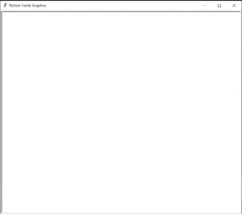
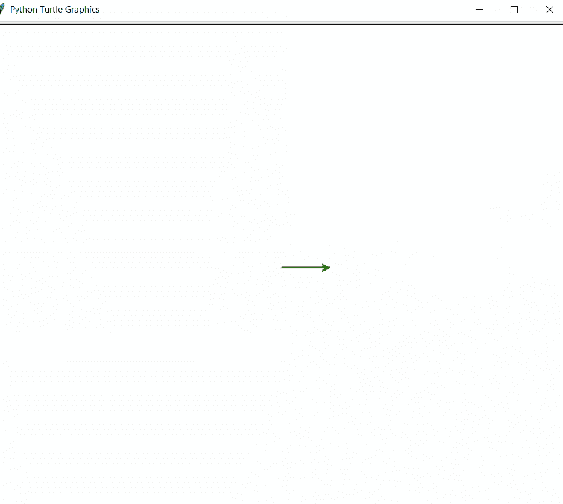

# 用蟒蛇龟画一个井字游戏棋盘

> 原文:[https://www . geesforgeks . org/draw-a-TIC-tac-toe-board-use-python-turtle/](https://www.geeksforgeeks.org/draw-a-tic-tac-toe-board-using-python-turtle/)

这里的任务是使用 Python 中的海龟图形制作**井字游戏棋盘布局**。首先让我们知道什么是海龟图形。

## 海龟图形

在计算机图形学中，[龟图形](https://www.geeksforgeeks.org/turtle-programming-python/)是在笛卡尔平面上使用相对光标的矢量图形。乌龟是画板一样的功能，让我们可以命令一只乌龟，并用它来画画。

**龟纹特征:**

*   **向后(长度):**向后移动笔 x 个单位。
*   **向右(角度):**顺时针方向旋转笔 x 角度。
*   **左(角度):**逆时针方向旋转笔 x 角度。
*   **penip():**停止龟笔的绘制。
*   **pendown():** 开始画龟笔。

### 方法

*   导入海龟模块。

```py
import turtle

```

*   找个屏幕来画画。

```py
ws = turtle.Screen()

```

屏幕会是这样的。



屏幕

*   为**龟定义一个实例。**
*   在这里，我已经手动设置海龟的速度为 2。
*   为了画出井字游戏棋盘，我们首先要画一个外方块。
*   然后，我们将制作正方形的内部线条，最终组成棋盘。
*   对于内部线条，我使用了**penip()，goto()和 pendown()** 方法来拿起笔，然后在特定的坐标下拿下来。
*   内部线条将完美组成**井字游戏棋盘**。

下面是上述方法的实现:

## 蟒蛇 3

```py
import turtle

# getting a Screen to work on
ws=turtle.Screen()

# Defining Turtle instance
t=turtle.Turtle()

# setting up turtle color to green
t.color("Green")

# Setting Up width to 2
t.width("2")

# Setting up speed to 2
t.speed(2)

# Loop for making outside square of
# length 300
for i in range(4):
    t.forward(300)
    t.left(90)

# code for inner lines of the square
t.penup()
t.goto(0,100)
t.pendown()

t.forward(300)

t.penup()
t.goto(0,200)
t.pendown()

t.forward(300)

t.penup()
t.goto(100,0)
t.pendown()

t.left(90)
t.forward(300)

t.penup()
t.goto(200,0)
t.pendown()

t.forward(300)
```

**输出:**



海龟制作井字游戏棋盘