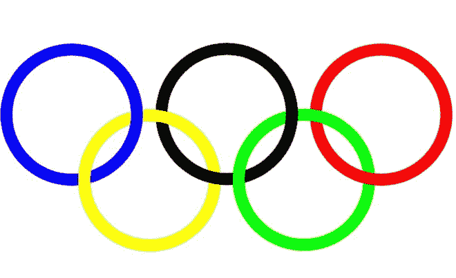
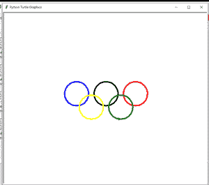

# 用乌龟用蟒蛇画一个奥林匹克标志

> 原文:[https://www . geesforgeks . org/用海龟画一个奥林匹克标志/](https://www.geeksforgeeks.org/draw-an-olympic-symbol-in-python-using-turtle/)

**先决条件:**[Python 中的海龟编程](https://www.geeksforgeeks.org/turtle-programming-python/)

奥林匹克五环是五个交错的环，在白色的场地上有蓝色、黄色、黑色、绿色和红色。如下图所示。



#### 方法:

*   导入海龟模块
*   设置每个环的厚度
*   用特定的坐标画出每个圆

下面是实现。

## 蟒蛇 3

```py
import turtle

# object tr for turtle
tr = turtle.Turtle()

# set thikness for each ring
tr.pensize(5)

tr.color("blue")
tr.penup()
tr.goto(-110, -25)
tr.pendown()
tr.circle(45)

tr.color("black")
tr.penup()
tr.goto(0, -25)
tr.pendown()
tr.circle(45)

tr.color("red")
tr.penup()
tr.goto(110, -25)
tr.pendown()
tr.circle(45)

tr.color("yellow")
tr.penup()
tr.goto(-55, -75)
tr.pendown()
tr.circle(45)

tr.color("green")
tr.penup()
tr.goto(55, -75)
tr.pendown()
tr.circle(45)
```

#### 输出:

