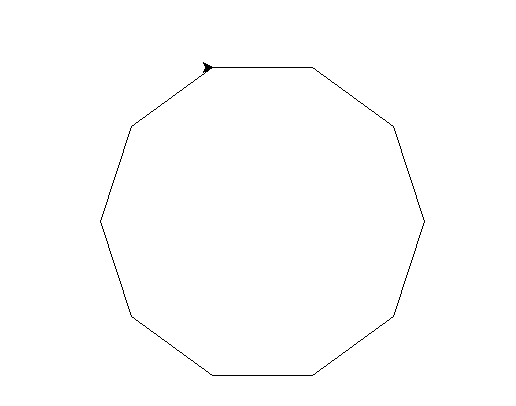
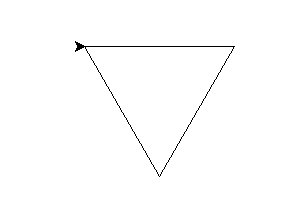
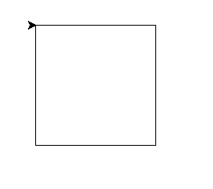

# 用龟-蟒画任意多边形

> 原文:[https://www . geesforgeks . org/draw-any-polygon-in-turtle-python/](https://www.geeksforgeeks.org/draw-any-polygon-in-turtle-python/)

**先决条件:** [蟒蛇龟基础知识](https://www.geeksforgeeks.org/turtle-programming-python/)

**乌龟**是 python 的内置模块。它使我们能够通过海龟和海龟模块中定义的方法以及使用一些逻辑循环来绘制任何图形。海龟图基本上是使用海龟模块中定义的四种方法绘制的。

> **向前(x)** :将龟(笔)向前移动 x 个单位。
> 
> **向后(x)** :将龟(笔)向后移动 x 个单位。
> 
> **右(n)** :顺时针旋转龟(笔)n 度。
> 
> **左(n)** :逆时针方向旋转龟(笔)n 度。

在本文中，我们将学习如何使用海龟模块绘制不同形状的多边形。给定边数(n)和边长(l)，人们可以很容易地画出任何多边形。让我们借助例子来更好地理解它。

```
# draw any polygon in turtle

import turtle

# creating turtle pen
t = turtle.Turtle()

# taking input for the no of the sides of the polygon
n = int(input("Enter the no of the sides of the polygon : "))

# taking input for the length of the sides of the polygon
l = int(input("Enter the length of the sides of the polygon : "))

for _ in range(n):
    turtle.forward(l)
    turtle.right(360 / n)
```

**输入:**

```
10
100
```

**输出:**


**输入:**

```
3
150
```

**输出:**


**输入:**

```
4
150
```

**输出:**
