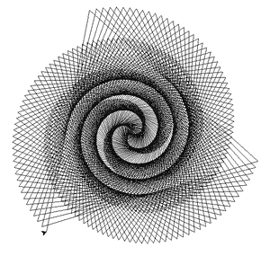

# 用蟒蛇皮画黑色螺旋图案

> 原文:[https://www . geeksforgeeks . org/draw-black-spiral-pattern-using-海龟-in-python/](https://www.geeksforgeeks.org/draw-black-spiral-pattern-using-turtle-in-python/)

**先决条件:**[Python 中的龟编程](https://www.geeksforgeeks.org/turtle-programming-python/)

“龟”是一个类似画板的 Python 特性，让我们命令一只龟在上面画来画去。该模块附带标准 Python 包，无需外部安装。

### **使用的功能:**

*   **向前(值):**向前移动乌龟。
*   **速度(值):**改变乌龟的速度。
*   **向左(值):**它向左移动乌龟。

在本文中，我们将讨论如何使用海龟图形绘制黑色螺旋图案。

**进场:**

*   进口海龟
*   初始化变量。
*   初始化海龟。
*   根据你的逻辑开始制作图案。

下面是上述方法的实现。

## 蟒蛇 3

```py
# import turtle
import turtle

# initialising variables
dist = 1
flag = 500

# initialising turtle
spiral = turtle.Turtle()

# changing speed of turtle
spiral.speed(10)

# making patten
while flag:

    # makes the turtle to move forward
    spiral.forward(dist)

    # makes the turtle to move left
    spiral.left(120)
    spiral.left(1)
    dist += 1
    flag -= 1

turtle.done()
```

**输出:**

