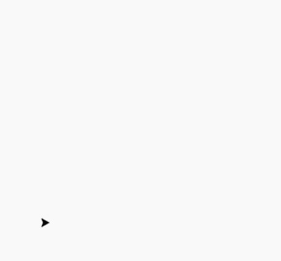

# 用蟒蛇龟画棋盘

> 原文:[https://www . geeksforgeeks . org/draw-chess-board-use-turtle-in-python/](https://www.geeksforgeeks.org/draw-chess-board-using-turtle-in-python/)

#### **先决条件:** [<u>【海龟编程基础知识】</u>](https://www.geeksforgeeks.org/turtle-programming-python/)

海龟是 Python 中的一个内置模块。它提供使用屏幕(纸板)和乌龟(钢笔)的绘图。要在屏幕上画东西，我们需要移动乌龟(笔)。要移动海龟，有一些功能，例如向前()，向后()，等等。

**绘制棋盘使用以下步骤:**

*   导入海龟并制作物品。
*   设置屏幕大小和海龟位置。
*   定义绘制正方形的方法
*   在另一个循环下调用该方法 8 次，调用次数为 8 次，使用替代颜色。
*   隐藏海龟对象。

下面是实现:

## 蟒蛇 3

```
# import turtle package
import turtle 

# create screen object
sc = turtle.Screen()

# create turtle object
pen = turtle.Turtle()

# method to draw square
def draw():

  for i in range(4):
    pen.forward(30)
    pen.left(90)

  pen.forward(30)

# Driver Code
if __name__ == "__main__" :

    # set screen
    sc.setup(600, 600)

    # set turtle object speed
    pen.speed(100)

    # loops for board
    for i in range(8):

      # not ready to draw
      pen.up()

      # set position for every row
      pen.setpos(0, 30 * i)

      # ready to draw
      pen.down()

      # row
      for j in range(8):

        # conditions for alternative color
        if (i + j)% 2 == 0:
          col ='black'

        else:
          col ='white'

        # fill with given color
        pen.fillcolor(col)

        # start filling with colour
        pen.begin_fill()

        # call method
        draw()
        # stop filling
        pen.end_fill()

    # hide the turtle
    pen.hideturtle()

    # This code is contributed by Deepanshu Rustagi.
```

#### 输出:

