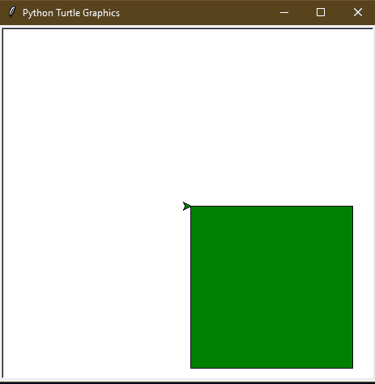
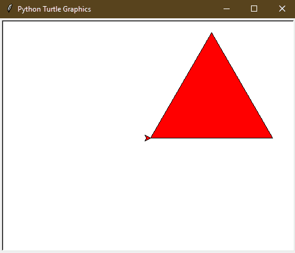
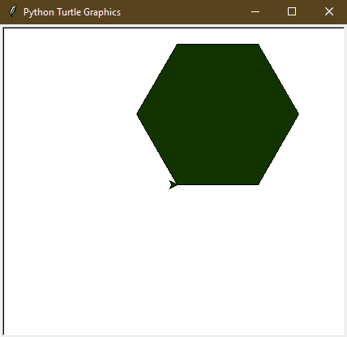
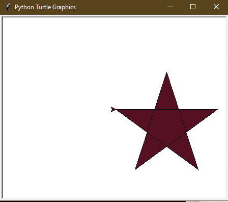
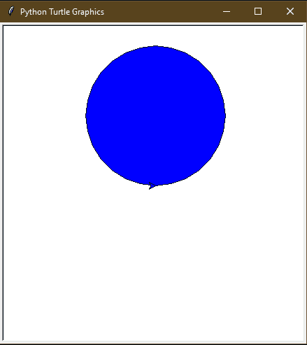

# 用海龟-蟒蛇画填色形状

> 原文:[https://www . geesforgeks . org/draw-color-filled-shapes-in-turtle-python/](https://www.geeksforgeeks.org/draw-color-filled-shapes-in-turtle-python/)

**先决条件:** [蟒蛇龟基础知识](https://www.geeksforgeeks.org/turtle-programming-python/)

**海龟**是 python 中的内置模块。它提供使用屏幕(纸板)和乌龟(钢笔)的绘图。要在屏幕上画东西，我们需要移动乌龟。移龟有一些功能，即`forward()`、`backward()`等。

为了填充海龟所画形状的颜色，海龟提供了三个功能

> **fillcolor()** :这有助于选择填充形状的颜色。它将输入参数作为颜色的颜色名称或十六进制值，并用选定的颜色填充即将关闭的地理对象。颜色名称是基本颜色名称，即红色、蓝色、绿色、橙色。
> 颜色的十六进制值是十六进制数的字符串(以“#”开头)，即#RRGGBB。r、G 和 B 是十六进制数(0、1、2、3、4、5、6、7、8、9、A、B、C、D、E、F)。
> 
> **begin_fill()** :这个函数告诉龟，所有即将关闭的图形对象都需要用选择的颜色填充。
> 
> **end_fill()** :此功能告诉龟停止填充即将关闭的图形对象。

## 绘制彩色填充正方形:

```
# draw color-filled square in turtle

import turtle

# creating turtle pen
t = turtle.Turtle()

# taking input for the side of the square
s = int(input("Enter the length of the side of the square: "))

# taking the input for the color
col = input("Enter the color name or hex value of color(# RRGGBB): ")

# set the fillcolor
t.fillcolor(col)

# start the filling color
t.begin_fill()

# drawing the square of side s
for _ in range(4):
  t.forward(s)
  t.right(90)

# ending the filling of the color
t.end_fill()
```

**输入:**

```
200
green
```

**输出:**


## 绘制彩色填充三角形:

```
# draw color filled triangle in turtle

import turtle

# creating turtle pen
t = turtle.Turtle()

# taking input for the side of the triangle
s = int(input("Enter the length of the side of the triangle: "))

# taking the input for the color
col = input("Enter the color name or hex value of color(# RRGGBB): ")

# set the fillcolor
t.fillcolor(col)

# start the filling color
t.begin_fill()

# drawing the triangle of side s
for _ in range(3):
  t.forward(s)
  t.right(-120)

# ending the filling of the color
t.end_fill()
```

**输入:**

```
200
red
```

**输出:**


## 绘图颜色填充的六边形:

```
# draw color-filled hexagon in turtle

import turtle

# creating turtle pen
t = turtle.Turtle()

# taking input for the side of the hexagon
s = int(input("Enter the length of the side of the hexagon: "))

# taking the input for the color
col = input("Enter the color name or hex value of color(# RRGGBB): ")

# set the fillcolor
t.fillcolor(col)

# start the filling color
t.begin_fill()

# drawing the hexagon of side s
for _ in range(6):
  t.forward(s)
  t.right(-60)

# ending the filling of the color
t.end_fill()
```

**输入:**

```
100
#113300
```

**输出:**


## 绘制彩色填充星形:

```
# draw color filled star in turtle

import turtle

# creating turtle pen
t = turtle.Turtle()

# taking input for the side of the star
s = int(input("Enter the length of the side of the star: "))

# taking the input for the color
col = input("Enter the color name or hex value of color(# RRGGBB): ")

# set the fillcolor
t.fillcolor(col)

# start the filling color
t.begin_fill()

# drawing the star of side s
for _ in range(5):
  t.forward(s)
  t.right(144)

# ending the filling of color
t.end_fill()
```

**输入:**

```
200
#551122
```

**输出:**


## 绘制彩色实心圆:

```
# draw color filled circle in turtle

import turtle

# creating turtle pen
t = turtle.Turtle()

# taking input for the radius of the circle
r = int(input("Enter the radius of the circle: "))

# taking the input for the color
col = input("Enter the color name or hex value of color(# RRGGBB): ")

# set the fillcolor
t.fillcolor(col)

# start the filling color
t.begin_fill()

# drawing the circle of radius r
t.circle(r)

# ending the filling of the color
t.end_fill()
```

**输入:**

```
100
blue
```

**输出:**
