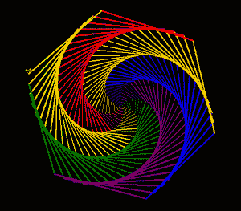

# 用 Python 中的龟图形绘制彩色螺旋网

> 原文:[https://www . geesforgeks . org/draw-colour-spiral-web-use-turtle-graphics-in-python/](https://www.geeksforgeeks.org/draw-colorful-spiral-web-using-turtle-graphics-in-python/)

**先决条件:** [海龟基础知识](https://www.geeksforgeeks.org/turtle-programming-python/)

“乌龟”是 Python 的一个功能，就像画板一样，让我们命令一只乌龟在上面画来画去。这是标准的 Python 包，不需要从外部安装。

**使用的方法:**

*   **向前(值):**向前移动乌龟。
*   **甲鱼。Pen():** 设置海龟笔
*   **速度(值):**改变乌龟的速度
*   **宽度(值):**设置宽度
*   **向左(值):**向左移动乌龟。
*   **bgcolor(color_name):** 更改背景色

**进场:**

*   进口海龟。
*   使用 python 中的列表数据结构定义颜色。
*   设置一个龟笔来绘制螺旋网。
*   根据你的逻辑开始制作螺旋网。

下面是上述方法的实现。

## 蟒蛇 3

```py
# import turtle
import turtle

# defining colors
colors = ['red', 'yellow', 'green', 'purple', 'blue', 'orange']

# setup turtle pen
t= turtle.Pen()

# changes the speed of the turtle
t.speed(10)

# changes the background color
turtle.bgcolor("black")

# make spiral_web
for x in range(200):
    t.pencolor(colors[x%6]) # setting color
    t.width(x/100 + 1) # setting width
    t.forward(x) # moving forward
    t.left(59) # moving left

turtle.done()
t.speed(10)

turtle.bgcolor("black") # changes the background color

# make spiral_web
for x in range(200):
    t.pencolor(colors[x%6]) # setting color
    t.width(x/100 + 1) # setting width
    t.forward(x) # moving forward
    t.left(59) # moving left

turtle.done()
```

**输出:**

