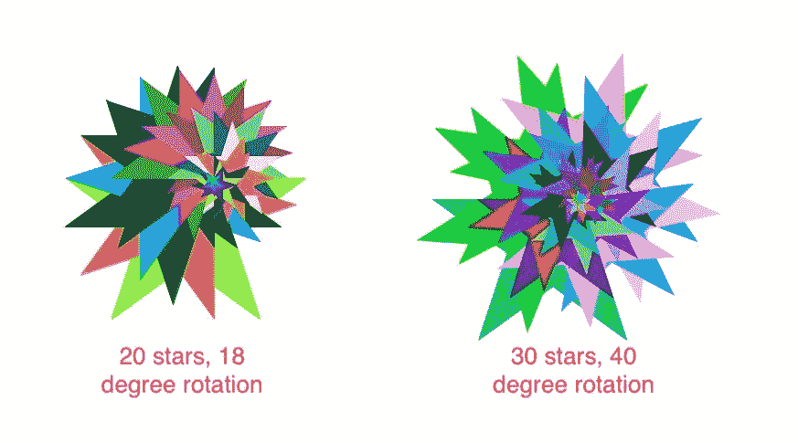
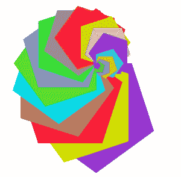

# 用龟蟒画彩色的星星图案

> 原文:[https://www . geesforgeks . org/draw-colony-star-pattern-in-turtle-python/](https://www.geeksforgeeks.org/draw-colourful-star-pattern-in-turtle-python/)

在本文中，我们将使用 Python 的*海龟*库绘制一个恒星螺旋，填充**随机生成的**颜色。我们可以通过改变一些参数来生成不同的模式。

[](https://media.geeksforgeeks.org/wp-content/uploads/20200523234408/stars.jpg)

**所需模块:**

***龟:***

*海龟*库使用户能够使用命令绘制图片或形状，为他们提供虚拟画布。
*乌龟*自带 Python 的标准库。它需要一个支持 *Tk* 的 Python 版本，因为它使用*Tkit*作为图形。

**解释:**
首先我们设置螺旋的每个参数:恒星的数量，恒星的外角和螺旋的旋转角度。颜色是通过为 rgb 值选择三个随机整数来随机选择的，所以每次我们都会得到不同的颜色组合。
在下面的实现中，我们将绘制一个 **30** 星的图案，外角 **144** 度，旋转角 **18** 度。

```
from turtle import * import random

speed(speed ='fastest')

def draw(n, x, angle):
    # loop for number of stars
    for i in range(n):

        colormode(255)

        # choosing random integers 
        # between 0 and 255
        # to generate random rgb values 
        a = random.randint(0, 255)
        b = random.randint(0, 255)
        c = random.randint(0, 255)

        # setting the outline 
        # and fill colour
        pencolor(a, b, c)
        fillcolor(a, b, c)

        # begins filling the star
        begin_fill()

        # loop for drawing each star
        for j in range(5):

            forward(5 * n-5 * i)
            right(x)
            forward(5 * n-5 * i)
            right(72 - x)

        # colour filling complete
        end_fill()

        # rotating for
        # the next star
        rt(angle)

# setting the parameters
n = 30    # number of stars
x = 144   # exterior angle of each star
angle = 18    # angle of rotation for the spiral

draw(n, x, angle)
```

**输出:**

<video class="wp-video-shortcode" id="video-418209-1" width="665" height="394" preload="metadata" controls=""><source type="video/mp4" src="https://media.geeksforgeeks.org/wp-content/uploads/20200523235846/Screen-Recording-2020-05-23-at-11.36.45-PM.mp4?_=1">[https://media.geeksforgeeks.org/wp-content/uploads/20200523235846/Screen-Recording-2020-05-23-at-11.36.45-PM.mp4](https://media.geeksforgeeks.org/wp-content/uploads/20200523235846/Screen-Recording-2020-05-23-at-11.36.45-PM.mp4)</video>

通过将外角更改为 **72** ，我们可以获得一个**五角星**的图案，如下所示:

[](https://media.geeksforgeeks.org/wp-content/uploads/20200523235233/Screenshot-2020-05-22-at-6.05.11-PM.png)

20 个五角星，18 度螺旋