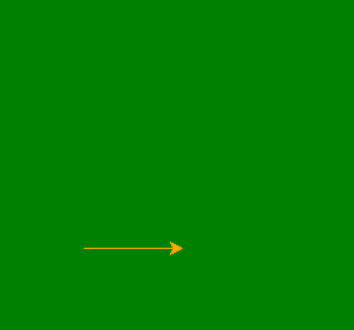

# 使用龟

在 Python 中绘制立方体和长方体

> 原文:[https://www . geesforgeks . org/draw-cube-and-长方体-in-python-use-turtle/](https://www.geeksforgeeks.org/draw-cube-and-cuboid-in-python-using-turtle/)

**先决条件:** [海龟编程基础知识](https://www.geeksforgeeks.org/turtle-programming-python/)

**海龟**是 Python 中的内置模块。它提供使用屏幕(纸板)和乌龟(钢笔)的绘图。要在屏幕上画东西，我们需要移动乌龟(笔)。要移动乌龟，有一些功能，即向前()、向后()，等等。

#### 绘制立方体

使用以下步骤:

*   首先画出前面的正方形
*   通过左下方移动到后面的方块
*   画后面的正方形
*   如代码所示绘制剩余的一面。

下面是实现。

## 蟒蛇 3

```
#import the turtle modules 
import turtle 

# Forming the window screen
tut = turtle.Screen()

# background color green
tut.bgcolor("green")

# window title Turtle
tut.title("Turtle")
my_pen = turtle.Turtle()

# object color
my_pen.color("orange")
tut = turtle.Screen()           

# forming front square face
for i in range(4):
    my_pen.forward(100)
    my_pen.left(90)

# bottom left side
my_pen.goto(50,50)

# forming back square face
for i in range(4):
    my_pen.forward(100)
    my_pen.left(90)

# bottom right side
my_pen.goto(150,50)
my_pen.goto(100,0)

# top right side
my_pen.goto(100,100)
my_pen.goto(150,150)

# top left side
my_pen.goto(50,150)
my_pen.goto(0,100)
```

**输出:**



#### 绘制长方体

使用以下步骤:

*   首先画出前面的矩形
*   通过左下侧移至后矩形
*   绘制后矩形
*   如代码所示绘制剩余的一面。

下面是实现。

## 蟒蛇 3

```
#import the turtle modules 
import turtle 

# Forming the window screen
tut = turtle.Screen()

# background color green
tut.bgcolor("green")

# window title Turtle
tut.title("Turtle")
my_pen = turtle.Turtle()

# object color
my_pen.color("orange")
tut=turtle.Screen()           

# forming front rectangle face
for i in range(2):
    my_pen.forward(100)
    my_pen.left(90)
    my_pen.forward(150)
    my_pen.left(90)

# bottom left side
my_pen.goto(50,50)

# forming back rectangle face
for i in range(2):
    my_pen.forward(100)
    my_pen.left(90)
    my_pen.forward(150)
    my_pen.left(90)

# bottom right side
my_pen.goto(150,50)
my_pen.goto(100,0)

# top right side
my_pen.goto(100,150)
my_pen.goto(150,200)

# top left side
my_pen.goto(50,200)
my_pen.goto(0,150)
```

**输出:**

