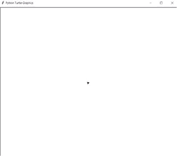

# 使用 Python 中的海龟图形绘制菱形

> 原文:[https://www . geesforgeks . org/draw-diamond-shape-use-turtle-graphics-in-python/](https://www.geeksforgeeks.org/draw-diamond-shape-using-turtle-graphics-in-python/)

在本文中，我们将学习如何在 Python 中使用海龟图形绘制钻石的形状。

**乌龟图形:**

*   **向前(长度):**向前移动笔 x 个单位。
*   **向右(角度):**顺时针方向旋转笔 x 角度。
*   **左(角度)**:逆时针方向旋转笔 x 角度。

**进场:**

*   导入海龟模块。
*   为海龟定义一个实例。
*   首先，做一个更大的三角形
*   然后在更大的三角形内画三条线
*   然后做 4 个小三角形
*   然后在这四个三角形上面画一条线

**下面是上述方法的 Python 实现:**

## 蟒蛇 3

```py
# python program
# import for turtle module
import turtle

# defining instance of turtle
pen = turtle.Turtle()
wn = turtle.Screen()

# this is for bigger triangle
pen.left(60)
pen.forward(200)
pen.left(120)
pen.forward(200)
pen.left(120)
pen.forward(200)
pen.left(150)

# this for making three lines
# inside the bigger triangle
pen.forward(174)
pen.backward(174)
pen.left(16.5)
pen.forward(180)
pen.backward(180)
pen.right(31.5)
pen.forward(180)
pen.right(75)

# this is for making upper triangle1
pen.forward(53)
pen.left(120)
pen.forward(50)
pen.left(120)
pen.forward(50)

# this is for making upper triangle2
pen.right(120)
pen.forward(50)
pen.left(120)
pen.forward(50)

# this is for making upper triangle3                   
pen.right(120)
pen.forward(50)
pen.left(120)
pen.forward(50)

# this is for making upper triangle1
pen.right(120)
pen.forward(50)
pen.left(120)
pen.forward(50)
pen.left(180)
pen.forward(50)

# this is for making line above all 4 small triangle
pen.left(300)
pen.forward(160)
```

**输出:**

