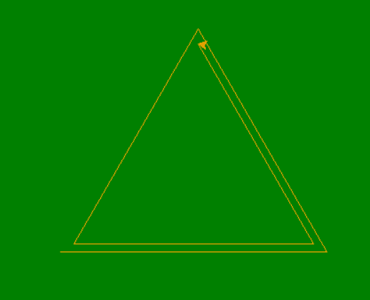
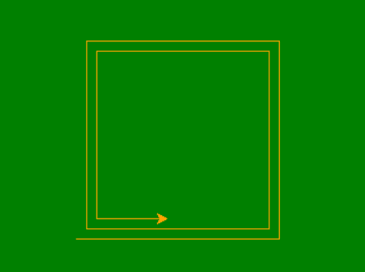
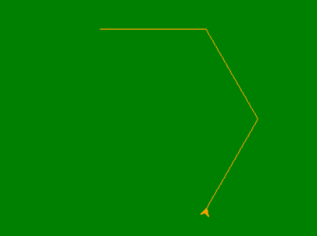

# 用龟在 Python 中绘制形状内的形状

> 原文:[https://www . geesforgeks . org/draw-shape-in-shape-in-python-use-turtle/](https://www.geeksforgeeks.org/draw-shape-inside-shape-in-python-using-turtle/)

**先决条件:**[Python 中的海龟编程](https://www.geeksforgeeks.org/turtle-programming-python/)

**乌龟**是画板一样的 Python 特性，让我们命令一只乌龟在上面画个遍！我们可以使用很多可以移动乌龟的功能。乌龟进了乌龟图书馆。海龟模块可以以面向对象和面向过程的方式使用。

这里也使用的一些常用方法有:

*   **向前(长度):**向前移动笔 x 个单位。
*   **向后(长度):**向后移动笔 x 个单位。
*   **向右(角度):**顺时针方向旋转笔 x 角度。
*   **左(角度):**逆时针方向旋转笔 x 角度。
*   **penip():**停止龟笔的绘制。
*   **pendown():** 开始画龟笔。

在本文中，我们将在一个类似的形状内绘制各种形状，就像在三角形内绘制三角形一样。

## **三角形内的三角形**

请遵循以下步骤:

*   为海龟定义一个实例。
*   对于正方形，执行 3 次循环(边)。
*   在每次迭代中，向前移动海龟 120 个单位。
*   这将组成一个三角形。
*   这是多次使用一个函数在三角形内部形成三角形。

下面是 python 实现。

## 蟒蛇 3

```py
# import the turtle modules
import turtle

# define the function
# for triangle
def form_tri(side):
    for i in range(3):
        my_pen.fd(side)
        my_pen.left(120)
        side -= 10

# Forming the window screen
tut = turtle.Screen()
tut.bgcolor("green")
tut.title("Turtle")

my_pen = turtle.Turtle()
my_pen.color("orange")

tut = turtle.Screen()          

# for different shapes
side = 300
for i in range(10):
    form_tri(side)
    side -= 30
```

**输出:**



## 广场内的广场

请遵循以下步骤:

*   为海龟定义一个实例。
*   对于正方形，执行 4 次循环(边)。
*   在每次迭代中，向前移动海龟 90 个单位。
*   这将组成一个正方形。
*   这是多次使用一个函数在正方形内形成正方形。

下面是 python 实现。

## 蟒蛇 3

```py
# import the turtle modules
import turtle

# define the function
# for square
def form_sq(side):
    for i in range(4):
        my_pen.fd(side)
        my_pen.left(90)
        side -= 5

# Forming the window screen
tut = turtle.Screen()
tut.bgcolor("green")
tut.title("Turtle")

my_pen = turtle.Turtle()
my_pen.color("orange")

tut = turtle.Screen()          

# for different shapes
side = 200

for i in range(10):
    form_sq(side)
    side-= 20
```

**输出:**



## 内六角

请遵循以下步骤:

*   为海龟定义一个实例。
*   对于六边形，执行 6 次循环(边)。
*   在每次迭代中向前移动海龟 300 单位。
*   这将组成一个六边形。
*   使用一个函数在六边形内部多次形成六边形。

下面是 python 实现。

## 蟒蛇 3

```py
# import the turtle modules
import turtle

# define the function
# for hexagon
def form_hex(side):
    for i in range(6):
        my_pen.fd(side)
        my_pen.left(300)
        side -= 2

# Forming the window screen
tut = turtle.Screen()
tut.bgcolor("green")
tut.title("Turtle")

my_pen = turtle.Turtle()
my_pen.color("orange")

tut = turtle.Screen()

# for different sizes
side = 120

for i in range(5):
    form_hex(side)
    side -= 12
```

**输出:**

