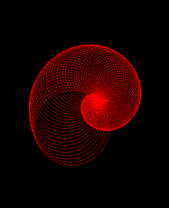

# 使用 Python 中的海龟图形绘制螺旋圈

> 原文:[https://www . geesforgeks . org/draw-spiral-circles-use-turtle-graphics-in-python/](https://www.geeksforgeeks.org/draw-spiralling-circles-using-turtle-graphics-in-python/)

**海龟** 是一个内置的 python 模块。它使我们能够通过海龟、海龟模块、中定义的方法以及使用一些逻辑循环来绘制任何图形。要在屏幕(纸板)上画些东西，只需移动乌龟(笔)。移动海龟(笔)有一些功能，如向前()、向后()、等等。

**进场:**

1.  导入并创建一个海龟实例。
2.  根据您的需要设置图形视觉效果。
3.  对一些整数值 I 运行 for 循环。
4.  对于 I 的每个值，画一个半径为 I 的圆。
5.  现在将海龟旋转一个固定的角度。

下面是上述方法的实现

## 蟒蛇 3

```
# importing turtle
import turtle

# initialise the turtle instance
animation = turtle.Turtle()

#creating animation
# changes speed of turtle
animation.speed(0)

# hiding turtle 
animation.hideturtle()

# changing background color
animation.getscreen().bgcolor("black")

# color of the animation
animation.color("red")

for i in range(100):

    # drawing circle using circle function 
    # by passing radius i
    animation.circle(i)

    # changing turtle face by 5 degree from it's
    # previous position after drawing a circle
    animation._rotate(5)
```

**输出:**

