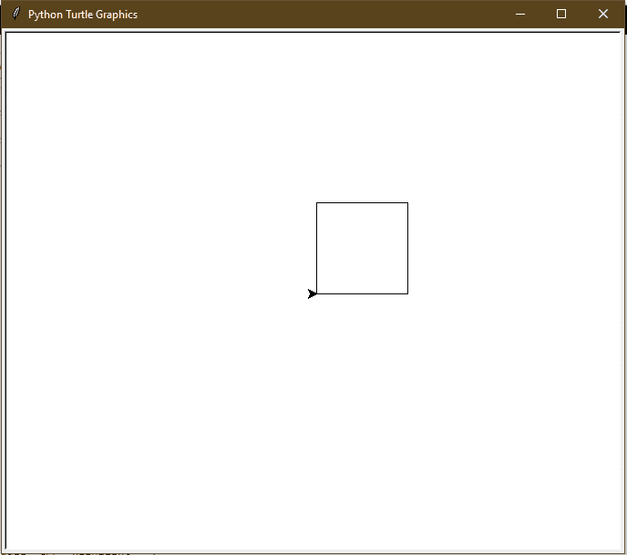
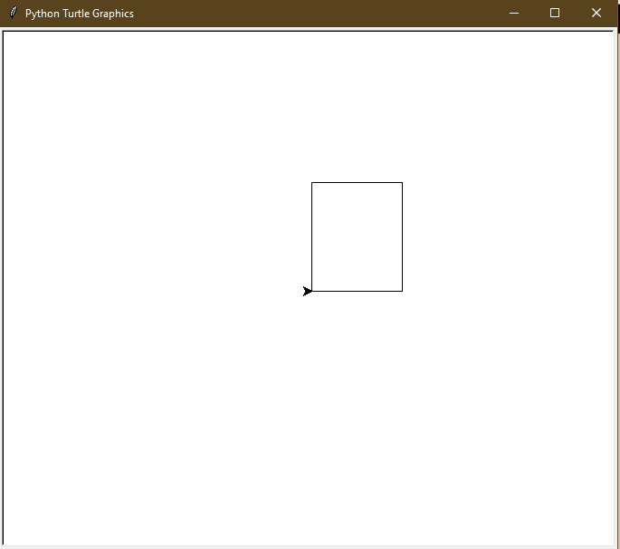
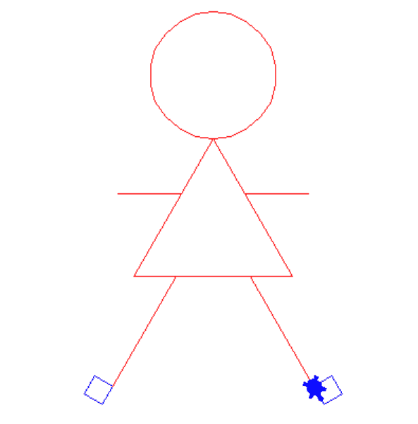

# 用龟蟒画正方形和长方形

> 原文:[https://www . geeksforgeeks . org/画中画-乌龟-蟒蛇皮-正方形-长方形/](https://www.geeksforgeeks.org/draw-square-and-rectangle-in-turtle-python/)

**先决条件:** [海龟编程基础](https://www.geeksforgeeks.org/turtle-programming-python/)
**海龟**是 Python 中的内置模块。它提供使用屏幕(纸板)和乌龟(钢笔)的绘图。要在屏幕上画东西，我们需要移动乌龟(笔)。要移动海龟，有一些功能，例如向前()，向后()，等等。

### 绘图方块:

## 蟒蛇 3

```
# draw square in Python Turtle
import turtle

t = turtle.Turtle()

s = int(input("Enter the length of the side of the Square: "))

# drawing first side
t.forward(s) # Forward turtle by s units
t.left(90) # Turn turtle by 90 degree

# drawing second side
t.forward(s) # Forward turtle by s units
t.left(90) # Turn turtle by 90 degree

# drawing third side
t.forward(s) # Forward turtle by s units
t.left(90) # Turn turtle by 90 degree

# drawing fourth side
t.forward(s) # Forward turtle by s units
t.left(90) # Turn turtle by 90 degree
```

**输入:**

```
100
```

**输出:**



**第二种方法(使用循环):**

## 蟒蛇 3

```
# draw Square in Python Turtle
import turtle

t = turtle.Turtle()

s = int(input("Enter the length of the side of square: "))

for _ in range(4):
  t.forward(s) # Forward turtle by s units
  t.left(90) # Turn turtle by 90 degree
```

**输入:**

```
100
```

**输出:**


### 绘制矩形:

## 蟒蛇 3

```
# draw Rectangle in Python Turtle
import turtle

t = turtle.Turtle()

l = int(input("Enter the length of the Rectangle: "))
w = int(input("Enter the width of the Rectangle: "))

# drawing first side
t.forward(l) # Forward turtle by l units
t.left(90) # Turn turtle by 90 degree

# drawing second side
t.forward(w) # Forward turtle by w units
t.left(90) # Turn turtle by 90 degree

# drawing third side
t.forward(l) # Forward turtle by l units
t.left(90) # Turn turtle by 90 degree

# drawing fourth side
t.forward(w) # Forward turtle by w units
t.left(90) # Turn turtle by 90 degree
```

**输入:**

```
100
120
```

**输出:**



**第二种方法(使用循环):**

## 蟒蛇 3

```
# draw Rectangle in Python Turtle
import turtle

t = turtle.Turtle()

l = int(input("Enter the length of the Rectangle: "))
w = int(input("Enter the width of the Rectangle: "))

for _ in range(4):

  # drawing length
  if _% 2 == 0:
    t.forward(l) # Forward turtle by l units
    t.left(90) # Turn turtle by 90 degree

  # drawing width
  else:
    t.forward(w) # Forward turtle by w units
    t.left(90) # Turn turtle by 90 degree
```

**输入:**

```
100
120
```

**输出:**


从现在开始，你一定学会了如何画各种基本的几何图形，如圆形、正方形、长方形。所以，让我们运用这些知识来构建一些你可以真正用于构建游戏的东西，比如让我们用几何知识的基本知识来画一个人。

下面是这个实现的代码

## 蟒蛇 3

```
import turtle

def draw_dream():
    window = turtle.Screen()
    window.bgcolor("white")
    draw_Scarlett()
    window.exitonclick()

def draw_Scarlett():
    brad = turtle.Turtle()
    brad.shape("turtle")
    brad.color("red")
    draw_head(brad)
    draw_body(brad)
    draw_arm(brad)
    draw_leg1(brad)
    draw_leg2(brad)

def draw_head(brad):
    brad.circle(60)
    brad.speed(3)
    brad.right(60)

def draw_body(brad):
    num = 0
    while num < 3:
        brad.forward(150)
        brad.right(120)
        brad.speed(1)
        num += 1

def draw_arm(brad):
    brad.forward(60)
    brad.left(60)
    brad.forward(60)

    brad.backward(60)
    brad.right(60)
    brad.backward(60)

    brad.right(60)

    brad.forward(60)
    brad.right(60)
    brad.forward(60)

    brad.backward(60)
    brad.left(60)
    brad.forward(90)

def draw_leg1(brad):
    brad.left(120)
    brad.forward(40)
    brad.right(120)
    brad.forward(120)
    draw_foot1(brad)

def draw_leg2(brad):
    brad.color("red")
    brad.right(180)
    brad.forward(120)
    brad.right(60)
    brad.forward(70)
    brad.right(60)
    brad.forward(120)
    draw_foot2(brad)

def draw_foot1(brad):
    brad.color("blue")
    num = 0
    while num < 4:
        brad.forward(20)
        brad.right(90)
        num += 1

def draw_foot2(brad):
    brad.color("blue")
    num = 0
    while num < 4:
        brad.forward(20)
        brad.left(90)
        num += 1

draw_dream()
```

**输出:**

