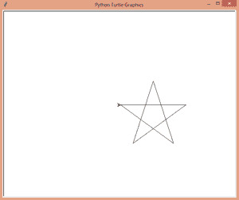
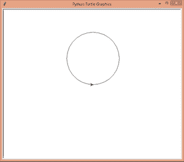
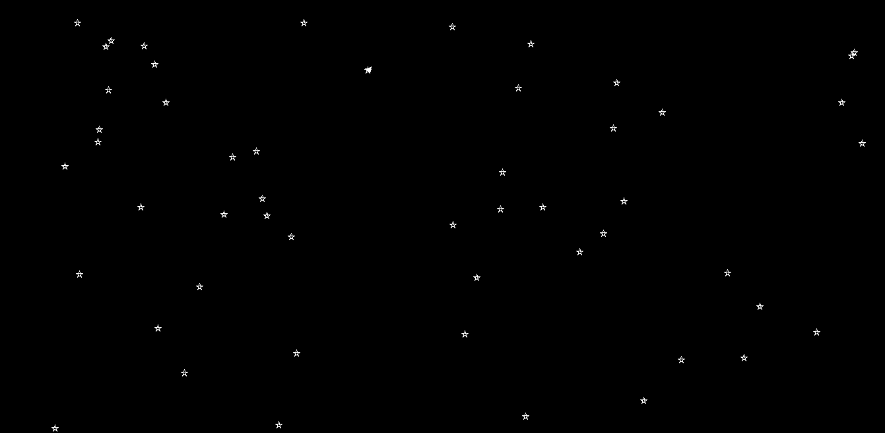
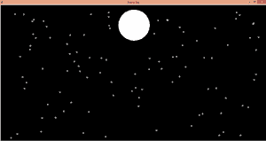

# 用 Python 中的龟画出有月亮的星空

> 原文:[https://www . geeksforgeeks . org/draw-带月亮的星空-使用蟒蛇皮乌龟/](https://www.geeksforgeeks.org/draw-starry-sky-with-moon-using-turtle-in-python/)

**先决条件:**[Python 中的海龟编程](https://www.geeksforgeeks.org/turtle-programming-python/)

在 Python 中，Turtle 是一个内置的库，它为我们提供了绘制不同图案、形状或任何我们想要的东西的功能，但为此，我们必须了解 Turtle 库提供的不同功能的用途。

**在这篇文章中，我们将学习如何绘制星空。**也许这篇文章写得很长，但读完整篇文章后，你会很容易理解每一步。

为此，我们使用 [**龟库**](https://www.geeksforgeeks.org/turtle-programming-python/) 和随机模块生成随机位置来绘制星星。

**下面列出了我们用来绘制星空的方法。**

<figure class="table">

| **方法** | **参数** | **描述** |
| --- | --- | --- |
| 乌龟() | 没有人 | 它创建并返回一个新的海龟对象。 |
| bgcolor(bgcolor) | 颜色名称 | 填充窗口背景的颜色 |
| 圆圈() | 半径、范围、步长 | 画一个给定半径的圆。 |
| 标题() | 名字 | 给海龟窗口命名 |
| forward() / fd() | 数量 | 它将乌龟向前移动指定的量。 |
| 屏幕() | 没有人 | 通过此方法后，龟屏将被激活 |
| 速度 | 价值 | 决定笔的速度 |
| 向上() | 没有人 | 拿起乌龟的笔。 |
| 向下() | 没有人 | 捡起乌龟的钢笔。 |
| 左() | 角 | 它逆时针转动乌龟。 |
| 右() | 角 | 它顺时针转动乌龟。 |
| goto() | x，y | 它将海龟移动到 x，y 位置。 |
| begin_fill() | 没有人 | 在绘制要填充的形状之前调用。相当于填充(真)。 |
| end_fill() | 没有人 | 填充在最后一次调用 begin_fill()后绘制的形状。相当于填充(假)。 |
| 海德龟（） | 没有人 | 完成绘图后隐藏乌龟。 |
| exitonclick() | 没有人 | 点击退出龟屏。 |
| 兰丁特 | 开始、结束值 | 生成给定范围内的随机值。 |

</figure>

我们的星空是由许多星星和一个圆形的月亮组成的。所以，我们必须先学习如何画星星和圆圈。

让我们首先学习如何通过我们的代码绘制星形。

## 计算机编程语言

```
# importing turtle library
import turtle

# creating turtle object
t = turtle.Turtle()

# to activate turtle graphics screen
w = turtle.Screen()

# speed of turtle's pen
t.speed(0)

# creating star
for i in range(0, 5):
    t.fd(200)
    t.right(144)

# after clicking turtle graphics screen
# will be terminated
w.exitonclick()
```

**输出:**



在上面的代码中，我们运行范围从 0 到 5 的 for 循环，因为我们都知道 star 有 5 条边，两条边之间的角度将为 144 度，以形成完美的星形，这就是我们在线 t 中所做的。右(144)我们以 144 度的角度移动海龟的头部，线 t.fd(200)决定我们星形的大小(值越小=星形越小)

现在，我们将学习如何通过我们的代码绘制圆。

## 计算机编程语言

```
# importing turtle library
import turtle

# creating turtle object
t = turtle.Turtle()

# to activate turtle graphics Screen
w = turtle.Screen()

# speed of turtle's pen
t.speed()

# Creating circle
t.circle(100)

# after clicking turtle graphics screen 
# will be terminated
w.exitonclick()
```

**输出:**



在上面的代码中，为了做一个圆，我们使用了海龟库提供的圆函数，只是我们传递了定义圆半径的参数 100。在运行我们的代码之后，我们得到了我们的圆。

所以，最后，我们学会了如何画星星和圆圈。

**现在我们要画出我们的星空**。

## 计算机编程语言

```
# importing libraries
import turtle
import random

# creating turtle object
t = turtle.Turtle()

# to activate turtle graphics Screen
w = turtle.Screen()

# setting speed of turtle
t.speed(0)

# giving the background color of turtle
# graphics screen
w.bgcolor("black")

# giving the color of pen to our turtle
# for drawing
t.color("white")

# giving title to our turtle graphics window
w.title("Starry Sky")

# making function to draw the stars
def stars():
    for i in range(5):
        t.fd(10)
        t.right(144)

# loop for making number of stars
for i in range(100):

    # generating random integer values for x and y
    x = random.randint(-640, 640)
    y = random.randint(-330, 330)

    # calling the function stars to draw the 
    # stars at random x,y value
    stars()

    # took up the turtle's pen
    t.up()

    # go at the x,y coordinate generated above
    t.goto(x, y)

    # took down the pen to draw
    t.down()

# for making our moon tooking up the pen
t.up()

# going at the specific coordinated
t.goto(0, 170)

# took down the pen to start drawing
t.down()

# giving color to turtle's pen
t.color("white")

# start filling the color
t.begin_fill()

# making our moon
t.circle(80)

# stop filling the color
t.end_fill()

# after drawing hidding the turtle from
# the window
t.hideturtle()

# terminated the window after clicking
w.exitonclick()
```

**输出:**



星空



在上面的代码中，在阅读每一行代码之前的注释后，您将会明白我们的代码是如何工作的，并绘制星空。