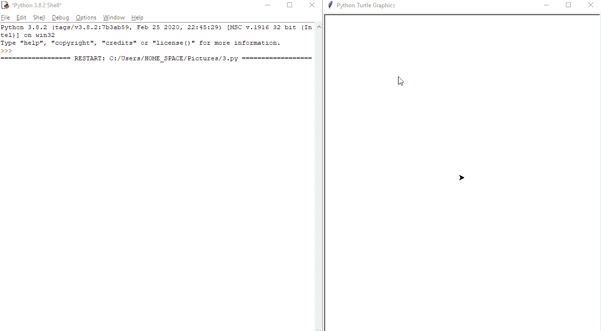

# 如何获取巨蟒龟的屏幕坐标？

> 原文:[https://www . geeksforgeeks . org/如何获得 python-turtle 中的屏幕坐标/](https://www.geeksforgeeks.org/how-to-get-coordinate-of-screen-in-python-turtle/)

海龟是 python 中的一个特殊特性，它包含一个图形库。在本文中，我们将学习如何在 Python Turtle 中获取屏幕坐标。

海龟有许多内置的功能来创建这个程序，我们使用如下。

> **导入海龟–>**这是允许我们访问海龟库的 python 库。
> 
> **龟()–>**此法用于制作物体。
> 
> **在屏幕上点击(函数名，1)–>**这是龟函数，将坐标发送给函数；1 代表左键单击，3 代表右键单击
> 
> **速度()–>**这是用来增减龟指针的速度。
> 
> **监听()–>T**his 允许服务器监听传入的连接。
> 
> **done()–>**这是用来按住屏幕的。

## 蟒蛇 3

```py
# turtle library
import turtle

#This to make turtle object
tess=turtle.Turtle() 

# self defined function to print coordinate
def buttonclick(x,y):
    print("You clicked at this coordinate({0},{1})".format(x,y))

 #onscreen function to send coordinate
turtle.onscreenclick(buttonclick,1)
turtle.listen()  # listen to incoming connections
turtle.speed(10) # set the speed
turtle.done()    # hold the screen
```

### **输出:**



**以上输出显示坐标是指针点击屏幕的打印位置**