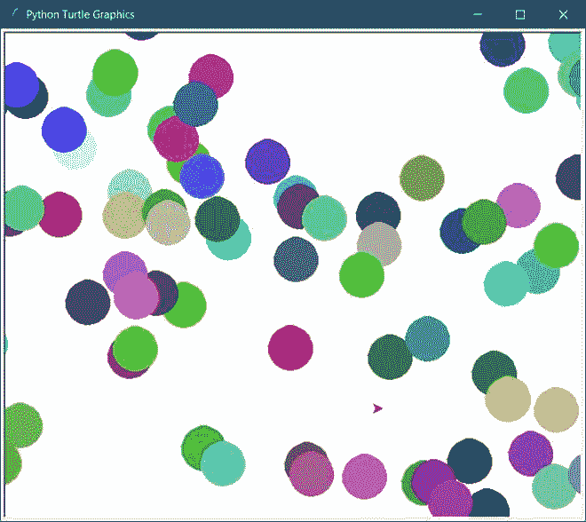

# 如何在 Python–Turtle 中制作随机颜色？

> 原文:[https://www . geeksforgeeks . org/如何制作随机颜色的蟒蛇皮乌龟/](https://www.geeksforgeeks.org/how-to-make-random-colors-in-python-turtle/)

海龟是 Python 库中的内置模块。海龟模块用于绘制有趣的形状或图画。我们可以通过调用导入海龟来使用海龟模块。随机模块用于生成随机数。

### 使用的方法

*   **randint(0，255):** 用于生成 0 到 255 之间的数字。
*   **速度(0):** 用于设置速度，在板上显示图纸。
*   **颜色模式(255):** 应设置为 255，以生成直到 255 的颜色编号。
*   **begin_fill():** 它开始用颜色填充圆圈。
*   **end_fill():** 结束用颜色填充圆。
*   **penip():**它将停止在板上绘图。
*   **pendown():** 默认情况下，海龟在 *pendown()* 状态下运行。回到船上过去的绘图状态。
*   **圆(半径):**用于生成特定半径的圆。

所有上述方法都将在无限循环中调用，以说明相同半径的随机生成的彩色圆。

下面是实现。

## 蟒蛇 3

```
# import turtle
from turtle import *
# import random
from random import randint

# speed to draw to color
speed(0)

# size of the pen
pensize(10)

# colormode should be 255 to
# show every type of color
colormode(255)

# To display the color continuously the
# while loop is true
while True:

    # randint will have random color based on
    # every randint the color will be called
    color(randint(0, 255),
          randint(0, 255),
          randint(0, 255))

    # it will begin to fill the circle with color
    begin_fill()

    # generate circle
    circle(20)

    # it will end to fill color
    end_fill()

    # it will start to draw
    penup()

    # x axis and y axis
    goto(randint(-500, 500), randint(-300, 270))

    # it wil stop to draw
    pendown()
```

**输出**



随机颜色