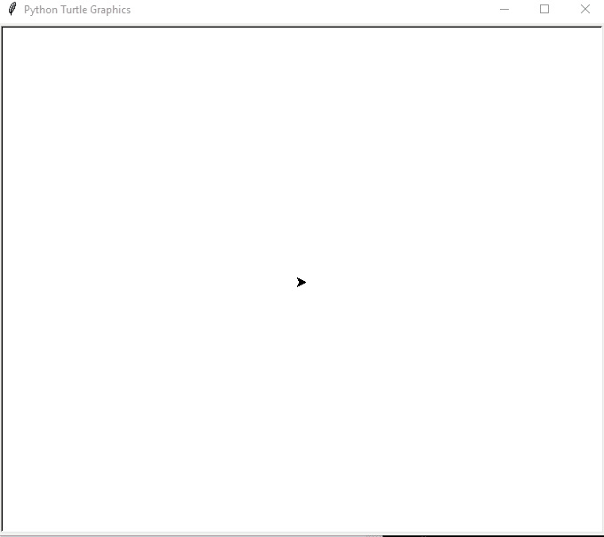

# 如何用 screenclick 在 Python Turtle 中制作三角形？

> 原文:[https://www . geesforgeks . org/如何在 python 中制作三角形-海龟-使用-onscreenclick/](https://www.geeksforgeeks.org/how-to-make-triangle-in-python-turtle-using-onscreenclick/)

“ [**【乌龟】**](https://www.geeksforgeeks.org/turtle-programming-python/) ”是画板一样的 Python 特性，让我们命令一只乌龟在上面画个遍！我们可以使用像 turtle.forward(…)和 turtle.right(…)这样的函数来移动乌龟。海龟也被称为标志编程语言，它通过命令移动和绘制产生线条或矢量图形，无论是在屏幕上还是用一个叫做海龟的小机器人。

#### **使用的功能**

*   **龟():**此法用于制作物体。
*   **在屏幕上点击(函数名，1):** 该龟函数将当前坐标发送给函数，该函数进一步用于形成三角形，1 表示左键点击，3 表示右键点击
*   **速度():**用于增加或减少龟指针的速度。
*   **监听():**这允许服务器监听传入的连接。
*   **done():** 这是用来按住屏幕的。
*   **penip():**这是龟库内置的画线功能。
*   **pendown():** 这是龟库内置的函数，用来画线。
*   **forward():** 这是海龟库中内置的函数，用于向前移动海龟的方向，它以像素为单位作为参数
*   **left():** 这是海龟库中内置的向海龟左转的函数，它以角度为参数

## 蟒蛇 3

```py
import turtle

# Screen() method to get screen
wn=turtle.Screen() 

# creating tess object
tess=turtle.Turtle() 

def triangle(x,y):

    # it is used to draw out the pen
    tess.penup()

    # it is used to move cursor at x
    # and y position
    tess.goto(x,y)

    # it is used to draw in the pen
    tess.pendown()
    for i in range(3):

          # move cursor 100 unit
        # digit forward
        tess.forward(100)

        # turn cursor 120 degree left
        tess.left(120)

        # Again,move cursor 100 unit
        # digit forward
        tess.forward(100)

# special built in function to send current
# position of cursor to triangle
turtle.onscreenclick(triangle,1)

turtle.listen()

# hold the screen
turtle.done()
```

**输出:**



**我们可以看到光标形成三角形，我们可以**