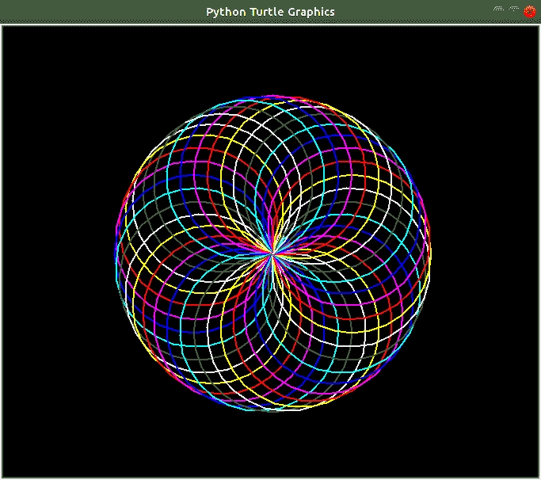

# 使用 Python 中的海龟打印肺活量图

> 原文:[https://www . geeksforgeeks . org/print-a-spiro graph-use-turtle-in-python/](https://www.geeksforgeeks.org/print-a-spirograph-using-turtle-in-python/)

**先决条件:**[Python 中的海龟编程](https://www.geeksforgeeks.org/turtle-programming-python/)

一个[肺活量图](https://www.geeksforgeeks.org/fractal-using-spirograph-python/)是一个非常有趣的几何图形，它通常与两个轴对称。它产生各种数学轮盘曲线，技术上称为次摆线和外摆线。在这里，我们使用了一系列的颜色来画圆，你可以根据你的颜色选择来使用你的组合。

下面是实现。

## 蟒蛇 3

```
# Import the turtle library for
# drawing the required curve
import turtle as tt

# Set the background color as black,
# pensize as 2 and speed of drawing
# curve as 10(relative)
tt.bgcolor('black')
tt.pensize(2)
tt.speed(10)

# Iterate six times in total
for i in range(6):

      # Choose your color combination
    for color in ('red', 'magenta', 'blue',
                  'cyan', 'green', 'white',
                  'yellow'):
        tt.color(color)

        # Draw a circle of chosen size, 100 here
        tt.circle(100)

        # Move 10 pixels left to draw another circle
        tt.left(10)

    # Hide the cursor(or turtle) which drew the circle
    tt.hideturtle()
```

输出:

