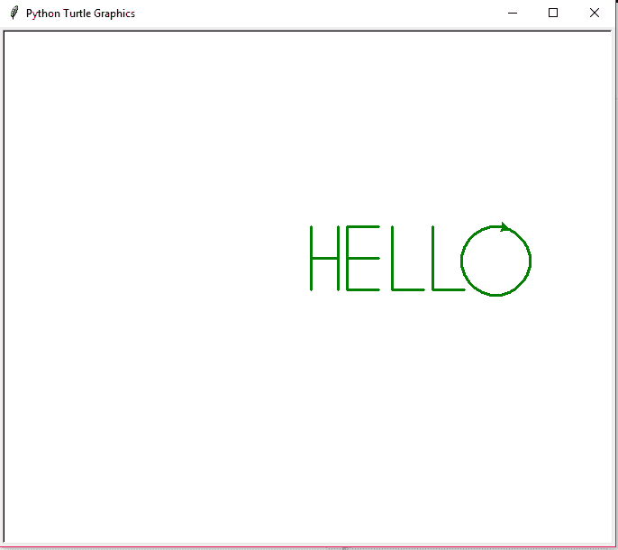

# 用海龟模块

打印 HELLO

> 原文:[https://www . geesforgeks . org/printing-hello-with-turtle-module/](https://www.geeksforgeeks.org/printing-hello-with-turtle-module/)

海龟是一个 Python 模块，它允许我们通过导入 Python 并使用海龟模块的内置功能来绘制各种几何图形。我们可以使用像 turtle.forward(…)和 turtle.right(…)这样的函数来移动乌龟。海龟是一种初学者友好的学习 python 的方法，通过运行一些基本命令并查看海龟的图形来完成。它就像一个画板，可以让你在上面画画。海龟模块可以以面向对象和面向过程的方式使用。

使用的龟法如下:

#### 用于移动海龟的功能

<figure class="table">

| 功能 | 描述 |
| --- | --- |
| 向前(步数) | 该功能用于将海龟向前移动指定的步数。 |
| 向后(步数) | 该功能用于将海龟向前移动指定的步数。 |
| 左侧(角度) | 该功能用于将海龟向左/逆时针旋转指定的角度。 |
| 右(角度) | 该功能用于将海龟向右/顺时针旋转指定的角度。 |

</figure>

#### 用于了解海龟状态的功能:

**位置()**–该功能用于获取乌龟指针的坐标/位置。这里不需要参数，因为这个函数不是用来输入的，而是用来输出海龟在控制台窗口中的位置。

#### 用于着色的功能:

<figure class="table">

| 功能 | 描述 |
| --- | --- |
| bgcolor(颜色) | 这个功能是用来给海龟窗口添加背景色的。 |
| pencolor(颜色) | 这个功能是用来给龟笔上色的。 |
| 填充颜色（"颜色"） | 此功能用于填充任何闭合形状的颜色。 |
| 颜色(pencolor、fillcolor) | 这是一个速记函数，用于同时指定铅笔颜色和填充颜色。 |

</figure>

#### 用于笔控制的功能:

<figure class="table">

| 功能 | 描述 |
| --- | --- |
| penup()或 pu() | 该功能用于从当前位置提起笔。 |
| goto() | 此功能用于在提起后将笔移动到新的位置。 |
| pendown()或 pd() | 此功能再次使用放下笔到新的位置。 |
| 思考(int) | 该函数用于指定钢笔绘制的线条宽度。 |

</figure>

**注意:**要了解更多关于海龟[的信息，请点击此处](https://www.geeksforgeeks.org/turtle-programming-python/)。
**例:**

## 蟒蛇 3

```
# Python program to
# demonstrate basics of turtle

# Importing and making a turtle object
# with background color as white
import turtle

frame = turtle.Screen().bgcolor("White")
draw = turtle.Turtle()
draw.left(90)
draw.forward(100)
draw.right(90)
draw.forward(100)
```

**输出:**


学习完海龟的基础知识后，让我们编写打印“HELLO”的代码。下面是实现。

## 蟒蛇 3

```
# Python program to
# demonstrate printing HELLO
# using turtle

# Here frame is initialized with
# background colour as "White"
import turtle
frame = turtle.Screen().bgcolor("White")
draw = turtle.Turtle()

# The colour, width and speed of the pen is initialized
draw.color("Green")
draw.width(3)
draw.speed(10)

# Now lets get started with actual code
# printing letter H
draw.left(90)
draw.forward(70)
draw.penup()
draw.goto(0, 35)
draw.pendown()
draw.right(90)
draw.forward(30)
draw.penup()
draw.goto(30, 70)
draw.pendown()
draw.right(90)
draw.forward(70)

# printing letter E
draw.penup()
draw.goto(40, 0)
draw.pendown()
draw.right(180)
draw.forward(70)
draw.right(90)
draw.forward(35)
draw.penup()
draw.goto(40, 35)
draw.pendown()
draw.forward(35)
draw.penup()
draw.goto(40, 0)
draw.pendown()
draw.forward(35)

# printing letter L
draw.penup()
draw.goto(90, 70)
draw.pendown()
draw.right(90)
draw.forward(70)
draw.left(90)
draw.forward(35)

# printing letter L
draw.penup()
draw.goto(135, 70)
draw.pendown()
draw.right(90)
draw.forward(70)
draw.left(90)
draw.forward(35)

# printing letter O
draw.penup()
draw.goto(210, 70)
draw.pendown()
for i in range(25):
    draw.right(15)
    draw.forward(10)
```

**输出:**

