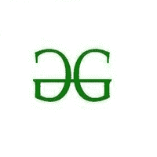

# Python–使用海龟图形

绘制“GFG”标志

> 原文:[https://www . geesforgeks . org/python-draw-gfg-logo-use-turtle-graphics/](https://www.geeksforgeeks.org/python-draw-gfg-logo-using-turtle-graphics/)

**先决条件:**[Python 中的海龟编程](https://www.geeksforgeeks.org/turtle-programming-python/)

**乌龟**是画板一样的 Python 特性，让我们命令一只乌龟在上面画个遍！我们可以使用很多可以移动乌龟的功能。乌龟进入乌龟图书馆。海龟模块可以以面向对象和面向过程的方式使用。

一些常用的方法有:

*   **向前(长度):**向前移动笔 x 个单位。
*   **向后(长度):**向后移动笔 x 个单位。
*   **向右(角度):**顺时针方向旋转笔 x 角度。
*   **左(角度):**逆时针方向旋转笔 x 角度。
*   **penip():**停止龟笔的绘制。
*   **pendown():** 开始画龟笔。

在本文中，我们将绘制 GeeksforGeeks 的徽标，如下所示–

<figure class="image"></figure>

**进场:**

*   进口海龟。
*   形成大小和颜色一致的窗纱。
*   然后开始画 logo:
    *   向后形成“C”
    *   直线上升 90 度
    *   向右 90 度线
    *   向下 90 度线
    *   向前形成“C”

下面是实现。

<gfg-tab role="tab" slot="tab" id="gfg-tab-0">Python3</gfg-tab> <gfg-panel role="tabpanel" slot="panel" id="gfg-panel-0" data-code-lang="python3">```py
# importing turtle for graphics
import turtle

# Forming the window screen
tut = turtle.Screen()

# background color green
tut.bgcolor("White")

# object
pen = turtle.Turtle()

#speed of pen
pen.speed(10)

# object color
pen.color("Green")

# object width
pen.width(10)
tut = turtle.Screen()

# Code for symbol
# backward C
for x in range(180):
    pen.forward(1)
    pen.right(1)

# up
pen.right(90)
pen.forward(50)

# right
pen.right(90)
pen.forward(130)

# down
pen.right(90)
pen.forward(50)
pen.left(90)

# forward C
for x in range(180):
    pen.backward(1)
    pen.right(1)

turtle.done()
```</gfg-panel>