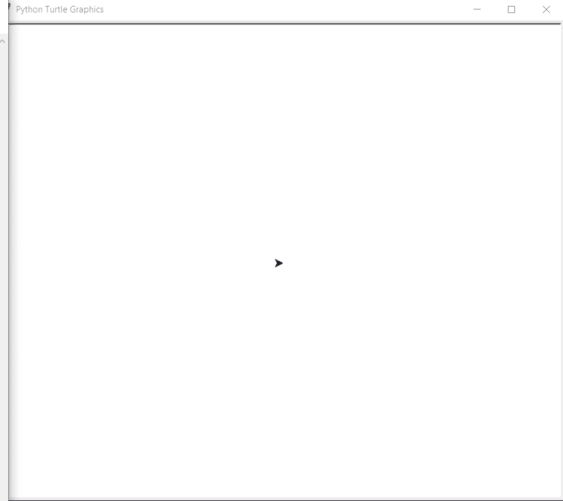

# Python–使用海龟图形绘制六边形

> 原文:[https://www . geesforgeks . org/python-draw-hexagon-use-turtle-graphics/](https://www.geeksforgeeks.org/python-draw-hexagon-using-turtle-graphics/)

在本文中，我们将学习如何使用 Python 中的海龟图形制作六边形。首先让我们知道什么是海龟图形。

### 海龟图形

乌龟是 Python 的一个功能，就像画板一样，让我们命令一只乌龟在上面画来画去！我们可以使用很多可以移动乌龟的功能。乌龟进了乌龟图书馆。海龟模块可以以面向对象和面向过程的方式使用。

一些常用的方法有:

*   **向前(长度):**向前移动笔 x 个单位。
*   **向后(长度):**向后移动笔 x 个单位。
*   **向右(角度):**顺时针方向旋转笔 x 角度。
*   **左(角度):**逆时针方向旋转笔 x 角度。
*   **penip():**停止龟笔的绘制。
*   **pendown():** 开始画龟笔。

### 方法–

*   为**龟定义一个实例。**
*   对于六边形，执行 6 次循环。
*   在每次迭代中，向前移动海龟 **90 单位**，向左移动海龟 **300 度。**
*   这将组成**六边形。**

下面是上述方法的 python 实现。

## 蟒蛇 3

```py
# import the turtle modules
import turtle

# Start a work Screen
ws = turtle.Screen()

# Define a Turtle Instance
geekyTurtle = turtle.Turtle()

# executing loop 6 times for 6 sides
for i in range(6):

    # Move forward by 90 units
    geekyTurtle.forward(90)

    # Turn left the turtle by 300 degrees
    geekyTurtle.left(300)
```

### 输出:



海龟制作六边形