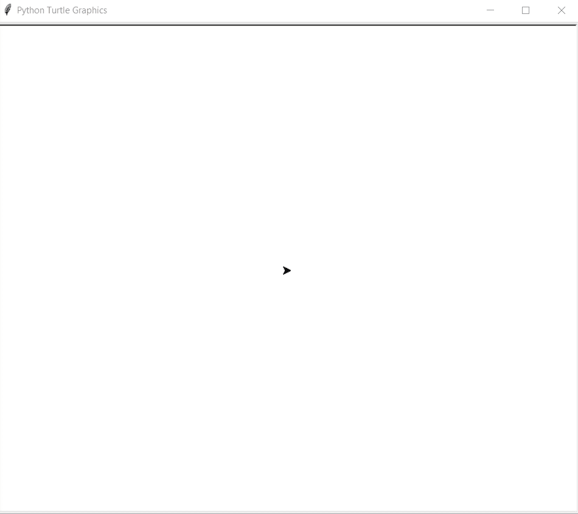

# Python–使用龟形图形绘制八角形

> 原文:[https://www . geesforgeks . org/python-draw-八角形-shape-use-turtle-graphics/](https://www.geeksforgeeks.org/python-draw-octagonal-shape-using-turtle-graphics/)

在本文中，我们将学习如何使用 Python 中的海龟图形制作八边形。首先让我们知道什么是海龟图形。

### 海龟图形

*   **向后(长度):**向后移动笔 x 个单位。
*   **向右(角度):**顺时针方向旋转笔 x 角度。
*   **左(角度):**逆时针方向旋转笔 x 角度。
*   **penip():**停止龟笔的绘制。
*   **pendown():** 开始画龟笔。

## 方法

*   导入海龟模块。
*   找个屏幕来画画
*   为**龟定义一个实例。**
*   对于一个绘图，**八边形**执行一个循环 8 次。
*   在每次迭代中，向前移动海龟 **100 单位**，向左移动海龟 **45 度**(相当于两边之间的 135 度，所以 180-135=45 度)。
*   这将在两个边之间形成一个 **135** 度**的角度。**
*   **8** 次迭代将完美地组成一个**八边形。**
    下面是上述方法的 Python 实现:

## 蟒蛇 3

```
# import for turtle module
import turtle

# making a workScreen
ws = turtle.Screen()

# defining a turtle instance
geekyTurtle = turtle.Turtle()

# iterating the loop 8 times
for i in range(8):

    # moving turtle 100 units forward
    geekyTurtle.forward(100)

    # turning turtle 45 degrees so
    # as to make perfect angle for an octagon
    geekyTurtle.left(45)
```

**输出:**



八角形