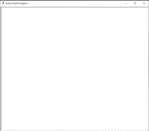
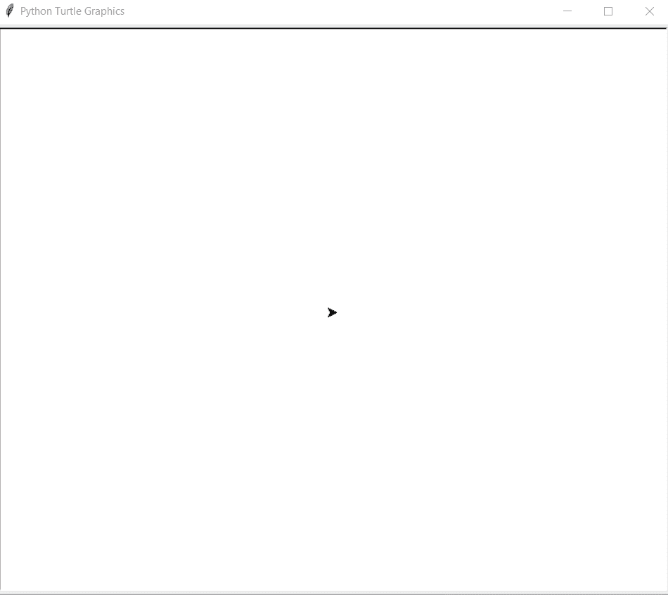

# Python–使用海龟图形绘制星形

> 原文:[https://www . geesforgeks . org/python-draw-star-use-turtle-graphics/](https://www.geeksforgeeks.org/python-draw-star-using-turtle-graphics/)

在本文中，我们将学习如何使用 Python 中的海龟图形制作星星。为此，让我们首先了解什么是海龟图形。

### 海龟图形

乌龟是 Python 的一个功能，就像画板一样，让我们命令一只乌龟在上面画来画去！我们可以使用很多可以移动乌龟的功能。乌龟进入乌龟图书馆。海龟模块可以以面向对象和面向过程的方式使用。

一些常用的方法有:

*   **向前(长度):**向前移动笔 x 个单位。
*   **向后(长度):**向后移动笔 x 个单位。
*   **向右(角度):**顺时针方向旋转笔 x 角度。
*   **左(角度):**逆时针方向旋转笔 x 角度。
*   **penip():**停止龟笔的绘制。
*   **pendown():** 开始画鳖笔。

### 方法

*   首先在你正在使用的闲置或编辑器中**导入龟**模块。

```
import turtle

```

*   找一块画板，乌龟会在上面画画。

```
ws=turtle.Screen()

```

将出现这样的屏幕:-



*   为**龟定义一个实例。**
*   对于一个绘图，一个**星**执行一个循环 5 次。
*   在每次迭代中，向前移动海龟 **100 单位**并向右移动海龟 **144 度。**
*   这将在一颗恒星**内形成一个角度 **36** 度**T3。****
*   **5** 次迭代会完美组成一颗**星。**

下面是上述方法的 python 实现。

**第一种方式:**

## 蟒蛇 3

```
# import for turtle
import turtle

# Starting a Working Screen
ws = turtle.Screen()

# initializing a turtle instance
geekyTurtle = turtle.Turtle()

# executing loop 5 times for a star
for i in range(5):

        # moving turtle 100 units forward
        geekyTurtle.forward(100)

        # rotating turtle 144 degree right
        geekyTurtle.right(144)
```

### 输出:



乌龟造星

**替代方法:**

## 蟒蛇 3

```
#import turtle
import turtle

# set screen
Screen = turtle.Turtle()

# decide colors
cir= ['red','green','blue','yellow','purple']

# decide pensize
turtle.pensize(4)

# Draw star pattern
turtle.penup()
turtle.setpos(-90,30)
turtle.pendown()
for i in range(5):
    turtle.pencolor(cir[i])
    turtle.forward(200)
    turtle.right(144)

turtle.penup()
turtle.setpos(80,-140)
turtle.pendown()

# choose pen color
turtle.pencolor("Black")
turtle.done()
```

**输出:-**

<video class="wp-video-shortcode" id="video-413700-1" width="640" height="360" preload="metadata" controls=""><source type="video/mp4" src="https://media.geeksforgeeks.org/wp-content/uploads/20201012173833/Animated-GIF-original.mp4?_=1">[https://media.geeksforgeeks.org/wp-content/uploads/20201012173833/Animated-GIF-original.mp4](https://media.geeksforgeeks.org/wp-content/uploads/20201012173833/Animated-GIF-original.mp4)</video>