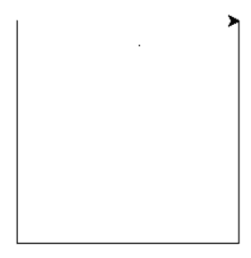
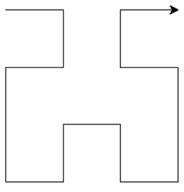

# 使用海龟的 Python–希尔伯特曲线

> 原文:[https://www . geesforgeks . org/python-Hilbert-curve-use-turtle/](https://www.geeksforgeeks.org/python-hilbert-curve-using-turtle/)

分形是一种不断重复的曲线或图形。它包含一个递归模式，重复自身直到期望的嵌套级别。**海龟**模块提供海龟图形，用于在 Python 中绘制各种形状和图案。

希尔伯特曲线是由一系列沿不同方向排列和定向的 U 形曲线连接而成的曲线。这些 U 形曲线以一定的步长间隔放置。

> 让我们检查一条**级-1** 希尔伯特曲线。以下步骤将绘制一条简单的 U 曲线。
> 
> 设 y = 90 度
> 
> 1.  向右旋转 y 度
> 2.  移动步长
> 3.  向左旋转 y 度
> 4.  移动步长
> 5.  向左旋转 y 度
> 6.  移动步长
> 7.  向右旋转 y 度
> 
> 
> 
> 让我们检验并尝试理解**级-2** 希尔伯特曲线。
> 
> 同样，我们假设海龟指针最初指向右边。以下步骤可用于绘制曲线:
> 
> 1.  向右旋转 90 度
> 2.  在 1 级创建一条旋转-y 度(即逆时针方向 y 度)的希尔伯特曲线
> 3.  移动步长
> 4.  向右旋转 y 度
> 5.  创建旋转 y 度(即顺时针方向 y 度)的一级希尔伯特曲线
> 6.  向左旋转 y 度。
> 7.  移动步长
> 8.  创建旋转-y 度的 1 级希尔伯特曲线
> 9.  向右旋转 y 度
> 
> 

`turtle`本节使用的方法如下:

*   **向前()**:用于将乌龟朝乌龟的方向向前移动给定的距离。
*   **向后()**:用于将乌龟朝乌龟方向向后移动给定距离。
*   **左()**:用于将乌龟向左旋转指定角度。
*   **右()**:用于将乌龟向右旋转指定角度。
*   **goto()** :用于将乌龟移动到指定的位置((x，y)坐标)。
*   **penip()**:用于指定移动时不绘图。
*   **pendown()** :用于指定在移动时绘制该图形。
*   **done()** :用于指定龟功完成。

Code for Hilbert Curve is given below :

```py
from turtle import * 

def hilbert(level, angle, step):

    # Input Parameters are numeric
    # Return Value: None
    if level == 0:
        return

    right(angle)
    hilbert(level-1, -angle, step)

    forward(step)
    left(angle)
    hilbert(level-1, angle, step)

    forward(step)
    hilbert(level-1, angle, step)

    left(angle)
    forward(step)
    hilbert(level-1, -angle, step)
    right(angle)

def main():
    level = int(input())
    size = 200
    penup()
    goto(-size / 2.0, size / 2.0)
    pendown()

    # For positioning turtle
    hilbert(level, 90, size/(2**level-1))       
    done()

if __name__=='__main__':
    main()
```