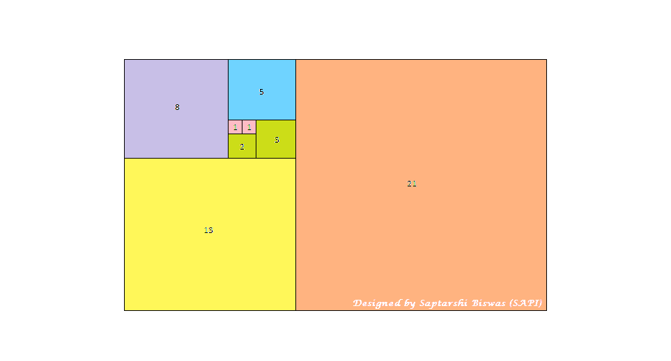
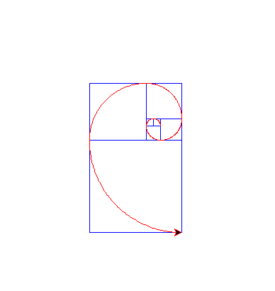

# Python |使用 Turtle 绘制斐波那契螺旋分形

> 原文:[https://www . geesforgeks . org/python-绘图-斐波那契-螺旋-分形-使用-海龟/](https://www.geeksforgeeks.org/python-plotting-fibonacci-spiral-fractal-using-turtle/)

**什么是分形几何？**
分形几何是数学函数或由数学函数生成的一组数字的特殊图形表示形式。它是一个递归的、详细的、无限自相似的数学集合。这些几何图形展示了**“展开对称”**。展开对称性是几何结构在极小的尺度上保持自相似模式的特性。
我们知道斐波那契数列遵循递归关系 **f(n) = f(n-1) + f(n-2)** ，其中 n 是数列中的第 n 项。同样 f(0) = 0，f(1) = 1
**<u>绘制斐波那契分形的方法</u>**
数列中的每个数字代表正方形边的长度。边长为 0 的正方形不存在。所以我们从边长 1 的平方开始。下一个正方形的边长也是 1。

*   我们首先并排构建维度 1 的两个正方形，如下图所示。
*   然后取两个正方形的连接长度，我们在两个一维正方形下面构造第三个正方形。现在正方形的维数是 2
*   再次分别取维度 1、2 的 2 个正方形，我们构造维度 3 的第四个正方形
*   虽然我们继续这个过程进行了少量的迭代，但是这个过程一直持续到无穷。



在我们画完正方形后，我们从最里面最小的正方形开始。然后我们在正方形内画出连续的象限，每个正方形的边作为半径。
下面是实现:

## 蟒蛇 3

```
# Python program for Plotting Fibonacci
# spiral fractal using Turtle
import turtle
import math

def fiboPlot(n):
    a = 0
    b = 1
    square_a = a
    square_b = b

    # Setting the colour of the plotting pen to blue
    x.pencolor("blue")

    # Drawing the first square
    x.forward(b * factor)
    x.left(90)
    x.forward(b * factor)
    x.left(90)
    x.forward(b * factor)
    x.left(90)
    x.forward(b * factor)

    # Proceeding in the Fibonacci Series
    temp = square_b
    square_b = square_b + square_a
    square_a = temp

    # Drawing the rest of the squares
    for i in range(1, n):
        x.backward(square_a * factor)
        x.right(90)
        x.forward(square_b * factor)
        x.left(90)
        x.forward(square_b * factor)
        x.left(90)
        x.forward(square_b * factor)

        # Proceeding in the Fibonacci Series
        temp = square_b
        square_b = square_b + square_a
        square_a = temp

    # Bringing the pen to starting point of the spiral plot
    x.penup()
    x.setposition(factor, 0)
    x.seth(0)
    x.pendown()

    # Setting the colour of the plotting pen to red
    x.pencolor("red")

    # Fibonacci Spiral Plot
    x.left(90)
    for i in range(n):
        print(b)
        fdwd = math.pi * b * factor / 2
        fdwd /= 90
        for j in range(90):
            x.forward(fdwd)
            x.left(1)
        temp = a
        a = b
        b = temp + b

# Here 'factor' signifies the multiplicative
# factor which expands or shrinks the scale
# of the plot by a certain factor.
factor = 1

# Taking Input for the number of
# Iterations our Algorithm will run
n = int(input('Enter the number of iterations (must be > 1): '))

# Plotting the Fibonacci Spiral Fractal
# and printing the corresponding Fibonacci Number
if n > 0:
    print("Fibonacci series for", n, "elements :")
    x = turtle.Turtle()
    x.speed(100)
    fiboPlot(n)
    turtle.done()
else:
    print("Number of iterations must be > 0")
```

**输出:**

