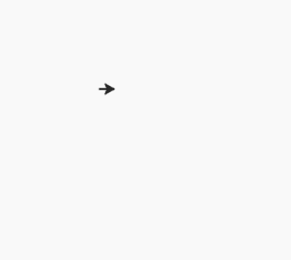
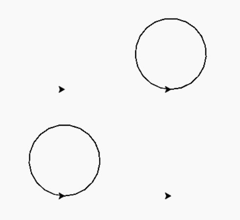

# 蟒蛇–乌龟. clear()

> 原文:[https://www.geeksforgeeks.org/python-turtle-clear/](https://www.geeksforgeeks.org/python-turtle-clear/)

海龟模块以面向对象和面向过程的方式提供海龟图形原语。因为它使用 tkinter 作为底层图形，所以需要安装一个支持 Tk 的 Python 版本。

## turtle.clear()

该功能用于从屏幕上删除海龟的图纸。不要移动海龟的状态和位置，其他海龟的图纸不受影响。这不需要任何争论。

> **语法:**turtle . clear()
> T3】参数:None
> T6】返回: Nothing

下面是上述方法的实现，并附有一些例子:

**例 1 :**

```
# import package
import turtle

# motion
turtle.forward(100)
turtle.right(90)
turtle.forward(100)
turtle.right(90)
turtle.forward(100)

# clear the drawing
# and remain turtle 
# as it is
turtle.clear()
```

**输出:**


**例 2 :**

```
# import package
import turtle

# make a turtle object
# and do some drawing
t1 = turtle.Turtle()
t1.up()
t1.setpos(-100, 50)
t1.down()
t1.circle(50)

# make a turtle object
# and do some drawing
t2 = turtle.Turtle()
t2.up()
t2.setpos(50, 50)
t2.down()
t2.circle(50)

# make a turtle object
# and do some drawing
t3 = turtle.Turtle()
t3.up()
t3.setpos(50, -100)
t3.down()
t3.circle(50)

# make a turtle object
# and do some drawing
t4 = turtle.Turtle()
t4.up()
t4.setpos(-100, -100)
t4.down()
t4.circle(50)

# here we clear the work done by turtle 
# objects : t1 and t3 only but turtle 
# shape remain as it is
t1.clear()
t3.clear()
```

**输出:**

