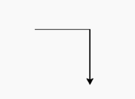
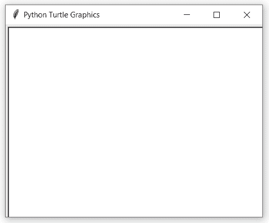

# 蟒蛇–乌龟. done()

> 原文:[https://www.geeksforgeeks.org/python-turtle-done/](https://www.geeksforgeeks.org/python-turtle-done/)

海龟模块以面向对象和面向过程的方式提供海龟图形原语。因为它使用 Tkinter 作为底层图形，所以它需要安装一个支持 Tk 的 Python 版本。

## turtle.done()

该函数用于启动事件循环——调用 Tkinter 的主循环函数。它不需要任何论证。必须是海龟图形程序中的最后一条语句。如果脚本是在空闲模式(无子进程)下运行的，则不得使用–用于海龟图形的交互使用。

> **语法:**turtle . done()
> T3】参数:None
> T6】返回: None

下面是上述方法的实现，并附有一些例子:

**例 1 :** 结尾。

## 蟒蛇 3

```
# import package
import turtle

# motion
turtle.forward(100)
turtle.right(90)
turtle.forward(100)

# stop execution
turtle.done()
```

**输出:**



**例 2 :** 在任意一步停止执行。

## 蟒蛇 3

```
# import package
import turtle

# motion
turtle.circle(20)
turtle.circle(30)

# stop execution
turtle.done()

# motion
turtle.circle(40)
turtle.circle(50)
```

**输出:**

