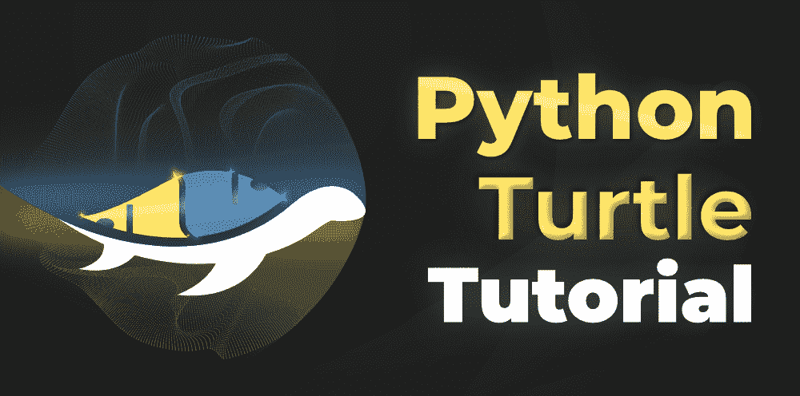
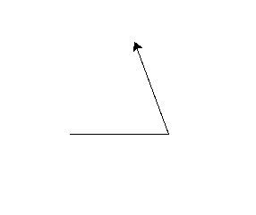

# 蟒蛇龟教程

> 原文:[https://www.geeksforgeeks.org/python-turtle-tutorial/](https://www.geeksforgeeks.org/python-turtle-tutorial/)

[**【海龟】**](https://www.geeksforgeeks.org/turtle-programming-python/) 是一个 Python 模块，提供了一个画板一样的功能，可以让用户创建图片和形状。海龟是向孩子们介绍编程最受欢迎的方式之一，也是原始 LOGO 编程语言的一部分。



用于绘图的屏幕上的笔被称为海龟，可以使用海龟. forward()、海龟. left()等功能移动。例如，turtle.forward(10)会将笔向前移动 10 个像素。为了更好地理解，考虑下面的例子。

**示例:**

## 蟒蛇 3

```
import turtle

# moves the pen in the 
# forward direction by 
# 110 pixels
turtle.forward(110)

# changes the direction of 
# the pen by 10 degrees in the
# left direction
turtle.left(110)

# moves the pen in the 
# forward direction in 
# the new direction by
# 110 pixels
turtle.forward(110)
```



让我们从基础开始学习海龟，借助包含解释良好的函数和练习的庞大数据集，帮助你更系统地学习海龟。

## 介绍

*   [Python 中的海龟编程](https://www.geeksforgeeks.org/turtle-programming-python/)

## 用海龟编程

### 用乌龟移动和绘画

*   [Python 中的龟背()方法](https://www.geeksforgeeks.org/turtle-backward-method-in-python/)
*   [Python 中的 turtle.left()方法](https://www.geeksforgeeks.org/turtle-left-method-in-python/)
*   [Python 中的 turtle.right()方法](https://www.geeksforgeeks.org/turtle-right-method-in-python/)
*   [Python 中的 turtle.setx()函数](https://www.geeksforgeeks.org/turtle-setx-function-in-python/)
*   [Python 中的 turtle.sety()函数](https://www.geeksforgeeks.org/turtle-sety-function-in-python/)
*   [Python 中的 turtle.seth()函数](https://www.geeksforgeeks.org/turtle-seth-function-in-python/)
*   [Python 中的 turtle.dot()函数](https://www.geeksforgeeks.org/turtle-dot-function-in-python/)
*   [Python 中的 turtle.home()函数](https://www.geeksforgeeks.org/turtle-home-function-in-python/)
*   [Python 中的 turtle.speed()函数](https://www.geeksforgeeks.org/turtle-speed-function-in-python/)
*   [Python 中的 turtle.undo()函数](https://www.geeksforgeeks.org/turtle-undo-function-in-python/)
*   [Python 中的 turtle.stamp()函数](https://www.geeksforgeeks.org/turtle-stamp-function-in-python/)
*   [Python 中的 turtle.clearstamp()方法](https://www.geeksforgeeks.org/turtle-clearstamp-method-in-python/)
*   [Python 中的 turtle.clearstamps()方法](https://www.geeksforgeeks.org/turtle-clearstamps-method-in-python/)
*   [Python 中的 turtle.towards()函数](https://www.geeksforgeeks.org/turtle-towards-function-in-python/)
*   [Python 中的 turtle.heading()函数](https://www.geeksforgeeks.org/turtle-heading-function-in-python/)
*   [Python 中的 turtle.xcor()函数](https://www.geeksforgeeks.org/turtle-xcor-function-in-python/)
*   [Python 中的 turtle.ycor()函数](https://www.geeksforgeeks.org/turtle-ycor-function-in-python/)
*   [Python 中的 turtle.degrees()函数](https://www.geeksforgeeks.org/turtle-degrees-function-in-python/)
*   [蟒蛇–龟.弧度()](https://www.geeksforgeeks.org/python-turtle-radians/)

### 海龟中的笔控制

*   [Python 中的 turtle.up()方法](https://www.geeksforgeeks.org/turtle-up-method-in-python/)
*   [Python 中的 turtle.down()方法](https://www.geeksforgeeks.org/turtle-down-method-in-python/)
*   [Python 中的 turtle.isdown()函数](https://www.geeksforgeeks.org/turtle-isdown-function-in-python/)
*   [Python 中的 turtle.width()函数](https://www.geeksforgeeks.org/turtle-width-function-in-python/)
*   [Python 中的 turtle.pen()函数](https://www.geeksforgeeks.org/turtle-pen-function-in-python/)
*   [Python 中的 turtle.write()函数](https://www.geeksforgeeks.org/turtle-write-function-in-python/)
*   [Python 中的龟. color()方法](https://www.geeksforgeeks.org/turtle-color-method-in-python/)
*   [Python 中的 turtle.fillcolor()函数](https://www.geeksforgeeks.org/turtle-fillcolor-function-in-python/)
*   [蟒蛇–甲鱼()方法](https://www.geeksforgeeks.org/python-turtle-pencolor-method/)
*   [Python 中的 turtle.filling()函数](https://www.geeksforgeeks.org/turtle-filling-function-in-python/)
*   [Python 中的 turtle.begin_fill()函数](https://www.geeksforgeeks.org/turtle-begin_fill-function-in-python/)
*   [Python 中的 turtle.end_fill()函数](https://www.geeksforgeeks.org/turtle-end_fill-function-in-python/)
*   [蟒蛇–乌龟. clear()](https://www.geeksforgeeks.org/python-turtle-clear/)

### 海龟事件处理

*   [Python 中的 turtle.onclick()函数](https://www.geeksforgeeks.org/turtle-onclick-function-in-python/)
*   [Python 中的 turtle.onkey()函数](https://www.geeksforgeeks.org/turtle-onkey-function-in-python/)
*   [Python 中的 turtle.onscreenclick()函数](https://www.geeksforgeeks.org/turtle-onscreenclick-function-in-python/)
*   [Python 中的 turtle.onrelease()函数](https://www.geeksforgeeks.org/turtle-onrelease-function-in-python/)
*   [Python 中的 turtle.ontimer()函数](https://www.geeksforgeeks.org/turtle-ontimer-function-in-python/)
*   [Python 中的 turtle.ondrag()函数](https://www.geeksforgeeks.org/turtle-ondrag-function-in-python/)
*   [Python–海龟. exit tonclick()](https://www.geeksforgeeks.org/python-turtle-exitonclick/)
*   [蟒蛇–乌龟. done()](https://www.geeksforgeeks.org/python-turtle-done/)

### 与海龟国合作

*   [Python 中的 turtle.showturtle()函数](https://www.geeksforgeeks.org/turtle-showturtle-function-in-python/)
*   [Python 中的 turtle.isvisible()函数](https://www.geeksforgeeks.org/turtle-isvisible-function-in-python/)
*   [Python 中的龟形()函数](https://www.geeksforgeeks.org/turtle-shape-function-in-python/)
*   [Python 中的龟甲()函数](https://www.geeksforgeeks.org/turtle-turtlesize-function-in-python/)
*   [Python 中的 turtle.tilt()函数](https://www.geeksforgeeks.org/turtle-tilt-function-in-python/)
*   [Python 中的 turtle.shapetransform()函数](https://www.geeksforgeeks.org/turtle-shapetransform-function-in-python/)
*   [Python 中的 turtle.settiltangle()函数](https://www.geeksforgeeks.org/turtle-settiltangle-function-in-python/)
*   [Python 中的 turtle.shearfactor()函数](https://www.geeksforgeeks.org/turtle-shearfactor-function-in-python/)
*   [Python 中的 turtle.get_poly()函数](https://www.geeksforgeeks.org/turtle-get_poly-function-in-python/)
*   [Python 中的 turtle.resizemode()函数](https://www.geeksforgeeks.org/turtle-resizemode-function-in-python/)
*   [Python 中的 turtle.pos()方法](https://www.geeksforgeeks.org/turtle-pos-method-in-python/)

### 使用海龟屏

*   [Python 中的 turtle.reset()函数](https://www.geeksforgeeks.org/turtle-reset-function-in-python/)
*   [Python 中的 turtle.resetscreen()函数](https://www.geeksforgeeks.org/turtle-resetscreen-function-in-python/)
*   [蟒蛇——乌龟。屏幕()。设置()方法](https://www.geeksforgeeks.org/python-turtle-screen-setup-method/)
*   [蟒蛇–乌龟. clear()](https://www.geeksforgeeks.org/python-turtle-clear/)
*   [Python 中的 turtle.bgpic()函数](https://www.geeksforgeeks.org/turtle-bgpic-function-in-python/)
*   [甲鱼。屏幕()。Python 中的海龟()函数](https://www.geeksforgeeks.org/turtle-screen-turtles-function-in-python/)
*   [Python 中的 turtle.setworldcoordinates()函数](https://www.geeksforgeeks.org/turtle-setworldcoordinates-function-in-python/)
*   [Python 中的 turtle.numinput()函数](https://www.geeksforgeeks.org/turtle-numinput-function-in-python/)
*   [Python 中的 turtle.textinput()函数](https://www.geeksforgeeks.org/turtle-textinput-function-in-python/)
*   [Python 中的 turtle.window_height()函数](https://www.geeksforgeeks.org/turtle-window_height-function-in-python/)
*   [Python 中的 turtle.window_width()函数](https://www.geeksforgeeks.org/turtle-window_width-function-in-python/)
*   [Python 中的 turtle.screensize()函数](https://www.geeksforgeeks.org/turtle-screensize-function-in-python/)
*   [Python 中的 turtle.title()函数](https://www.geeksforgeeks.org/turtle-title-function-in-python/)
*   [蟒蛇–乌龟. done()](https://www.geeksforgeeks.org/python-turtle-done/)
*   [Python 中的 turtle.addshape()函数](https://www.geeksforgeeks.org/turtle-addshape-function-in-python/)
*   [Python 中的 turtle.colormode()函数](https://www.geeksforgeeks.org/turtle-colormode-function-in-python/)
*   [Python–turtle . delay()方法](https://www.geeksforgeeks.org/python-turtle-delay-method/)
*   [Python 中的 turtle.tracer()函数](https://www.geeksforgeeks.org/turtle-tracer-function-in-python/)
*   [Python 中的 turtle.mode()函数](https://www.geeksforgeeks.org/turtle-mode-function-in-python/)
*   [Python 中的 turtle.register_shape()函数](https://www.geeksforgeeks.org/turtle-register_shape-function-in-python/)
*   [蟒蛇–乌龟拜拜()](https://www.geeksforgeeks.org/python-turtle-bye/)

### 特殊的海龟方法

*   [Python 中的 turtle.clone()函数](https://www.geeksforgeeks.org/turtle-clone-function-in-python/)
*   [Python 中的 turtle.undobufferentries()函数](https://www.geeksforgeeks.org/turtle-undobufferentries-function-in-python/)
*   [Python 中的 turtle.setundobuffer()函数](https://www.geeksforgeeks.org/turtle-setundobuffer-function-in-python/)
*   [Python 中的 turtle.getpen()函数](https://www.geeksforgeeks.org/turtle-getpen-function-in-python/)
*   [Python 中的 turtle.getshapes()函数](https://www.geeksforgeeks.org/turtle-getshapes-function-in-python/)
*   [Python 中的 turtle.get_shapepoly()函数](https://www.geeksforgeeks.org/turtle-get_shapepoly-function-in-python/)
*   [Python 中的 turtle.getscreen()函数](https://www.geeksforgeeks.org/turtle-getscreen-function-in-python/)

## 海龟练习和项目

### 初学者

*   [如何获取巨蟒龟的屏幕坐标？](https://www.geeksforgeeks.org/how-to-get-coordinate-of-screen-in-python-turtle/)
*   [用龟蟒画正方形和长方形](https://www.geeksforgeeks.org/draw-square-and-rectangle-in-turtle-python/)
*   [用海龟-蟒蛇画填色形状](https://www.geeksforgeeks.org/draw-color-filled-shapes-in-turtle-python/)
*   [Python–使用海龟图形绘制六边形](https://www.geeksforgeeks.org/python-draw-hexagon-using-turtle-graphics/)
*   [Python–使用龟形图形绘制八角形](https://www.geeksforgeeks.org/python-draw-octagonal-shape-using-turtle-graphics/)
*   [用龟-蟒画任意多边形](https://www.geeksforgeeks.org/draw-any-polygon-in-turtle-python/)
*   [用 Python 中的龟画椭圆](https://www.geeksforgeeks.org/draw-ellipse-using-turtle-in-python/)
*   [使用龟](https://www.geeksforgeeks.org/draw-cube-and-cuboid-in-python-using-turtle/)在 Python 中绘制立方体和长方体
*   [用 Python 中的乌龟绘制彩色立体立方体](https://www.geeksforgeeks.org/draw-colored-solid-cube-using-turtle-in-python/)
*   [Python–使用海龟图形绘制星形](https://www.geeksforgeeks.org/python-draw-star-using-turtle-graphics/)
*   [如何在 Python-Turtle 中绘制填色星？](https://www.geeksforgeeks.org/how-to-draw-color-filled-star-in-python-turtle/)
*   [使用 Python 中的海龟图形绘制彩虹](https://www.geeksforgeeks.org/draw-rainbow-using-turtle-graphics-in-python/)
*   [Python–使用海龟图形](https://www.geeksforgeeks.org/python-write-gfg-using-turtle-graphics/)书写“GFG”
*   [Python–使用海龟图形](https://www.geeksforgeeks.org/python-draw-gfg-logo-using-turtle-graphics/)绘制“GFG”标志
*   [使用 Python 中的 Turtle 绘制笑脸表情](https://www.geeksforgeeks.org/draw-smiling-face-emoji-using-turtle-in-python/)

### 中间的

*   [用龟在 Python 中绘制形状内的形状](https://www.geeksforgeeks.org/draw-shape-inside-shape-in-python-using-turtle/)
*   [用乌龟用蟒蛇画一个奥林匹克标志](https://www.geeksforgeeks.org/draw-an-olympic-symbol-in-python-using-turtle/)
*   [用 Python 中的乌龟用 VIBGYOR 画同心圆](https://www.geeksforgeeks.org/draw-concentric-circles-with-vibgyor-using-turtle-in-python/)
*   [使用 Python 中的乌龟绘制点状图案](https://www.geeksforgeeks.org/draw-dot-patterns-using-turtle-in-python/)
*   [使用 Python 中的 Turtle 绘制汽车](https://www.geeksforgeeks.org/draw-a-car-using-turtle-in-python/)
*   [使用 Python 中的 Turtle 模块绘制太阳](https://www.geeksforgeeks.org/draw-sun-using-turtle-module-in-python/)
*   [使用 Python 中的海龟图形绘制心脏](https://www.geeksforgeeks.org/draw-heart-using-turtle-graphics-in-python/)
*   [使用 Python 中的海龟图形绘制菱形](https://www.geeksforgeeks.org/draw-diamond-shape-using-turtle-graphics-in-python/)
*   [使用 Python 中的海龟绘制图形网格](https://www.geeksforgeeks.org/draw-graph-grid-using-turtle-in-python/)
*   [使用 Python 中的海龟图形绘制熊猫](https://www.geeksforgeeks.org/draw-panda-using-turtle-graphics-in-python/)
*   [使用 Python 中的 Turtle 编程绘制房屋](https://www.geeksforgeeks.org/draw-house-using-turtle-programming-in-python/)
*   [用 Python 中的龟模画雪人](https://www.geeksforgeeks.org/draw-a-snowman-using-turtle-module-in-python/)
*   [使用 Python 中的海龟绘制时钟设计](https://www.geeksforgeeks.org/draw-clock-design-using-turtle-in-python/)
*   [使用 Python-Turtle 创建数字钟](https://www.geeksforgeeks.org/create-digital-clock-using-python-turtle/)
*   [用龟蟒画彩色的星星图案](https://www.geeksforgeeks.org/draw-colourful-star-pattern-in-turtle-python/)
*   [使用 Python 中的海龟打印肺活量图](https://www.geeksforgeeks.org/print-a-spirograph-using-turtle-in-python/)
*   [使用 Python 中的海龟绘制螺旋星](https://www.geeksforgeeks.org/draw-spiraling-star-using-turtle-in-python/)
*   [用 Python 中的龟画螺旋方块](https://www.geeksforgeeks.org/draw-spiraling-square-using-turtle-in-python/)
*   [使用 Python 中的海龟绘制螺旋三角形](https://www.geeksforgeeks.org/draw-spiraling-triangle-using-turtle-in-python/)
*   [使用 Python 中的海龟绘制螺旋多边形](https://www.geeksforgeeks.org/draw-spiraling-polygon-using-turtle-in-python/)
*   [用 Python 中的龟图形绘制彩色螺旋网](https://www.geeksforgeeks.org/draw-colorful-spiral-web-using-turtle-graphics-in-python/)
*   [用蟒蛇龟画一个井字游戏棋盘](https://www.geeksforgeeks.org/draw-a-tic-tac-toe-board-using-python-turtle/)
*   [用蟒蛇龟画棋盘](https://www.geeksforgeeks.org/draw-chess-board-using-turtle-in-python/)
*   [使用海龟的 Python–希尔伯特曲线](https://www.geeksforgeeks.org/python-hilbert-curve-using-turtle/)
*   [乌龟–使用箭头键](https://www.geeksforgeeks.org/turtle-draw-lines-using-arrow-keys/)画线
*   [用龟](https://www.geeksforgeeks.org/draw-lines-at-the-respective-positions-clicked-by-the-mouse-using-turtle/)在鼠标点击的各个位置画线
*   [巨蟒龟–图形键盘命令](https://www.geeksforgeeks.org/python-turtle-graphics-keyboard-commands/)
*   [如何用 screenclick 在 Python Turtle 中制作三角形？](https://www.geeksforgeeks.org/how-to-make-triangle-in-python-turtle-using-onscreenclick/)

### 预先的

*   [如何在 Python 中创建自定义的海龟形状？](https://www.geeksforgeeks.org/how-to-create-custom-turtle-shapes-in-python/)
*   [使用 Python 的正方形圆](https://www.geeksforgeeks.org/circle-of-squares-using-python/)
*   [如何使用海龟模块在 Python 中绘制 2 层彩色蜘蛛网？](https://www.geeksforgeeks.org/how-to-draw-2-layered-and-colored-spider-web-in-python-using-turtle-module/)
*   [使用海龟的 Python 中的 Y 分形树](https://www.geeksforgeeks.org/y-fractal-tree-in-python-using-turtle/)
*   [如何用龟蟒制作印度国旗](https://www.geeksforgeeks.org/how-to-make-indian-flag-using-turtle-python/)
*   [用 Python 中的龟画出有月亮的星空](https://www.geeksforgeeks.org/draw-starry-sky-with-moon-using-turtle-in-python/)
*   [使用 Python 中的 Turtle 绘制移动对象](https://www.geeksforgeeks.org/draw-moving-object-using-turtle-in-python/)
*   [使用 Python 中的 Turtle 创建一个简单的动画](https://www.geeksforgeeks.org/create-a-simple-animation-using-turtle-in-python/)
*   [使用 Python 中的 Turtle 创建一个简单的双人游戏](https://www.geeksforgeeks.org/create-a-simple-two-player-game-using-turtle-in-python/)
*   [使用 Python 中的海龟创建一个蛇游戏](https://www.geeksforgeeks.org/create-a-snake-game-using-turtle-in-python/)
*   [使用 Python-Turtle 创建乒乓游戏](https://www.geeksforgeeks.org/create-pong-game-using-python-turtle/)
*   [使用 Python3 翻转瓷砖(记忆游戏)](https://www.geeksforgeeks.org/flipping-tiles-memory-game-using-python3/)