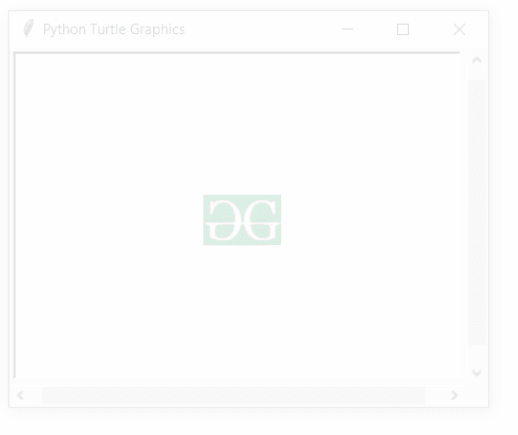

# Python 中的 turtle.addshape()函数

> 原文:[https://www . geesforgeks . org/turtle-addshape-function-in-python/](https://www.geeksforgeeks.org/turtle-addshape-function-in-python/)

海龟模块以面向对象和面向过程的方式提供海龟图形原语。因为它使用 Tkinter 作为底层图形，所以它需要安装一个支持 Tk 的 Python 版本。

## turtle.addshape()

该函数用于将海龟形状添加到 TurtleScreen 的形状列表中。

**语法:**

```py
turtle.addshape(name, shape=None)

```

**参数:**

<figure class="table">

| **论据** | **描述** |
| 名字 | gif 文件的名称 |
| 形状 | 形状是坐标对的元组 |

</figure>

下面是上述方法的实现，并附有一些例子:

**例 1 :**

## 蟒蛇 3

```py
# import package
import turtle

# print list of the all
# shapes available
print(turtle.getshapes())

# add shape to the shape list
turtle.addshape(name="gfg.gif",shape=None)

# check the updated shape list
print(turtle.getshapes())
```

**输出:**

> ['箭头'，'空白'，'圆形'，'经典'，'正方形'，'三角形'，'乌龟']
> ['箭头'，'空白'，'圆形'，'经典'，' gfg.gif '，'正方形'，'三角形'，'乌龟']

**例 2 :**

## 蟒蛇 3

```py
# import package
import turtle

# add shape to the shape list as above
turtle.addshape(name="gfg.gif",shape=None)

# set turtle with new shape
# and new position
turtle.shape("gfg.gif")
turtle.up()
turtle.setpos(-10,10)
turtle.down()

# loop for motion
for i in range(22):
    turtle.fd(40+5*i)
    turtle.right(90)
```

**输出:**

