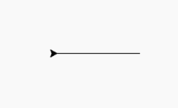
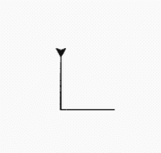

# Python 中的龟背()方法

> 原文:[https://www . geesforgeks . org/turtle-backward-in-method-python/](https://www.geeksforgeeks.org/turtle-backward-method-in-python/)

海龟模块以面向对象和面向过程的方式提供海龟图形原语。因为它使用 Tkinter 作为底层图形，所以它需要安装一个支持 Tk 的 Python 版本。

## turtle.backward()

方法的作用是:根据参数的值向后移动乌龟。它给出了一条向后运动到另一个位置或方向的线。

**语法:**

```
turtle.backward(distance)

```

它采用的参数是距离{一个数字(整数或浮点数)}。因此，它将海龟向后移动指定的距离，与海龟前进的方向相反。下面是上述方法的实现，并附有一些例子:

**例 1:**

## 蟒蛇 3

```
# importing packages
import turtle

# move turtle backward with 
# distance = 100
turtle.backward(100)
```

**输出:**



**例 2:**

## 蟒蛇 3

```
# importing package
import turtle

# move the turtle backward by 50
turtle.backward(50)

# change the direction
turtle.right(90)

# move the turtle backward by 50 again
turtle.backward(50)
```

**输出:**

