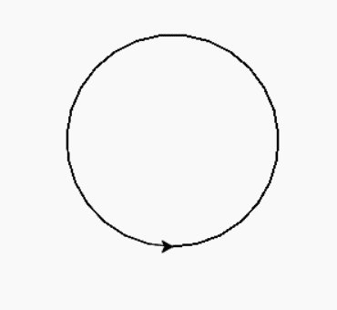
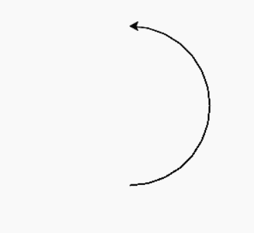
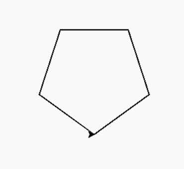

# Python 中的龟圆()方法

> 原文:[https://www . geesforgeks . org/turtle-circle-in-method-python/](https://www.geeksforgeeks.org/turtle-circle-method-in-python/)

[海龟](https://www.geeksforgeeks.org/turtle-programming-python/)模块以面向对象和面向过程的方式提供海龟图形原语。因为它使用 Tkinter 作为底层图形，所以它需要安装一个支持 Tk 的 Python 版本。

### turtle.circle():

这个方法用来画一个给定半径的圆。

> **语法:**龟。圆(半径，范围=无，步数=无)
> 
> **参数:**
> 
> *   **半径:**圆的半径。
> *   **范围:**以度为单位的圆弧部分。
> *   **步数:**将形状分成相同数量的给定步数。

下面是上述方法的实现，并附有一些例子:

**例 1:**

## 蟒蛇 3

```py
# importing turtle package
import turtle

# draw circle of radius 
# 80 pixel
turtle.circle(80)
```

**输出**:



**例 2:**

## 蟒蛇 3

```py
# importing turtle package
import turtle

# draw circle of radius 80 
# pixel and extent = 180
# so it draw half circle
turtle.circle(80, 
              extent = 180)
```

**输出**:



**例 3:**

## 蟒蛇 3

```py
# importing turtle package
import turtle

# draw circle of radius 80
# pixel and steps = 5
# so it draw pentagon with
# equal length 5 sides
turtle.circle(80, 
              steps = 5)
```

**输出:**

