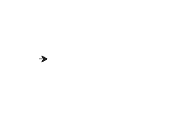

# Python 中的 turtle.clearstamp()方法

> 原文:[https://www . geesforgeks . org/turtle-clearstamp-method-in-python/](https://www.geeksforgeeks.org/turtle-clearstamp-method-in-python/)

海龟模块以面向对象和面向过程的方式提供海龟图形原语。因为它使用 Tkinter 作为底层图形，所以它需要安装一个支持 Tk 的 Python 版本。

## turtle.clearstamp()

turtle.clearstamp()方法用于删除 turtle 的所有或第一个/最后 n 个印章。此方法需要整数参数。所以，用 id 做的印章被它清除了。

> **语法:** turtle.clearstamp(stampid)
> 
> **参数:**
> 
> **stamp id–**一个整数，必须是上一次 stamp()调用的返回值。

下面是上述方法的实现，并附有一些例子:

**例 1 :**

## 蟒蛇 3

```
# import package
import turtle

# set turtle speed to slowest
# for better understandings
turtle.speed(1)

# motion with stamps
# and their ids
turtle.forward(50)
id1 = turtle.stamp()

turtle.forward(50)
id2 = turtle.stamp()

turtle.forward(50)
id3 = turtle.stamp()

# hide the turtle to
# clarify stamps
turtle.ht()

# clear the stamps
# of id : id1 and id3
turtle.clearstamp(id1)
turtle.clearstamp(id3)
```

**输出:**



**例 2 :**

## 蟒蛇 3

```
# import package
import turtle 

# list to store ids
ids = []

# loop to create motion
# with stamps
for i in range(12):

    # motion
    turtle.forward(50)

    # stampid
    id = turtle.stamp()
    lst.append(id)
    turtle.right(30)

# hide the turtle for 
# better understandings
turtle.ht()

# loop for clear stamps with 
# their ids using clearstamp
# half stamps are cleared
for i in range(len(lst)//2):
    turtle.clearstamp(lst[i])
```

**输出:**

